# Round 2 Writeups

- [sanity-check](#sanity-check)
- [odd-one-out](#odd-one-out)
- [terminal-skillz](#terminal-skillz)
- [its-rewind-time](#fibonacci-2)
- [super-spreader-1](#super-spreader-1)
- [super-spreader-2](#super-spreader-2)
- [super-spreader-3](#super-spreader-3)
- [floor-tiling-1](#bellman-troubles-3)
- [floor-tiling-2](#bellman-troubles-4)
- [floor-tiling-2](#bellman-troubles-5)
- [fancy-socks-1](#fancy-socks-1)
- [fancy-socks-2](#fancy-socks-2)
- [fancy-socks-3](#fancy-socks-3)
- [cookie-monster-1](#cookie-monster-1)
- [cookie-monster-2](#cookie-monster-2)
- [floor-tiling-4](#floor-tiling-4)
- [amphibian-addict-1](#amphibian-addict-1)
- [amphibian-addict-2](#amphibian-addict-2)
- [super-spreader-4](#super-spreader-4)

## sanity-check

General Skills (10 points)

### Problem

Enter this flag for 10 free points! You guys know the drill...

Relevant links: [sanity-check.txt](https://cararra-ctf-files.herokuapp.com/sanity-check.txt)

### **Writeup**

Click on the link, download the text file, and voilà! You get that the flag is `cararraCTF{u_R34dy_fOr_ROuND_2?}`.

## odd-one-out

General Skills (20 points)

### Problem

Bob likes it when numbers come in pairs. So, he wrote down a list of `N` numbers randomly and made sure that each number occurred an even number of times. Unfortunately, he forgot to check one number. Find the number that occurs an odd number of times. The test case gives `N` followed by `N` numbers. Enter your answer in flag format: if your answer is `50`, enter the flag `cararraCTF{50}`.

### Writeup

The most straightforward way to do this problem is to just keep a map or array storing the number of occurrences for each numbers. We could then iterate through that map and find which number has an odd number of occurrences.

However, the extremely clean way to do it is using XORs since XORing a number with itself an even number of times gives 0, while XORing a number with itself an odd number of times gives itself. So, if we xor all the numbers together, we should be left with the number that occurs an odd number of times.

```python
f = open('odd-one-out.txt')
n = int(f.readline())

xorsum = 0
for i in range(n):
    xorsum ^= int(f.readline())

print(xorsum)
```

Running the code, we get an answer of `16611` and a flag of `cararraCTF{16611}`.

### Additional Solutions

Java XOR (by kp#0649)

```java
import java.io.*; 

public class oddoneout {
    public static void main(String[] args) throws IOException {
        BufferedReader br = new BufferedReader(new FileReader("odd-one-out.txt")); 
        int N = Integer.parseInt(br.readLine()); 
        int ans = 0; 
        for (int i = 0; i<N; i++) {
            ans ^= Integer.parseInt(br.readLine()); 
        }
        System.out.println(ans);
    }
}
```

C++ Set (by Mastermind#7720)

```cpp
#include <bits/stdc++.h>
using namespace std;

int main() {
    ios_base::sync_with_stdio(false);
    cin.tie(nullptr);
    freopen("odd-one-out.txt", "r", stdin);

    set<long long> s;

    long long num;
    while (cin >> num) {
        if (s.count(num)) {
            s.erase(num);
        } else {
            s.insert(num);
        }
    }

    for (long long n : s) {
        cout << n << endl;
    }
}
```

## terminal-skillz

General Skills (25 points)

### Problem

The flag is in flag.txt. Find the flag, and don't get distracted.

Relevant links: [terminal-skillz.zip](https://github.com/rohanku/its-rewind-time)

### Writeup

There are a ton of files called `file_.txt`, each with a the same fake flag: `cararraCTF{read_ze_instructions}`. So, grepping won't work. Reading the instructions, as the fake flag tells us to, we see that we need to find flag.txt.

This can be done easily using the command find . -name flag.txt.

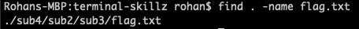

Once we find the file path, we can run cat sub4/sub2/sub3/flag.txt to get the flag.


We get that the flag is `cararraCTF{n1c3_t3rmin411ing_<3}`.

*An alternative (and arguably more elegant) solution is to grep for `cararraCTF{` and filter out unique flags using the command `grep -hr cararraCTF{ . | sort | uniq`. It does take a bit more time to run but its still cool :D.*

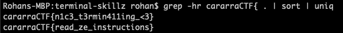

### Additional Solutions

PowerShell (by kp#0649)

```powershell
Get-ChildItem flag.txt -Recurse | Get-Content
```

```powershell
Get-ChildItem -Recurse *.txt | Select-String -Pattern "cararra" | Get-Content | Sort-Object -Unique
```

<aside>
💡 A terminal was not necessary to solve this problem, and a simple ZIP extract and search would have retrieved the flag.

</aside>

## its-rewind-time

General Skills (40 points)

### Problem

It seems like the flag has been redacted. Can you still find it?

Relevant links: [its-rewind-time](https://github.com/rohanku/its-rewind-time)

### Writeup

Taking a look at the commit history of the repo, we see that the most recent commit redacted the flag. We could theoretically look through all of the diffs, but that would take eons.

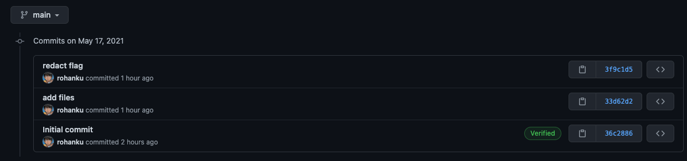

A better strategy would be to clone the repo, revert back to the commit with the flag, then grep for the flag.

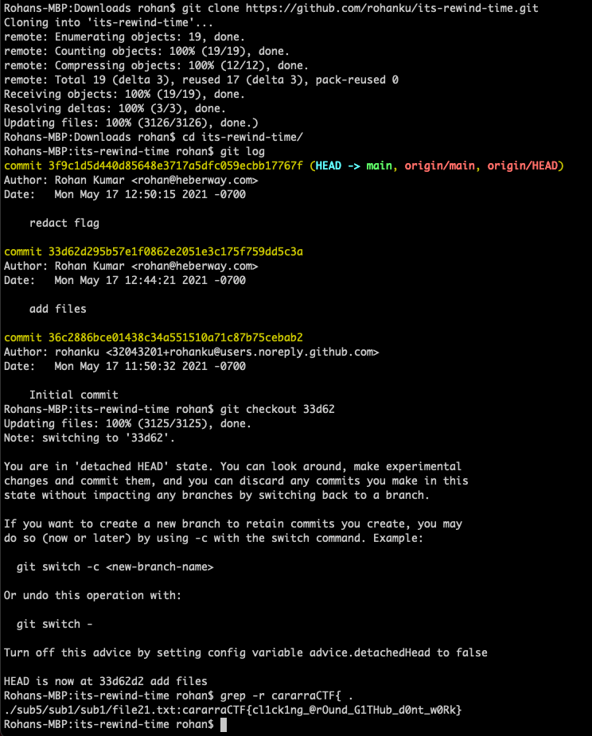

And we get that the flag is `cararraCTF{cl1ck1ng_@rOund_G1THub_d0nt_w0Rk}`!

### Additional Solutions

PowerShell (by kp#0649)

```powershell
git clone https://github.com/rohanku/its-rewind-time
git checkout 33d62
Get-ChildItem -Recurse | Select-String -Pattern "cararra" | Get-Content
```

## super-spreader-1

(Algorithms, 50 points)

### Problem

Several people named Bob are standing in a line. Unfortunately, some of the Bobs have CARARRAVID-19, and each minute, Bobs with the virus spread it to all other Bobs within a radius of `K`. That is, if Bob is at position `x`, he spreads the virus to Bobs within the interval `[x-K, x+K]`. Find the minimum number of Bobs that must be initially infected for all the Bobs to become infected after a long period of time. The test case gives `N` and `K` followed by the distinct positions of each Bob. Enter your answer in flag format: if your answer is `50`, enter the flag `cararraCTF{50}`.

### Writeup

The first step is to notice that after a long period of time, all Bobs that are reachable from a spreader by only making jumps of length K will be infected. This "infectability" is also reflexive and transitive, meaning that we can essentially clump together Bobs that can infect each other and know that all Bobs in the same clump will be infected if any one of them starts with CARARRAVID-19.

In this problem, we can clump using a greedy strategy after sorting. Specifically, we add the next cow to the clump if it is within K of the most recent cow we went through, and start a new clump otherwise. At the end, we just count the number of clumps since each clump only needs one Patient Zero to infect the rest.

```python
f = open('super-spreader-1.txt')

[n, k] = map(int, f.readline().split())
nums = [int(f.readline()) for i in range(n)]

nums.sort()

prev = nums[0]-k-1
tot = 0

for i in nums:
    if i > prev + k:
        tot += 1
    prev = i

print(tot)
```

Running the code, we get an answer of `36636` and a flag of `cararraCTF{36636}`.

### Additional Solutions

Java Greedy (by kp#0649)

```java
import java.util.*;
import java.io.*; 

public class superspreader1 {
    public static void main(String[] args) throws IOException {
        BufferedReader br = new BufferedReader(new FileReader("super-spreader-1.txt")); 
        StringTokenizer st = new StringTokenizer(br.readLine()); 
        int N = Integer.parseInt(st.nextToken()); 
        int K = Integer.parseInt(st.nextToken()); 
        int[] locations = new int[N]; 
        for (int i = 0; i<N; i++) {
            locations[i] = Integer.parseInt(br.readLine()); 
        }
        Arrays.sort(locations); 
        int prev = locations[0]; 
        int ans = 1; 
        for (int i = 1; i<N; i++) {
            if (locations[i] > prev+K) {
                ans++; 
            }
            prev = locations[i]; 
        }
        System.out.println(ans);
    }
}
```

C++ DSU (by Mastermind#7720)

```cpp
#include <bits/stdc++.h>

using namespace std;

struct DSU {
    vector<int> e;
    void init(int n) { e = vector<int>(n, -1); }

    int get(int x) { return e[x] < 0 ? x : e[x] = get(e[x]); }

    bool sameSet(int a, int b) { return get(a) == get(b); }

    int size(int x) { return -e[get(x)]; }

    bool unite(int x, int y) {
        x = get(x);
        y = get(y);
        if (x == y) return 0;
        if (e[x] > e[y]) swap(x, y);
        e[x] += e[y];
        e[y] = x;
        return 1;
    }
};

int main() {
    ios_base::sync_with_stdio(false);
    cin.tie(nullptr);
    freopen("super-spreader-1.txt", "r", stdin);

    long long n, k;
    cin >> n >> k;
    vector<long long> v(n);

    for (int i = 0; i < n; i++) {
        cin >> v[i];
    }

    sort(begin(v), end(v));

    DSU d;
    d.init(n);
    long long pVal = 0;
    for (int i = 1; i < n; i++) {
        if (v[i] - v[i - 1] <= k) {
            d.unite(i, i - 1);
        }
    }

    set<long long> s;
    for (int i = 0; i < n; i++) {
        s.insert(d.get(i));
    }

    cout << s.size() << endl;
}
```

## super-spreader-2

Algorithms (100 points)

### Problem

Several people named Bob numbered `1 ... N` live in a community, and certain Bobs interact more with other Bobs. Therefore, certain pairs of Bobs `(b_i, b_j)` have a bidirectional interaction degree of `I(b_i, b_j)`. Unfortunately, some of the Bobs have CARARRAVID-19, and each minute, Bobs `b_s` with the virus spread it to all other Bobs `b_i` where the interaction degree `I(b_s, b_i)` is at least `K`. Alice is attempting to infect all Bobs by strategically infecting `B` Bobs. Find the maximum value of `K` for which Alice can achieve her goal. The test case gives `N`, `B`, and `M` followed by M lines of interaction degrees in the form `b_i [SPACE] b_j [SPACE] I(b_i, b_j)`. Enter your answer in flag format: if your answer is `50`, enter the flag `cararraCTF{50}`.

Relevant links: [super-spreader-2.txt](https://cararra-ctf-files.herokuapp.com/r2/super-spreader-2.txt)

### Writeup

The idea is similar to the previous one, where we basically want to find clusters of cows that are reachable from each other using only edges of length greater than K (if we think of interaction degrees as edges and Bobs as nodes). This is a pretty common clustering problem and it simply involves sorting the edges and "contracting" them from greatest to least, merging the clusters at either end of each edge.

Since, of course, some edges may be entirely within a cluster, we need weighted quick-union disjoint set union (DSU) in order to know when we're actually merging two separate clusters. Once we get the number of clusters down to B, we're done and we print the smallest edge we contracted as our answer.

```python
f = open('super-spreader-2.txt')

[n, b, m] = map(int, f.readline().split())

edges = [tuple(map(int, f.readline().split())) for i in range(m)]
edges.sort(key=lambda x: x[2], reverse=True)
print(edges)

groups = n
height = [1]*n
parent = [i for i in range(n)]

def find(x):
    if parent[x]==x:
        return x
    return find(parent[x])

def union(x, y):
    global groups
    fx = find(x)
    fy = find(y)
    if fx != fy:
        groups -= 1
    if height[fy] > height[fx]:
        parent[fx] = fy
        height[fy] = max(height[fx]+1, height[fy])
    else:
        parent[fy] = fx
        height[fx] = max(height[fy]+1, height[fx])

for (b1, b2, i) in edges:
    union(b1-1, b2-1) 
    if groups <= b:
        print(i)
        break
```

Running the code, we get an answer of `228262157` and a flag of `cararraCTF{228262157}`.

### Additional Solutions

Java DSU (by kp#0649) 

```java
import java.util.*; 
import java.io.*; 

public class superspreader2 {
    static class DSU {
        int N, cnt; 
        int[] parent;
        public DSU(int N) {
            this.N = N;
            this.cnt = N; 
            this.parent = new int[N];
            for (int i = 0; i < N; i++) {
                parent[i] = i;
            }
        }
        public int find(int a) {
            while (a != parent[a]) {
                parent[a] = parent[parent[a]];
                a = parent[a];
            }
            return a;
        }
        public boolean merge(int u, int v) {
            int a = find(u);
            int b = find(v);
            if (a == b) return false;
            cnt--; 
            parent[a] = b;
            return true;
        }
    }
    static class Edge implements Comparable<Edge>{
        int from, to, weight; 
        public Edge(int _from, int _to, int _weight) {
            from = _from;
            to = _to;  
            weight = _weight; 
        }
        @Override 
        public int compareTo(Edge o) {
            return o.weight - weight; 
        }
    }
    public static void main(String[] args) throws IOException {
        BufferedReader br = new BufferedReader(new FileReader("super-spreader-2.txt"));
        StringTokenizer st = new StringTokenizer(br.readLine()); 
        int N = Integer.parseInt(st.nextToken()); 
        int B = Integer.parseInt(st.nextToken()); 
        int M = Integer.parseInt(st.nextToken()); 
        Edge[] edges = new Edge[M]; 
        for (int i = 0; i<M; i++) {
            st = new StringTokenizer(br.readLine()); 
            int u = Integer.parseInt(st.nextToken())-1; 
            int v = Integer.parseInt(st.nextToken())-1;
            int w = Integer.parseInt(st.nextToken());
            edges[i] = new Edge(u,v,w);  
        }
        Arrays.sort(edges);
        DSU uf = new DSU(N); 
        for (Edge e: edges) {
            uf.merge(e.to,e.from); 
            if (uf.cnt == B) {
                System.out.println(e.weight); 
                break;
            }
        }
    }
}
```

## super-spreader-3

Algorithms (175 points)

### Problem

Several people named Bob are standing at distinct lattice points of the Cartesian plane. Unfortunately, some of the Bobs have CARARRAVID-19, and each minute, Bobs with the virus spread it to all other Bobs within a Manhattan distance of `5`. Recall that the Manhattan distance between Bobs at `(x_1, y_1)` and `(x_2, y_2)` is defined as `|x_1 - x_2| + |y_1 - y_2|`. Find the minimum number of Bobs that must be initially infected for all the Bobs to become infected after a long period of time. The test case gives `N` followed by each Bob's `(x, y)` coordinates on a new line. Enter your answer in flag format: if your answer is `50`, enter the flag `cararraCTF{50}`. 

Relevant links: [super-spreader-3.txt](https://cararra-ctf-files.herokuapp.com/r2/super-spreader-3.txt)

### Writeup

This problem is basically the same as the previous one, but it has too many implied pair-wise edges to enumerate and sort. However, the Manhattan distance is fairly small, so we simply go through each Bob, look at all points within that Manhattan distance of the Bob, and if there is a Bob there we combine the two into a cluster.

This runs in `N log N` time due to our DSU, with a somewhat large constant factor (around `25`) for checking each lattice point within a Manhattan distance of `5`.

```python
f = open('super-spreader-3.txt')

n = int(f.readline())
points = []
m = {}

for i in range(n):
    points.append(tuple(map(int, f.readline().split())))
    m[points[i]] = i

groups = n
height = [1]*n
parent = [i for i in range(n)]

def find(x):
    if parent[x]==x:
        return x
    return find(parent[x])

def union(x, y):
    global groups
    fx = find(x)
    fy = find(y)
    if fx != fy:
        groups -= 1
    if height[fy] > height[fx]:
        parent[fx] = fy
        height[fy] = max(height[fx]+1, height[fy])
    else:
        parent[fy] = fx
        height[fx] = max(height[fy]+1, height[fx])

for i in range(n):
    for j in range(-5, 6):
        for k in range (-(5-abs(j)), 5-abs(j)+1):
            newpoint = (points[i][0]+j, points[i][1]+k)
            if newpoint in m:
                union(m[newpoint], i)

print(groups)
```

Running the code, we get an answer of `88590` and a flag of `cararraCTF{88590}`.

### Additional Solutions

Java DSU (by kp#0649)

```java
import java.util.*; 
import java.io.*; 

public class superspreader3 {
    static class Pair {
        int x; int y; 
        public Pair(int x, int y) {
            this.x = x; 
            this.y = y; 
        }
        @Override
        public boolean equals(Object obj) {
            Pair o = (Pair) obj;
            return o.x == x && o.y == y;
        }
        @Override
        public int hashCode() {
            int h = 17; 
            h = h*31 + x; 
            h = h*31 + y; 
            return h; 
        }
    }
    static class DSU {
        int N, cnt;
        int[] parent;
        public DSU(int N) {
            this.N = N;
            this.cnt = N;
            this.parent = new int[N];
            for (int i = 0; i < N; i++) {
                parent[i] = i;
            }
        }
        public int find(int a) {
            while (a != parent[a]) {
                parent[a] = parent[parent[a]];
                a = parent[a];
            }
            return a;
        }
        public boolean merge(int u, int v) {
            int a = find(u);
            int b = find(v);
            if (a == b) return false;
            cnt--;
            parent[a] = b;
            return true;
        }
    }
    public static void main(String[] args) throws IOException {
        BufferedReader br = new BufferedReader(new FileReader("super-spreader-3.txt")); 
        StringTokenizer st; 
        int N = Integer.parseInt(br.readLine()); 
        Pair[] points = new Pair[N];
        HashMap<Pair,Integer> map = new HashMap<>();
        for (int i = 0; i<N; i++) {
            st = new StringTokenizer(br.readLine()); 
            int x = Integer.parseInt(st.nextToken()); 
            int y = Integer.parseInt(st.nextToken()); 
            points[i] = new Pair(x,y);
            map.put(points[i],i);
        }
        DSU uf = new DSU(N);
        for (int i = 0; i<N; i++) {
            for (int xdir = -5; xdir <= 5; xdir++) {
                int rem = 5 - Math.abs(xdir); 
                for (int ydir = -rem; ydir <= rem; ydir++) {
                    int newX = points[i].x + xdir;
                    int newY = points[i].y + ydir;
                    Pair test = new Pair(newX, newY);
                    if (map.containsKey(test)) {
                        uf.merge(map.get(test), i);
                    }
                }
            }
        }
        System.out.println(uf.cnt);
    }
}
```

C++ Brute Force (by Mastermind#7720)

```cpp
#include <bits/stdc++.h>
using namespace std;

struct DSU {
    vector<int> e;
    void init(int n) { e = vector<int>(n, -1); }

    int get(int x) { return e[x] < 0 ? x : e[x] = get(e[x]); }

    bool sameSet(int a, int b) { return get(a) == get(b); }

    int size(int x) { return -e[get(x)]; }

    bool unite(int x, int y) {
        x = get(x);
        y = get(y);
        if (x == y) return 0;
        if (e[x] > e[y]) swap(x, y);
        e[x] += e[y];
        e[y] = x;
        return 1;
    }
};

long long dist(long long x1, long long y1, long long x2, long long y2) {
    return abs(x1 - x2) + abs(y1 - y2);
}

long long dist(pair<long long, long long> a, pair<long long, long long> b) {
    return dist(a.first, a.second, b.first, b.second);
}

const long long k = 5;

int main() {
    ios_base::sync_with_stdio(false);
    cin.tie(nullptr);
    freopen("super-spreader-3.txt", "r", stdin);

    long long n;
    cin >> n;
    vector<pair<long long, long long>> v(n);

    for (int i = 0; i < n; i++) {
        cin >> v[i].first >> v[i].second;
    }

    sort(begin(v), end(v));

    DSU d;
    d.init(n);
    for (int i = 0; i < n; i++) {
        for (int j = i + 1; j < n; j++) {
            if (dist(v[i], v[j]) <= k) {
                d.unite(i, j);
            }
        }
    }

    set<long long> s;
    for (int i = 0; i < n; i++) {
        s.insert(d.get(i));
    }

    cout << s.size() << endl;
}
```

<aside>
💡 Despite the DSU, this solution still has a time complexity of `O(N^2)` .

</aside>

## floor-tiling-1

Algorithms (50 points)

### Problems

Bob is trying to tile a `1 x 200` floor with `1 x 1` and `1 x 6` tiles. Find the number of ways he can do so `10^9 + 7`. Enter your answer in flag format: if your answer is `50`, enter the flag `cararraCTF{50}`.

### Writeup

This is a simple recursion since our last block can either be a `1 x 1` or `1 x 6` tile. If we have `dp[i]` is the number of ways to tile a `1 x i` floor, we have `dp[i] = dp[i-1] + dp[i-6]` where our base case is `dp[0] = 1`.

```python
n, mod = 200, 10**9 + 7

dp = [1]*(n+1)

for i in range(6, n+1):
    dp[i] = dp[i-1] + dp[i-6]

print(dp[n] % mod)
```

Running the code, we get an answer of `83524547` and a flag of `cararraCTF{83524547}`.

### Additional Solutions

Java DP (by kp%0649)

```java
import java.util.*;

public class floortiling1 {
    public static void main(String[] args) {
        int n = 200, mod = (int) 1e9+7; 
        long[] dp = new long[n+1]; 
        Arrays.fill(dp,1L); 
        for (int i = 6; i<=n; i++) {
            dp[i] = dp[i-1] + dp[i-6]; 
            dp[i] %= mod; 
        }
        System.out.println(dp[n]);
    }
}
```

## floor-tiling-2

Algorithms (75 points)

### Problem

Bob is trying to tile his `42 x 69` floor with `1 x 1` and `1 x 2` tiles (that can be placed in any orientation). Since he likes being organized, he wants all the `1 x 2` tiles to be organized parallel to each other (as in the long sides are parallel to other long sides). Find the number of ways he can do so `mod 10^9 + 7`. Enter your answer in flag format: if your answer is `50`, enter the flag `cararraCTF{50}`.

### Writeup

We can use simple DP to find the way to tile each row, then take it to the power of number columns in order to find the ways to tile the grid. However, we can also have the 1 x 2 tiles parallel to columns, so we have to find the number of ways to tile each column and take it to the power of the number of rows.

Don't forget to subtract 1 however, since the tiling of all 1 x 1 tiles is counted twice.

```python
n, m, mod = 42, 69, 10**9 + 7

dp = [1]*(max(n, m)+1)
dp[1] = 1

for i in range(2, max(n,m)+1):
    dp[i] = dp[i-1] + dp[i-2]

print((pow(dp[n], m, mod) + pow(dp[m], n, mod) - 1) % mod)
```

Running the code, we get an answer of `666014757` and a flag of `cararraCTF{666014757}`.

### Additional Solutions

Java DP (by kp#0649) 

```java
import java.util.*;

public class floortiling2 {
    static long binpow(long a, long b, long mod) {
        a %= mod; 
        long ans = 1; 
        while (b > 0) {
            if ((b & 1) == 1) {
                ans = ans * a % mod; 
            }
            a = a * a % mod; 
            b >>= 1; 
        }
        return ans; 
    }
    public static void main(String[] args) {
        int n = 42, m = 69, mod = (int)1e9+7; 
        long[] dp = new long[70]; 
        Arrays.fill(dp,1L); 
        for (int i = 2; i<=69; i++) {
            dp[i] = dp[i-2]+dp[i-1]; 
            dp[i] %= mod; 
        }
        long ans = binpow(dp[n],m,mod) + binpow(dp[m],n,mod) - 1; 
        ans %= mod; 
        System.out.println(ans);
    }
}
```

<aside>
💡 Modular binary exponentiation is used to avoid overflow and compute powers in `log` time.

</aside>

## floor-tiling-3

Algorithms (150 points)

### Problem

Bob is once again tiling his `1 x 100` floor, but this time he is using ornate, one-of-a-kind tiles. He has unique tiles numbered `1 ... N`, and he derives `h_i` happiness from tile `i`. Each tile is `1 x l_i`. Given that he has standard `1 x 1` tiles that give him no happiness, find the maximum amount of happiness he can derive from his newly tiled floor. The test gives `N` followed by the `h_i` and `l_i` of each tile on a new line. Enter your answer in flag format: if your answer is `50`, enter the flag `cararraCTF{50}`.

Relevant links: [floor-tiling-3.txt](https://cararra-ctf-files.herokuapp.com/r2/floor-tiling-3.txt)

### Writeup

This is simply a rephrasing of the knapsack problem, so we can use DP. If we let dp[i][j] be the maximum happiness Bob can derive from a 1 x i floor using only the first j tiles, then we know that `dp[i][j] = max(dp[i][j-1], dp[i-l_j][j-1] + h_j)`.

```python
f = open('floor-tiling-3.txt')

n = int(f.readline())
w, mod = 100, 10**9 + 7
h = [0] * n
l = [0] * n

for i in range(n):
    h[i], l[i] = map(int, f.readline().split())

dp = [[0]*n for i in range(w+1)]

for i in range(l[0], w+1):
    dp[i][0] = h[0]

for j in range(1, n):
    for i in range(0, w+1):
        dp[i][j] = max(dp[i][j-1], 0 if i < l[j] else dp[i-l[j]][j-1] + h[j])

print(dp[w][n-1])
```

Running the code, we get an answer of `99007` and a flag of `cararraCTF{99007}`.

## fancy-socks-1

Systems (100 points)

### Problem

Bob wrote some big numbers on his socks, and whenever he picks out a pair for the day he challenges himself to find the product of each sock's number as fast as possible. He's pretty fast at it, but how fast are you? Connect to the challenge using the terminal command `websocat ws://cararra-ctf-files.herokuapp.com/r2/fancy-socks-1 -E`. Note: Python and JavaScript have good web socket libraries.

Relevant links: [websocat](https://github.com/vi/websocat)

### Writeup

Running the command, we get the following challenge:z


We could theoretically sit there multiplying massive numbers 500 times, but this seems like a good time to use some code instead.

Using Python's `websockets` library, we can connect to the server and answer the questions much more quickly than a human can.

```python
import asyncio
import websockets

async def solve():
    uri = "ws://cararra-ctf-files.herokuapp.com/r2/fancy-socks-1"
    async with websockets.connect(uri) as websocket:
        print(f"< {await websocket.recv()}")

        for i in range(500):
            print(f"< {await websocket.recv()}")
            print(f"< {await websocket.recv()}")
            problem = await websocket.recv()
            print(f"< {problem}")
            [n1, n2] = map(int, problem[:-4].split(" * "))
            print(n1, n2)
            await websocket.send(f"{n1*n2}")
            print(f"> {n1*n2}")

        print(f"< {await websocket.recv()}")
        print(f"< {await websocket.recv()}")

asyncio.get_event_loop().run_until_complete(solve())
```

Running the code and waiting, we get:

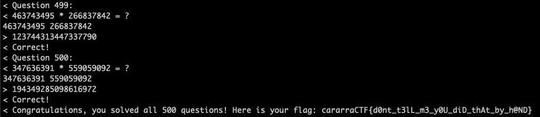

Nice! Our flag is `cararraCTF{d0nt_t3lL_m3_y0U_diD_thAt_by_h@ND}`.

### Additional Solutions

JavaScript Solver (by Mastermind#7720)

```jsx
import WebSocket from "ws";

const socket = new WebSocket(
  "ws://cararra-ctf-files.herokuapp.com/r2/fancy-socks-1"
);

socket.onopen = (e) => {
  console.log("opened");
};

socket.onmessage = (event) => {
  console.log(event.data);
  if (event.data.includes("*")) {
    const [string1, x, string2, ..._] = event.data.split(" ");
    const val1 = parseInt(string1);
    const val2 = parseInt(string2);
    console.log(val1, val2);
    socket.send(`${val1 * val2}`);
  }
};
```

## fancy-socks-2

Cryptography (100 points)

### Problem

Bob is now trying to send secret messages on his socks, so he decided to code up his own encryptor. Can you find the key? Connect to the challenge using the terminal command `websocat ws://cararra-ctf-files.herokuapp.com/r2/fancy-socks-2 -E`. Enter your answer in flag format: if your answer is `HI`, enter the flag `cararraCTF{HI}`.

Relevant links: [websocat](https://github.com/vi/websocat)

### Writeup

After connecting, we notice that we can encrypt any plaintext we want, getting the corresponding ciphertext. This is known as a chosen plaintext attack.

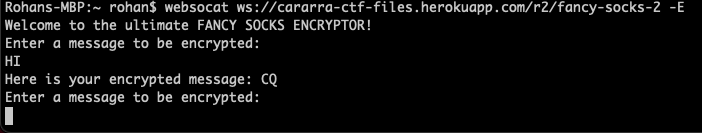

After playing around with different plaintexts, it's evident that it cannot be a Caesar or monoalphabetic substitution cipher, suggesting that it probably is a Vigenere cipher. The chosen plaintext attack against a Vigenere cipher is simply encrypting a long string of A's, giving us the key as follows:

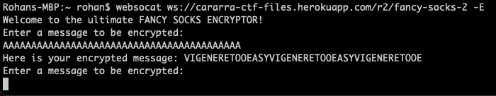

From this, we get that the key is `VIGENERETOOEASY` and that the flag is `cararraCTF{VIGENERETOOEASY}`.

## fancy-socks-3

Cryptography (200 points)

### Problem

Bob has started writing secret messages encrypted with RSA on his socks, and on each sock he also writes the public key he used. You decide to pick up one of his socks, but you don't believe that he knows how to actually decrypt any of them. He said he would prove it to you and decrypt any encrypted message you want (as long as its not the one he wrote down). Can you recover the sock's secret message? Connect to the challenge using the terminal command `websocat ws://cararra-ctf-files.herokuapp.com/r2/fancy-socks-3 -E`.

### Writeup

This is a chosen ciphertext attack against RSA. Although we cannot directly decrypt the desired ciphertext, we can take advantage of the fact that there is no padding by encrypting $c\cdot 2^e$.

Decryption would give us $(c \cdot 2^e)^d \equiv c^d \cdot 2^{ed} \equiv m \cdot 2 \pmod n$, after which we can simply divide the resulting plaintext by 2 to get m.

Here is the code for the exploit:

```python
import asyncio
import websockets
from base64 import b64decode, b64encode

async def solve():
    uri = "ws://cararra-ctf-files.herokuapp.com/r2/fancy-socks-3"
    async with websockets.connect(uri) as websocket:
        print(f"< {await websocket.recv()}")
        line = await websocket.recv()
        print(f"< {line}")
        secret = int.from_bytes(b64decode(line.split(": ")[1]), 'big')
        print(secret)
        print(f"< {await websocket.recv()}")
        line = await websocket.recv()
        print(f"< {line}")
        n = int.from_bytes(b64decode(line.split("= ")[1]), 'big')
        line = await websocket.recv()
        print(f"< {line}")
        e = int.from_bytes(b64decode(line.split("= ")[1]), 'big')
        print(f"< {await websocket.recv()}")
        payload = (secret * pow(2, e, n)) % n
        b64payload = b64encode(bytes.fromhex(hex(payload)[2:]))
        print(n, e, payload, b64payload)
        await websocket.send(b64payload.decode('utf-8'))
        line = await websocket.recv()
        print(f"< {line}")
        plaintext = int.from_bytes(b64decode(line.split(": ")[1]), 'big')//2
        print(bytes.fromhex(hex(plaintext)[2:]).decode('utf-8'))

asyncio.get_event_loop().run_until_complete(solve())
```

## cookie-monster-1

Web Exploitation (125 points)

### Problem

Bob coded up his own version of cookie clicker! Can you buy a flag?

Relevant links: [cookie-monster-1](https://cararra-ctf-files.herokuapp.com/r2/cookie-monster-2)

### Writeup

The title of the challenge suggests that this challenge involves cookies, so we go to the Applications tab of the Developer Console and see a Base64 cookie. 

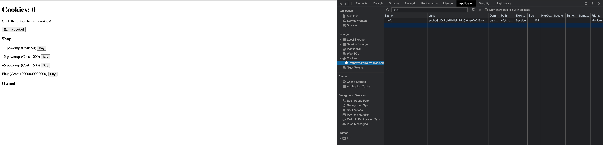

Decoding it, we get this:


It seems like we can now edit the cookie so we have enough cookies to buy a flag! Changing the field and re-encoding, we get:

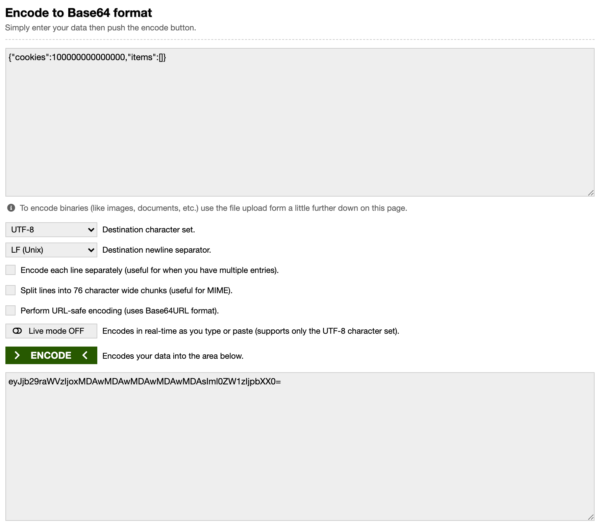

Plugging it into the site, we can now purchase a flag!

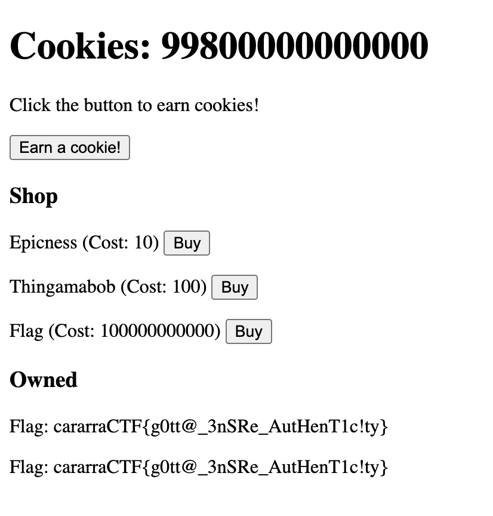

I accidentally bought two, but two is always better than one :). We get that the flag is `cararraCTF{g0tt@_3nSRe_AutHenT1c!ty}` (the solution to this vulnerability is to use JWTs that require a password to sign and verify the cookies, meaning the person cannot change the cookie).

## cookie-monster-2

Web Exploitation (125 points)

### Problem

Bob upgraded his Cookie Monster website! Now can you buy a flag?

Relevant links: [cookie-monster-2](https://cararra-ctf-files.herokuapp.com/r2/cookie-monster-2)

### Writeup

The cookie is now a JWT, so there is no way you're changing that. You can parse it with [JWT.io](http://jwt.io) to see what's in it though:

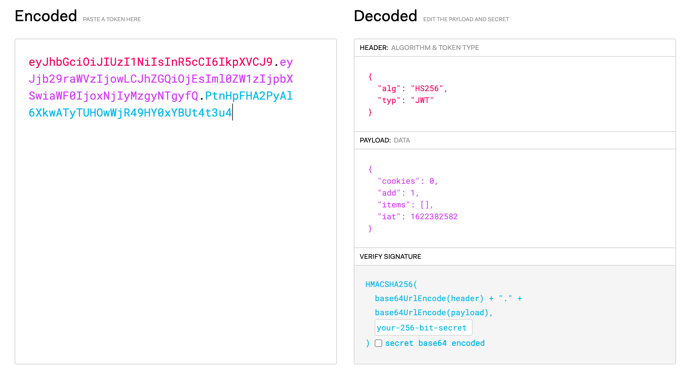

However, if you change the content without the secret and enter the new cookie, you get this beautiful error message:


So, back to the drawing board. By reviewing the source code, you can see how the earn button works: It calls an API by using the query parameter ?earn={amount} based on the add parameter in the cookie.

However, we can also call the API by adding the query parameter ?earn=10000000000000 ourselves(go to the url [http://cararra-ctf-files.herokuapp.com/r2/cookie-monster-2?earn=10000000000000](http://cararra-ctf-files.herokuapp.com/r2/cookie-monster-2?earn=10000000000000)).

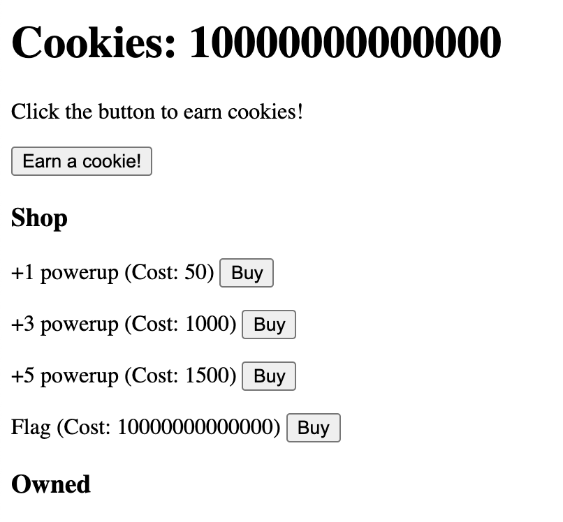

Now we can buy a flag :D.

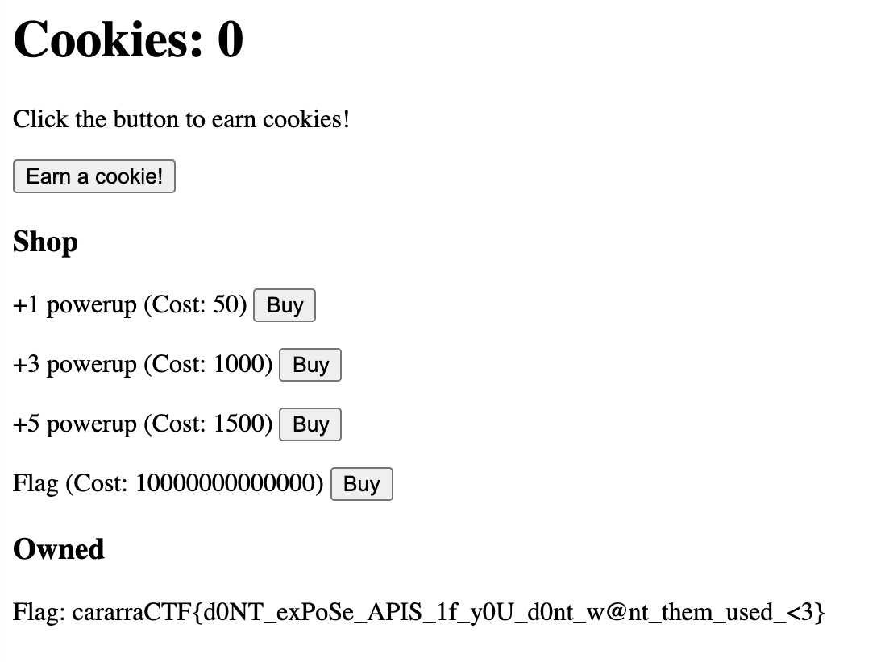

Needed two more zeros, but we got the flag `cararraCTF{d0NT_exPoSe_APIS_1f_y0U_d0nt_w@nt_them_used_<3}`!

## floor-tiling-4

Algorithms (225 points)

### Problem

Bob is tiling his `1 x 1000` floor with `1 x 1 ... 1 x 10` tiles. He has an unlimited supply of each type of tile in `100` different colors numbered `1..N`. However, he only wants certain pairs of colors to be adjacent to each other. Given `C` conditions followed by two numbers (that are not necessarily distinct) on each line representing colors that may be found adjacent to one another, find the number of ways for Bob to tile his floor mod 10^9 + 7.

Relevant links: [floor-tiling-4.txt](https://cararra-ctf-files.herokuapp.com/r2/floor-tiling-4.txt)

### Writeup

This is another DP problem, although the state and transition is not as obvious as previous ones. 

In this case, we use the state dp[i][j][k] where i is how much floor has been tiled so far, j is the length of the final tile of the tiling, and k is the final color.

The transition is then simply two cases: either we extend a previous tile, in which case we have `dp[i][j][k] += dp[i-1][j-1][k]`, or we start a new tile, in which case `dp[i][0][k] += dp[i-1][j-1][l]` where `l` is any color that may be adjacent to `k`.

Here is the implementation:

```python
f = open('floor-tiling-4.txt')

n, t, colors, mod = 1000, 10, 100, 10**9 + 7

adj = [set() for i in range(colors)]

c = int(f.readline())
for i in range(c):
    (a, b) = tuple(map(int, f.readline().split()))
    adj[a-1].add(b-1)
    adj[b-1].add(a-1)

dp = [[[0] * colors for i in range(t)] for i in range(n)]

dp [0][0] = [1] * colors

for i in range(1, n):
    for j in range(t):
        for k in range(colors):
            if j > 0:
                dp[i][j][k] += dp[i-1][j-1][k]
                dp[i][j][k] %= mod
            for l in adj[k]:
                dp[i][0][k] += dp[i-1][j][l]
                dp[i][0][k] %= mod

tot = 0
for j in range(t):
    for k in range(colors):
        tot += dp[n-1][j][k]
        tot %= mod

print(tot)
```

Running the code, we get an answer of `937630127` and a flag of `cararraCTF{937630127}`.

## fancy-socks-4

Reverse Engineering (250 points)

### Problem

Bob thinks he has finally perfected his encryption method. Feeling that RSA had failed him, he decided to create his own encryption technique, and is feeling so confident that its irreversible that he decided to send you the source code. Can you decode the message? Connect to the challenge using the terminal command `websocat ws://cararra-ctf-files.herokuapp.com/r2/fancy-socks-4 -E`.

Relevant links: [fancy-socks-4.txt](https://cararra-ctf-files.herokuapp.com/r2/fancy-socks-4.txt)

### Writeup

Looking at the source code, it seems that the letters of the flag are encrypted three at a time. We could theoretically go through the convoluted code and try to reverse each thing to get a decryption function, but the most straightforward and generalizable way to solve this problem is to just brute force each group of 3, one at a time.

We can do this using the following code:

```jsx
const flag_encrypted =
  "17hdzd017hb3no17hb0h217ilem817eb1ut17e9mbr17gk1t217gdhs617h42zl17g7nsa17h7xh017i0guf17hszza17hm29f17fwlrn";

function encrypt(msg) {
  const bruh = [
    123019231,
    1230125901,
    508,
    52365235,
    412089123,
    1230580342,
    2030923023,
    145031231,
    1323015712,
  ];
  const asdf = [1231, 120309, 58, 89324234, 1023012, 1230580342];
  msg += new Array(4 - (((msg.length + 2) % 3)+1)).join("a");
  encrypted = "";
  for (let i = 0; 3 * i < msg.length; i++) {
    let k =
      256 * 256 * msg.charCodeAt(3 * i) +
      256 * msg.charCodeAt(3 * i + 1) +
      msg.charCodeAt(3 * i + 2);
    for (let j = 0; j < bruh.length; j++) {
      k ^= bruh[j];
    }
    for (let j = 0; j < bruh.length; j++) {
      if (j % 2 == 0) {
        k += bruh[j];
      } else {
        k += 2 * bruh[j];
      }
    }
    for (let j = 0; j < asdf.length; j++) {
      k ^= asdf[j];
    }
    for (let j = 0; j < bruh.length; j++) {
      if (j % 2 == 1) {
        k += 2 * bruh[j];
      } else {
        k += bruh[j];
      }
    }
    for (let j = 0; j < asdf.length; j++) {
      if (j % 3 == 0) {
        k += asdf[j];
      } else {
        k += 2 * asdf[j];
      }
    }
    for (let j = 0; j < bruh.length; j++) {
      if (j % 2 == 1) {
        k -= 2 * bruh[j];
      } else {
        k -= bruh[j];
      }
    }
    encrypted += k.toString(36);
  }
  return encrypted;
}

function run() {
  let flag = "";
  while (!flag.includes("}")) {
    let len = flag.length;
    for (let i = 33; i < 127; i++) {
      for (let j = 33; j < 128; j++) {
        for (let k = 33; k < 128; k++) {
          let test = flag + String.fromCharCode(i, j, k);
          let encrypted = encrypt(test);
          if (flag_encrypted.indexOf(encrypted) == 0) {
            flag += String.fromCharCode(i, j, k);
            break;
          }
        }
        if (flag.length > len) break;
      }
      if (flag.length > len) break;
    }
    console.log(flag);
  }
}

run();
```

Running the code, we get that the flag is `cararraCTF{n0_S3cur1Ty_thrOuGH_0bScuR1TY!!}`.

### Additional Solutions

JavaScript Decryptor (by DefyGG#1673)

```jsx
const crypto = require("crypto");

const flag_encrypted = "17hdzd017hb3no17hb0h217ilem817eb1ut17e9mbr17gk1t217gdhs617h42zl17g7nsa17h7xh017i0guf17hszza17hm29f17fwlrn";

function encrypt(msg) {
  const bruh = [
    123019231,
    1230125901,
    508,
    52365235,
    412089123,
    1230580342,
    2030923023,
    145031231,
    1323015712,
  ];
  const asdf = [1231, 120309, 58, 89324234, 1023012, 1230580342];
  msg += new Array(4 - (msg.length % 3)).join("a");
  encrypted = "";
  for (let i = 0; 3 * i < msg.length; i++) {
    let k =
      256 * 256 * msg.charCodeAt(3 * i) +
      256 * msg.charCodeAt(3 * i + 1) +
      msg.charCodeAt(3 * i + 2);

    for (let j = 0; j < bruh.length; j++) {
      k ^= bruh[j];
    }
    for (let j = 0; j < bruh.length; j++) {
      if (j % 2 == 0) {
        k += bruh[j];
      } else {
        k += 2 * bruh[j];
      }
    }
    for (let j = 0; j < asdf.length; j++) {
      k ^= asdf[j];
    }

    for (let j = 0; j < asdf.length; j++) {
      if (j % 3 == 0) {
        k += asdf[j];
      } else {
        k += 2 * asdf[j];
      }
    }
    encrypted += k.toString(36);
  }

  return encrypted;
}

function decrypt(msg) {
  const bruh = [
    123019231,
    1230125901,
    508,
    52365235,
    412089123,
    1230580342,
    2030923023,
    145031231,
    1323015712,
  ];
  const asdf = [1231, 120309, 58, 89324234, 1023012, 1230580342];
  k=parseInt(msg,36);
  for (let j = 0; j < asdf.length; j++) {
    if (j % 3 == 0) {
      k -= asdf[j];
    } else {
      k -= 2 * asdf[j];
    }
  }
  for (let j = 0; j < asdf.length; j++) {
    k ^= asdf[j];
  }
  for (let j = 0; j < bruh.length; j++) {
    if (j % 2 == 0) {
      k -= bruh[j];
    } else {
      k -= 2 * bruh[j];
    }
  }
  for (let j = 0; j < bruh.length; j++) {
    k ^= bruh[j];
  }
  
  one = k%256;
  two=((k-one)/256)%256;
  
  three=(((k-one)/256)-two)/256;

  s=String.fromCharCode(three)+String.fromCharCode(two)+String.fromCharCode(one);
  return s;
  

}

s=""
s+=decrypt("17hdzd0");
s+=decrypt("17hb3no");
s+=decrypt("17hb0h2");
s+=decrypt("17ilem8");
s+=decrypt("17eb1ut");
s+=decrypt("17e9mbr");
s+=decrypt("17gk1t2");
s+=decrypt("17gdhs6");
s+=decrypt("17h42zl");
s+=decrypt("17g7nsa");
s+=decrypt("17h7xh0");
s+=decrypt("17i0guf");
s+=decrypt("17hszza");
s+=decrypt("17hm29f");
s+=decrypt("17fwlrn");
console.log(s);
```

## amphibian-addict-1

Forensics (200 points)

### Problem

Alice is an amphibian addict, and she came up with an extremely secret recipe for making an amphibian with super powers. Thus, she devised a supposedly unbreakable system of nested zip folders each encrypted with the scientific name of an amphibian species. For example, the password for the outermost zip is "Xenopus lenduensis". Can you retrieve her secret?

Relevant links: [amphibian-addict-1.zip](https://cararra-ctf-files.herokuapp.com/r2/amphibian-addict-1.zip), [AmphibiaWeb](https://amphibiaweb.org/)

### Writeup

To solve this problem, we need to somehow acquire all the scientific names of amphibians programmatically. Searching around on AmphibiaWeb, we come across this [page](https://amphibiaweb.org/data/access.html): 


Since we only care about species names, we can download the JSON file they give us and parse it in order to get a list of species.

```jsx
import json

x =  json.loads(open('species.json').read())
species = []

for amphibian in x:
    species.append(amphibian['genus'] + " " + amphibian['species'])
```

Now that we have all the species, we can simply use Python to brute force possible passwords for each zip file (assuming we opened the outermost zip file ourself).

```python

import zipfile
import os

n = 14

for i in range(n+1):
    file_name = f'zip{n-i}.zip'
    for j in species:
        with zipfile.ZipFile(file_name) as file:
            try:
                file.extractall(pwd=bytes(j, 'utf-8'))
            except:
                x = 2 
            else:
                print("found password")
                os.remove(file_name)
                break
```

Eventually, this script gets us a `flag.txt` file, which we can open to get our flag as `cararraCTF{n1ce_brUt3_f0rC3_scr1Pt!ng}`.

### Additional Solutions

PowerShell Brute Force (by kp#0649)

```powershell
[Net.ServicePointManager]::SecurityProtocol = [Net.SecurityProtocolType]::Tls12
$ErrorActionPreference = "Stop"
$content = Invoke-WebRequest "https://amphibiaweb.org/amphib_names.json" | ConvertFrom-Json
$names = [System.Collections.ArrayList]@()
for ($i = 0; $i-lt $content.Length; $i++) {
    [void]$names.Add($content[$i].genus+" "+$content[$i].species)
}
$curr = Get-Location
for ($i = 14; $i-ge 0; $i--) {
    :INNER foreach ($s in $names) {
        [bool] $checkpoint = $false
        try {
            Expand-7Zip -ArchiveFileName "zip$i.zip" -TargetPath "$curr" -Password "$s"
            $checkpoint = $true
        }
        catch {
        }
        if ($checkpoint) {
            Write-Output "Password: $s"
            rm "zip$i.zip"
            break INNER
        }
    }
}
type "flag.txt"
```

<aside>
💡 This solution is extremely slow and took around 13 minutes to finish.

</aside>

## amphibian-addict-2

Forensics (300 points)

### Problem

Alice is an amphibian addict, and she came up with an extremely secret recipe for making an amphibian with super powers. Since her previous system was too weak, she created many more layers of nested zip folders each encrypted with the scientific name of an amphibian species. For example, the password for the outermost zip is "Oedipina nica". Can you retrieve her secret?

Relevant links: [amphibian-addict-2.zip](https://cararra-ctf-files.herokuapp.com/r2/amphibian-addict-2.zip), [AmphibiaWeb](https://amphibiaweb.org/)

### Writeup

This time, there are 1000 folders, so the brute force strategy we used last time just isn't going to work. It turns out that JohnTheRipper has some optimizations for password cracking (such as storing hashes and extracting hashes from zips), so we can use that to get a drastic speedup.

We can pass [JohnTheRipper](https://github.com/openwall/john) a wordlist of all the amphibian names by putting each name on a new line in a file called `wordlist.txt`. This is the exploit code:

```jsx
import os
import subprocess

n = 1000

for i in range(n+1):
    file_name = "zip%d.zip" % (n-i)
    os.system('zip2john %s > hash.txt' % file_name)
    os.system('john hash.txt --wordlist=wordlist.txt')
    os.system('john hash.txt --show > a.txt')
    passwd = open("a.txt").read().split("\n")[-4].split(":")[1]
    os.system('unzip -o -P \"%s\" %s' % (passwd, file_name))
    os.system('rm -rf %s' % file_name)
    print(i)
```

This code is really clean since it is basically BASH scripting in Python, and running it takes a while but is much, much faster than the brute force alternative. After running, we get our `flag.txt` and can open it to find our flag is `cararraCTF{n1c3_D!cTi0N@RY_4ttack}`.

## super-spreader-4

Algorithms (350 points)

### Problem

Several people named Bob are standing at distinct lattice points of the Cartesian plane. Unfortunately, some of the Bobs have CARARRAVID-19, and each minute, Bobs with the virus spread it to the Bob nearest to them (ties are broken first by smallest x coordinate, then by smallest y coordinate). Find the minimum number of Bobs that must be initially infected for all the Bobs to become infected after a long period of time. The test case gives `N` followed by each Bob's `(x, y)` coordinates on a new line. Enter your answer in flag format: if your answer is `50`, enter the flag `cararraCTF{50}`.

### Writeupt

This problem is the toughest since it uses a very cool data structure to quickly answer nearest neighbor queries: the k-d tree.

Essentially the way it works is each point splits up the plane into two halves, and this allows us to "binary search" for the nearest neighbor using some clever pruning strategies that eventually reduce this from the brute force complexity of $O(N^2)$ to $O(N \log N)$.

You can read more about k-d trees on [Wikipedia](https://en.wikipedia.org/wiki/K-d_tree).

Here is the code (you can also use Python libraries instead but that's lame):

```python
f = open("super-spreader-4.txt")

n = int(f.readline())
points = [tuple(map(int, f.readline().split())) for i in range(n)]
indices = { points[i]:i fortl i in range(len(points)) }

# binary-indexed k-d tree (for node n, its children are 2*n+1 and 2*n+2)
kdtree = [None] * (2*n)

def dist(p1, p2):
    return (p1[0] - p2[0])**2 + (p1[1] - p2[1])**2

# create a tree from the points in array p rooted at an index index in our k-d tree array (the depth determines which way we split the plane)
def create_tree(p, index, depth):
    global kdtree

		# base case 1: if there are no points to put in the tree, there's nothing to do
    if len(p) == 0:
        return

		# base case 2: if there's one point, we just put it at the index
    if len(p) == 1:
        kdtree[index] = p[0]
        return

		# sort the points based on the coordinate by which we're splitting the plane
    p.sort(key=lambda x: x[depth % 2])

		# split the plane by the middle point to make a balanced tree
    mid = len(p) // 2
    kdtree[index] = p[mid]

		# recursively fill in the children of the point
    create_tree(p[:mid], 2*index + 1, depth + 1)
    create_tree(p[mid+1:], 2*index + 2, depth + 1)

def nearest_neighbor(p, index, depth, best_node, best_dist):
		# if we've gone outside of the tree, just return what we've already found
    if index >= len(kdtree) or not kdtree[index]:
        return best_node, best_dist
		
		# check the distance to the current node and update best values as necessary
    d = dist(p, kdtree[index])
    if p != kdtree[index]:
        if d < best_dist:
            best_dist = d
            best_node = kdtree[index]
        if d == best_dist and kdtree[index] < best_node:
            best_node = kdtree[index]

		# if we're to the left of bottom of the splitting line, then go down the left branch of the tree (want to check points in the part of the plane our test point is in first)
    if p[depth % 2] < kdtree[index][depth % 2]:
        best_node, best_dist = nearest_neighbor(p, 2*index + 1, depth + 1, best_node, best_dist)
    else:
        best_node, best_dist = nearest_neighbor(p, 2*index + 2, depth + 1, best_node, best_dist)

		# if the distance to the splitting line is bigger then the best dist, nothing on the other side can be better either
    if abs(p[depth % 2] - kdtree[index][depth % 2])**2 > best_dist:
        return best_node, best_dist

		# if not, recurse down the other branch of the tree
    if p[depth % 2] < kdtree[index][depth % 2]:
        best_node, best_dist = nearest_neighbor(p, 2*index + 2, depth + 1, best_node, best_dist)
    else:
        best_node, best_dist = nearest_neighbor(p, 2*index + 1, depth + 1, best_node, best_dist)

    return best_node, best_dist

def nn(p):
    return nearest_neighbor(p, 0, 0, None, 1000000000)

groups = n
height = [1]*n
parent = [i for i in range(n)]

def find(x):
    if parent[x]==x:
        return x
    return find(parent[x])

def union(x, y):
    global groups
    fx = find(x)
    fy = find(y)
    if fx != fy:
        groups -= 1
    if height[fy] > height[fx]:
        parent[fx] = fy
        height[fy] = max(height[fx]+1, height[fy])
    else:
        parent[fy] = fx
        height[fx] = max(height[fy]+1, height[fx])

create_tree(points[:], 0, 0)

for p in points:
    union(indices[p], indices[nn(p)[0]])

print(groups)
```

Running the code, we get an answer of `31105` and a flag of `cararraCTF{31105}`.


