# Round 3 Writeups

## sanity-check

General Skills (10 points)

### Problem

Enter this flag for 10 free points! Visiting a web page shouldn't be too hard.

Relevant links: [sanity-check](https://cararra-ctf-files.herokuapp.com/r3/sanity-check)

### Writeup

Visit the website and copy the flag `cararraCTF{rOunD_3_t1mE!!}`!

## light-bulbs

General Skills (20 points)

### Problem

There are 64 light bulbs numbered `1 .. 64` controlled by N switches numbered `1 .. N`. Switch `i` controls `k_i` light bulbs. If the lights are all initially off and Bob decides to flip switches `Q` times, find how many lights are on after Bob flips his switches. The test case gives `N` and `Q` followed by `N` lines starting with `k_i` and the numbers of the lightbulbs controlled by the corresponding switches. The next `Q` lines give the (not necessarily distinct) switches that Bob flips.  Enter your answer in flag format: if your answer is `50`, enter the flag `cararraCTF{50}`.

Relevant links: [light-bulbs.txt](https://cararra-ctf-files.herokuapp.com/r3/light-bulbs.txt)

### Writeup

This problem is fairly easy to solve, but doing so cleanly is a bit more tricky. Using bit masks is the cleanest way to do so since each switch corresponds to a binary number, as does the current states of the lights. Flipping a switch simply corresponds to XORing it with the current state of the lights.

At the end, we simply find the bit sum of the light state to see how many are on.

```python
f = open("light-bulbs.txt")

n, q = tuple(map(int, f.readline().split()))
mask = [0] * n
for i in range(n):
    for num in map(int, f.readline().split()[1:]):
        mask[i] += pow(2, num - 1)

lights = 0
for i in range(q):
    lights ^= mask[int(f.readline())-1]

print(bin(lights).count("1"))
```

Running the code, it turns out that exactly half of the lights end up on, so our flag is `cararraCTF{32}`.

### Additional Solutions

Java XOR (by kp#0649)

```java
import java.util.*; 
import java.io.*;
import java.math.*; 

public class lightbulbs {
    public static void main(String[] args) throws IOException {
        BufferedReader br = new BufferedReader(new FileReader("light-bulbs.txt")); 
        StringTokenizer st = new StringTokenizer(br.readLine()); 
        int n = Integer.parseInt(st.nextToken()); 
        int q = Integer.parseInt(st.nextToken());
        BigInteger[] mask = new BigInteger[n];
        Arrays.fill(mask,BigInteger.ZERO);
        for (int i = 0; i<n; i++) {
            st = new StringTokenizer(br.readLine()); 
            int k = Integer.parseInt(st.nextToken()); 
            for (int j = 0; j<k; j++) {
                int val = Integer.parseInt(st.nextToken());
                mask[i] = mask[i].add(BigInteger.ONE.shiftLeft(val));
            }
        }
        BigInteger ans = BigInteger.ZERO;
        for (int i = 0; i<q; i++) {
            int j = Integer.parseInt(br.readLine())-1;
            ans = ans.xor(mask[j]);
        }
        System.out.println(ans.bitCount());
    }
}
```

## number-sense-1

Algorithms (30 points)

### Problem

A number `N` followed by `N` lines each consisting of a set of digits is given in the test case. For each set of digits, find the largest multiple of 2, 3, and 5 that can be created using a subset of the digits, then find the sum of the `N` multiples you find mod `10^9 + 7`. If such a multiple does not exist for a certain set of digits, do not add anything to your sum. Enter your answer in flag format: if your answer is `50`, enter the flag `cararraCTF{50}`.

### Writeup

We first need to notice some things about N. First, we know it must have a 0 as its unit digits to be divisible by 2 and 5. Second, the sum of the digits must be a multiple of 3.

Setting the units digit to 0 is easy: If there is at least one 0 in the test case, we just put that and the end and we're good (if not, it isn't possible to create such an N).

Making the sum a multiple of 3 involves either removing a digit that is congruent to the sum mod 3 (in which case the resulting sum will become a multiple of 3) or removing two digits that are not.

Here is the implementation:

```python
f = open("number-sense-1.txt")

n = int(f.readline())
tot = 0

for i in range(n):
    digits = list(map(int, f.readline().strip()))
    occurrences = [0] * 10
		# stores the digits in each residue class mod 3 in increasing order
    mod = [[] for i in range(3)]
    digits.sort()

    for i in digits:
        occurrences[i] += 1
        mod[i%3].append(i)

    s = sum(digits)
    if occurrences[0] == 0:
        continue
		# check if we have to remove a digit
    if s%3 != 0:
        if len(mod[s%3]) == 0:
						# If there is no single digit we can subtract, we subtract the smallest two digits that would give a sum divisible by 3
            occurrences[mod[3 - s%3][0]] -= 1
            occurrences[mod[3 - s%3][1]] -= 1
        else:
						#If there is a single digit, we subtract the smallest one
            occurrences[mod[s%3][0]] -= 1

		# construct the number
    ans = ""
    for i in range(9, -1, -1):
        ans += str(i) * occurrences[i]
    
    tot += int(ans)
    tot %= 10**9 + 7

print(tot)
```

Running the code, we get an answer of `862082217` and a flag of `cararraCTF{862082217}`.

## number-sense-2

Algorithms (75 points)

### Problem

A number `N` followed by `N` lines each consisting of a set of digits of size at most 15 is given in the test case. For each set of digits, find the largest multiple of 2, 5, and 11 that can be created using ALL of the digits, then find the sum of the `N` multiples you find mod `10^9 + 7`. If such a multiple does not exist for a certain set of digits, do not add anything to your sum. Enter your answer in flag format: if your answer is `50`, enter the flag `cararraCTF{50}`.

### Writeup

In this case, N is small enough for brute force. We can't do naive brute force and go through all 15! permutations, but we know that the sum of the digits must be a multiple of 3 and that the sum of alternating digits must differ by a multiple of 11 from each other.

First, we check if there's a 0 for our units digit. Since we have to use all of the digits, we can check the multiple of 3 condition at the beginning as well. Then, we basically just go through every way of splitting alternating digits and check if it satisfies the divisibility condition for 11.

```python
f = open("number-sense-2.txt")

n = int(f.readline())
tot = 0

def gen_choices(n, choices = [], i = 0, k = 0):
    if k == n // 2:
        return [choices + [0] * (n - i)]
    if i >= n:
        return []
    return gen_choices(n, choices + [1], i+1, k+1) + gen_choices(n, choices + [0], i+1, k)

choices = [gen_choices(i) for i in range(16)]

for i in range(n):
    digits = list(map(int, f.readline().strip()))
    digits.sort(reverse=True)
    if digits[-1] != 0:
        continue
    digits.pop()
    s = sum(digits)
    if s%3 != 0:
        continue
    best = 0
    for choice in choices[len(digits)]:
        split_digits = [[], []]
        for i in range(len(digits)):
            split_digits[choice[i]].append(digits[i])
        if (sum(split_digits[1]) - sum(split_digits[0])) % 11 == 0:
            num = ""
            for i in range(len(digits)):
                num += str(split_digits[i%2][i//2])
            num += "0"
            best = max(best, int(num))
    tot += best
    tot %= 10**9 + 7
                

print(tot)
```

Running the code, we get an answer of `661975339` and a flag of `cararraCTF{661975339}`.

## number-sense-3

Algorithms (125 points)

### Problem

Bob has a secret number N whose greatest prime factor is 5. He wants you to guess it, but he will only tell you the greatest common divisor of the number you guess and N. Guess his number to get the flag! Connect to the challenge using the terminal command `websocat ws://cararra-ctf-files.herokuapp.com/r3/number-sense-3 -E` and keep in mind that a new N is generated each time you do.

Relevant links: [websocat](https://github.com/vi/websocat)

### Writeup

In terms of prime factors, taking the GCD basically returns the largest power of each prime factor between the two numbers. So, if X has a greater power for each prime factor (i.e. it is a multiple of N), then gcd(X, N) = N.

We can use Python to calculate  and send that to the websocket. The number we get back is simply N, so we can send that back across the websocket. 

```python
import asyncio
import websockets

async def solve():
    uri = "ws://cararra-ctf-files.herokuapp.com/r3/number-sense-3"
    async with websockets.connect(uri) as websocket:
        print(f"< {await websocket.recv()}")
        print(f"< {await websocket.recv()}")
        power = 2 ** 1000 * 3 ** 1000 * 5 ** 1000
        await websocket.send(f"{power}")
        print(f"> {power}")
        recv = await websocket.recv()
        print(f"< {recv}")
        gcd = int(recv.split(" = ")[1])

        print(f"< {await websocket.recv()}")
        await websocket.send(f"{gcd}")
        print(f"> {gcd}")
        print(f"< {await websocket.recv()}")

asyncio.get_event_loop().run_until_complete(solve())
```

Running the code, we get a flag of `cararraCTF{gCd_g1v3S_P4Rt1AL_1nfo!!!}.`

## number-sense-4

Algorithms (175 points)

### Problem

Bob has a secret number `N` less than  whose greatest prime factor is at most 13. He wants you to guess it, but for a guess `X` he will only tell you `gcd(2*3*5*7*11*13, X/gcd(X, N))`. Guess his number to get the flag! Connect to the challenge using the terminal command `websocat ws://cararra-ctf-files.herokuapp.com/r3/number-sense-4 -E` and keep in mind that a new `N` is generated each time you do.

Relevant links: [websocat](https://github.com/vi/websocat)

### Writeup

The function Bob returns seems pretty arbitrary, but if you think about what it does, `X/gcd(X, N)` essentially tells us how much larger X's powers are than N.

For example, if X is  and N is , then X/gcd(X, N) = .

Once we take the gcd with , we essentially know which of X's powers are larger than N, but we don't know by how much. Since we have unlimited tries, we can basically just check increasing powers of 2 until a 2 shows up in the answer, at which point we know the previous power of 2 was the biggest power of 2 in N.

Implementing this concept, we have the following code:

```python
import asyncio
import websockets

async def solve():
    uri = "ws://cararra-ctf-files.herokuapp.com/r3/number-sense-4"
    async with websockets.connect(uri) as websocket:
        print(f"< {await websocket.recv()}")

        primes = [2, 3, 5, 7, 11, 13]
        powers = [0] * len(primes)
        
        for i in range(len(primes)):
            while True:
                print(f"< {await websocket.recv()}")
                power = primes[i] ** powers[i]
                await websocket.send(f"{power}")
                print(f"> {power}")
                recv = await websocket.recv()
                print(f"< {recv}")
                gcd = int(recv.split(" = ")[1])
                if gcd != 1:
                    break
                powers[i] += 1

        print(f"< {await websocket.recv()}")
        power = 1
        for i in range(len(primes)):
            power *= primes[i] ** (powers[i]-1)
        await websocket.send(f"{power}")
        print(f"> {power}")
        print(f"< {await websocket.recv()}")

asyncio.get_event_loop().run_until_complete(solve())
```

Running the code, we get a flag of `cararraCTF{unl1m1t3d_tr1es_t00_eZ}`.

## number-sense-5

Algorithms (200 points)

### Problem

Bob has a secret number `N` less than  whose greatest prime factor is at most 13. He wants you to guess it, but for a guess `X` he will only tell you `gcd(2*3*5*7*11*13, X/gcd(X, N))`. Guess his number to get the flag! You only get 11 tries before Bob gets tired and disconnects. Connect to the challenge using the terminal command `websocat ws://cararra-ctf-files.herokuapp.com/r3/number-sense-5 -E` and keep in mind that a new `N` is generated each time you do.

Relevant links: [websocat](https://github.com/vi/websocat)

### Writeup

This time, we have to be a bit more careful since we can't just guess each prime sequentially. However, since we know when our guessed prime is too big or too small, we can simply use binary search, and binary search on each prime in parallel.

Here is the code:

```python
import asyncio
import websockets
import math

async def solve():
    uri = "ws://cararra-ctf-files.herokuapp.com/r3/number-sense-5"
    async with websockets.connect(uri) as websocket:
        print(f"< {await websocket.recv()}")
        print(f"< {await websocket.recv()}")

        primes = [2, 3, 5, 7, 11, 13]
        lo_values = [0] * len(primes)
        hi_values = [1000] * len(primes)
        
        while True:
            print(f"< {await websocket.recv()}")
            power = 1
            for i in range(len(primes)):
                mid = (lo_values[i] + hi_values[i])//2
                power *= primes[i] ** mid
            await websocket.send(f"{power}")
            print(f"> {power}")
            recv = await websocket.recv()
            print(f"< {recv}")
            gcd = int(recv.split(" = ")[1])
            for i in range(len(primes)):
                mid = (lo_values[i] + hi_values[i])//2
                if math.gcd(primes[i], gcd) == 1:
                    lo_values[i] = mid
                else:
                    hi_values[i] = mid
            print(lo_values, hi_values)
            if all(lo + 1 == hi for (lo, hi) in zip(lo_values, hi_values)):
                break

        print(f"< {await websocket.recv()}")
        power = 1
        for i in range(len(primes)):
            power *= primes[i] ** lo_values[i]
        await websocket.send(f"{power}")
        print(f"> {power}")
        print(f"< {await websocket.recv()}")

asyncio.get_event_loop().run_until_complete(solve())
```

Running the code, we get an answer of `cararraCTF{p@rAll3l_b1N4RY_S3arCH!!!}`.

## hex-messages

Forensics (25 points)

### Problem

That doesn't look like a flag...

Relevant links: [hex-messages.txt](https://cararra-ctf-files.herokuapp.com/r3/hex-messages.txt)

### Writeup

Opening the file with a text editor, we see the following: 

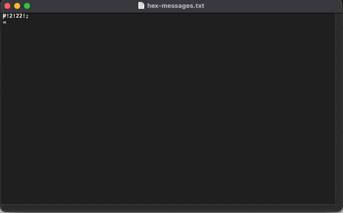

That doesn't look like a flag as the problem states, but the title of the question suggests that the answer lies in the bytes of the file. Opening the file with Hex Fiend, we see something that may resemble a flag more:

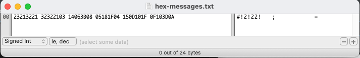

Writing this out in an easier to read fashion, we have `23 21 32 21 32 32 21 03 14 06` ... The first part of this sequence oddly resembles 'cararra' and 'CTF', if 23 represents 'c', 21 represents 'a', 32 represents 'r', and so forth. If you know your ASCII numbers, you probably know that capital letters are offset from lowercase letters by 20 and that uppercase letters start at 'A' = 43.

If we shift everything up by 40, we get our flag is `cararraCTF{HEX_DUMP_OP}`

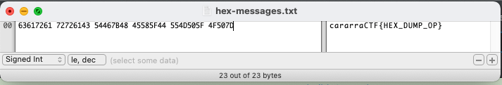

## magic-bytes

Forensics (50 points)

### Problem

Bob tried to obscure the file type of his flag. Can you recover it?

Relevant links: [magic-bytes](https://cararra-ctf-files.herokuapp.com/r3/magic-bytes)

### Writeup

Opening the file in Hex Fiend, we see a header that is characteristic of a PNG (I was also nice and kept in the letters "PNG" as a hint).

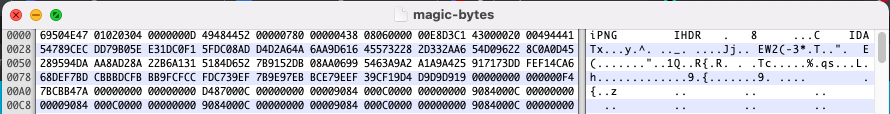

However, after changing the file extension and trying to open it, we get an error message: 


Since the question is called magic bytes, there probably is a problem with the magic bytes. Searching up what the magic bytes are supposed to be on Wikipedia, we have `89 50 4E 47 0D 0A 1A 0A`.

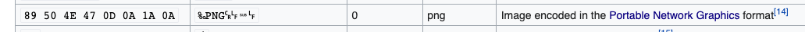

Copying and pasting over the first 8 bytes of the file and then opening it up, we finally get our flag in PNG format.

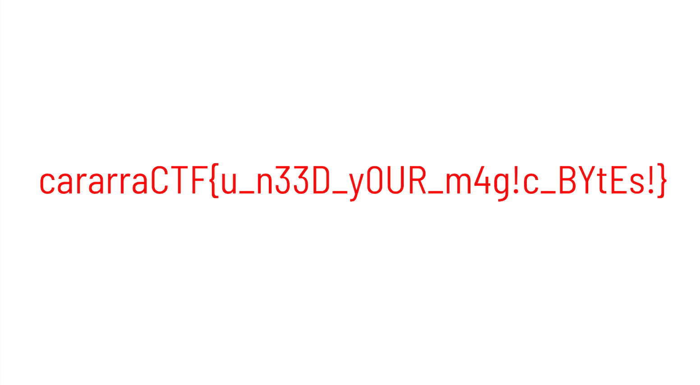

Thus, our flag is `cararraCTF{u_n33d_y0UR_m4g!c_BytEs!}`.

## know-your-crcs

Forensics (100 points)

### Problem

Malice changed up one byte of Bob's PNG and now he can't open it. Recover the contents for him.

Relevant links: [know-your-crcs.png](https://cararra-ctf-files.herokuapp.com/r3/know-your-crcs.png)

### Writeup

In the context of PNGs, CRCs are Cyclic Redundancy Checks. Basically, they are 4 byte values computed on each chunk of the PNG and are used to ensure that the PNG has not been corrupted.

In this case, a byte was changed somewhere, and we can figure out which chunk was effected by double checking the CRCs. Luckily for us, this PNG file only has 3 chunks (IHDR, IDAT, and IEND).

Starting with IHDR, we can use [https://crccalc.com/](https://crccalc.com/) to calculate the CRC on the relevant bytes of the IHDR chunk (all of it excluding the length field: `49484452000000FA000000150806000000`).

It turns out that the CRC for the IHDR chunk should have been `0x6FFEF36A`, but the current CRC is `0x6FEFF36A`.

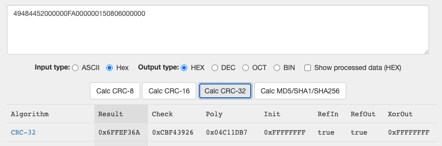

Fixing the byte that's off, we can open our image and get the flag.


Our flag is `cararraCTF{cRCs_prevent_CoRruP1tioN}` (technically they don't prevent it, but they do  ensure that the image you open is not corrupted).

## ocr-n00b

Forensics (30 points)

### Problem

That flag is somewhat long, so you probably don't want to transcribe it...

Relevant links: [ocr_n00b.jpg](https://cararra-ctf-files.herokuapp.com/r3/ocr-n00b.jpg)

### Writeup

This problem is fairly straightforward, but just requires a bit more than just transcribing the flag. We can use some online OCR software ([https://www.onlineocr.net/](https://www.onlineocr.net/)) to convert the picture to hex digits.

We now have the hex:

```markdown
636172617272614354467b746869735f666c61675f69735f766572795f6c6f6e675f736f5f646f5f6e6f745f7472795f746f5f7472616e7363726962655f69745f62795f68616e645f706c735f7573655f6f63725f3c335f31323033393132303338393132303339383130323933383130323933313032393338313032393331303932333831303932363132333137383038363435333532333432333132333137363835363734353233313233313632333431323738393937343536343536323334323331327d
```

All we need to do now is convert it to ASCII:

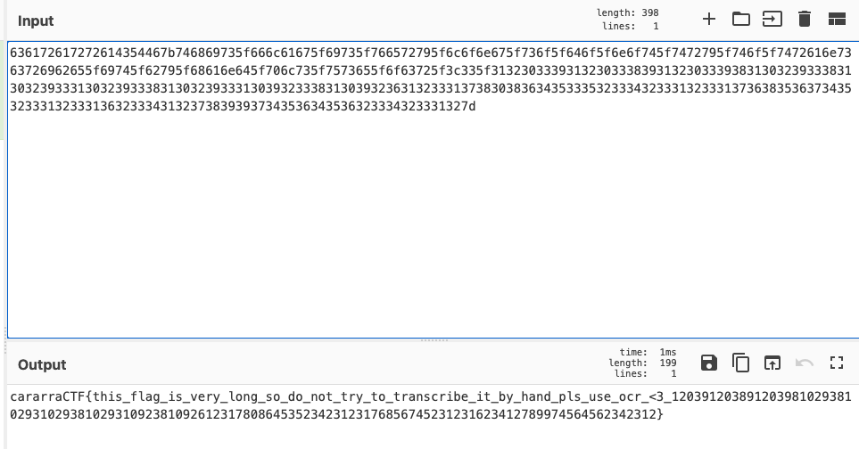

And we got our flag! `cararraCTF{this_flag_is_very_long_so_do_not_try_to_transcribe_it_by_hand_pls_use_ocr_<3_12039120389120398102938102931029381029310923810926123178086453523423123176856745231231623412789974564562342312}`

## ocr-pr0

Forensics (150 points)

### Problem

Retrieve the massive flag. Unfortunate, online tools will probably not cut it for this one.

Relevant links: [ocr_pr0.zip](https://cararra-ctf-files.herokuapp.com/r3/ocr-pr0.zip)

### Writeup

From an initial review of the files, it seems that each is a character in decimal (99 corresponds to 'c', 97 corresponds to 'a', and so on). Now, we can either transcribe each decimal number by hand then convert the decimal values to ASCII, or we can use a Python script and OCR libraries to do it for us.

The second option seems a bit more attractive, so we can use `pytesseract` to read in the numbers. To increase the accuracy, we can limit it to digits, and then we convert the decimal number to a character and append it to our flag.

```python
from PIL import Image

import pytesseract

flag = ""

for i in range(249):
    flag += chr(int(pytesseract.image_to_string(Image.open(f'flag{i}.png'), config='digits').strip()))
    print(flag)
```

Running the code, we get that our flag is `cararraCTF{th1s_tIMe_y0U_n33D_a_scr1pT_python_OCR_libraries_kinda_op_lets_make_Th1s_fl@g_v3ry_L0NG_12039812051720394810238102975108231092381027519284391230127341859718236123812931240129856324182830128731925691283710238120938124912317203981203019238}`.

### Additional Solutions

Brute Force (by kp#0649)

```java
Open each of the files manually and add it to your final string. 
```

## string-things-1

Algorithms (50 points)

### Problem

Bob wants to find all the indices where a certain gene could be in the genome of C. cararricus. The test case gives the gene of interest on the first line and the genome on the second line. Find the sum of all starting indices of possibly overlapping occurrences of the gene in the genome.

### Writeup

There are several ways to do this problem, and technically we should use an O(N) algorithm like Rabin-Karp or KMP. However, it turns out that Python's built in substring function is very very fast (it uses a mix of Boyer-Moore and Horspool), and even using O(N^2) can be pretty fast.

If we simply use the built in function, we can get the answer fairly quickly:

```python
f = open('string-things-1.txt')

gene = f.readline().strip()
genome = f.readline().strip()

# taken from https://stackoverflow.com/questions/35220418/runtime-of-pythons-if-substring-in-string
def find_all(a_str, sub):
    start = 0
    while True:
        start = a_str.find(sub, start)
        if start == -1: return
        yield start
        start += 1

print(sum(list(find_all(genome, gene))))
```

Running the code, we get an answer of `231680270` and a flag of `cararraCTF{231680270}`.

### Additional Solutions

Java Brute Force (by kp#0649)

```java
import java.util.*;
import java.io.*; 

public class stringthings1 {
    public static void main(String[] args) throws IOException{
        BufferedReader br = new BufferedReader(new FileReader("string-things-1.txt"));
        String check = br.readLine();
        String path = br.readLine();
        int n = path.length();
        int i = 0, ans = 0; 
        while (i<n) {
            i = path.indexOf(check,i);
            if (i == -1) break; 
            ans += i; 
            i++; 
        }
        System.out.println(ans);
    }   
}
```

## string-things-2

Algorithms (100 points)

### Problem

Bob got bored of looking for genes, so now he wants to look for long palindromes in the small genome of Q. bowl. The test case gives the genome. Find the length of the longest palindrome in the genome.

Relevant links: [string-things-2](https://cararra-ctf-files.herokuapp.com/r3/string-things-2.txt)

### Writeup

This question involves some fairly straightforward dynamic programming, where dp[i][j] stores whether or not the substring from i to j is a palindrome. Building up possible palindromes from there is pretty easy (if the letters on the left and the right of a palindrome are equal, we can expand it).

Here is the code:

```python
f = open("string-things-2.txt")
s = f.readline().strip()

start = 0
length = 0

n = len(s)

dp = [[False] * n for i in range(n)]

for i in range(n):
    dp[i][i] = True

for l in range(2, n+1):
    for i in range(n-l+1):
        if s[i] == s[i+l-1]:
            if i+1 >= i+l-2:
                dp[i][i+l-1] = True
            else:
                dp[i][i+l-1] = dp[i+1][i+l-2]
        if dp[i][i+l-1] and length < l:
            start = i
            length = l

print(length)
print(s[start: start+length])
```

Running it, we get an answer of `824` and a flag of `cararraCTF{824}` .

### Additional Solutions

Java Brute Force (by kp#0649)

```java
import java.util.*;
import java.io.*; 

public class stringthings2 {
    public static void main(String[] args) throws IOException{
        BufferedReader br = new BufferedReader(new FileReader("string-things-2.txt"));
        char[] string = br.readLine().toCharArray();
        int n = string.length; 
        int ans = 0; 
        for (int i = 0; i<n; i++) {
            for (int j = i+1; j<n; j++) {
                boolean ok = true; 
                for (int k = 0; k<(j-i+1)/2; k++) {
                    if (string[i+k] != string[j-k]) {
                        ok = false; 
                        break; 
                    }
                }
                if (ok) {
                    ans = Math.max(ans,j-i+1);
                }
            }
        }
        System.out.println(ans);
    }   
}
```

## string-things-3

Algorithms (250 points)

### Problem

Bob got bored of looking for genes, so now he wants to look for long palindromes in the massive genome of C. cararrasaurus. The test case gives the genome. Find the length of the longest palindromic substring in the genome.

Relevant links: [string-things-3](https://cararra-ctf-files.herokuapp.com/r3/string-things-3.txt) 

### Writeup

Finding a linear time solution to the longest palindromic substring is pretty hard, but you can learn about [Manacher's algorithm on Geeks for Geeks](https://www.geeksforgeeks.org/manachers-algorithm-linear-time-longest-palindromic-substring-part-2/). The idea is pretty cool and involves avoiding repeating character comparisons.

Here is the code:

```java
import java.util.*;
import java.io.*;

class solver {
    public static void main(String[] args) throws IOException {
        Scanner sc = new Scanner(new File("string-things-2.txt"));
        char[] s = sc.nextLine().toCharArray();
        int n = 2 * s.length + 1;

        int[] lps = new int[n];
        lps[1] = 1;

        int c = 1;
        int r = 2;
        int maxl = 0;
        int maxcenter = 0;

        for (int ir = 2; ir < n; ir++) {
            int il = 2 * c - ir;
            lps[ir] = 0;
            if (r - ir > 0)
                lps[ir] = Math.min(lps[il], r - ir);

            while (ir + lps[ir] < n - 1 && ir - lps[ir] > 0) {
                if ((ir + lps[ir] + 1) % 2 == 0 || s[(ir + lps[ir] + 1) / 2] == s[(ir - lps[ir] - 1) / 2])
                    lps[ir] += 1;
                else
                    break;
            }

            if (lps[ir] > maxl) {
                maxl = lps[ir];
                maxcenter = ir;
            }

            if (ir + lps[ir] > r) {
                c = ir;
                r = ir + lps[ir];
            }
        }

        System.out.println(maxl);
    }
}
```

Running it, we get an answer of `3046` and a flag of `cararraCTF{3046}` . I had to use Java since Python is incredibly slow.

### Additional Solutions

Java Manacher (by kp#0649)

```java
import java.util.*;
import java.io.*;

public class stringthings3 {
    public static void main(String[] args) throws IOException {
        BufferedReader br = new BufferedReader(new FileReader("string-things-3.txt"));
        String s = br.readLine();
        StringBuilder temp = new StringBuilder("@");
        for (int i = 0; i<s.length(); i++) {
            temp.append("#").append(s.substring(i,i+1));
        }
        temp.append("#&");
        char[] str = temp.toString().toCharArray();
        int[] p = new int[str.length];
        int c = 0, r = 0, ans = 0, ind = 0;
        for (int i = 1; i<str.length-1; i++) {
            int nxt = c-i+c;
            if (r > i) {
                p[i] = Math.min(r-i,p[nxt]);
            }
            while ((i+1+p[i]) < str.length && (i-1-p[i]) >= 0 && str[i+1+p[i]] == str[i-1-p[i]]) {
                p[i]++;
            }
            if (i+p[i] > r) {
                c = i;
                r = i+p[i];
            }
            if (p[i] > ans) {
                ans = p[i];
                ind = i;
            }
        }
        int start = (ind - 1 - ans) / 2; 
        System.out.println(ans);
    }
}
```

<aside>
💡 Code adapted from [HackerEarth](https://www.hackerearth.com/practice/algorithms/string-algorithm/manachars-algorithm/tutorial/).

</aside>

## curling-1

Web Exploitation (50 points)

### Problem

Get the flag!

Relevant links: [curling-1](https://cararra-ctf-files.herokuapp.com/r3/curling-1)

### Writeup

This problem is fairly straightforward (we just want to automate guessing numbers). However, we could either spend time writing a python script or we can use a simple BASH command: 

```bash
curl http://cararra-ctf-files.herokuapp.com/r3/curling-1?number=[1-1000] -s | grep cararraCTF
```

Although this does get the answer, it takes a very long time to run since it sends the requests sequentially. We can get an almost 1000x speedup just by sending the requests asynchronously using the following command:

```bash
for i in {1..1000}; do curl http://cararra-ctf-files.herokuapp.com/r3/curling-1?number=$i -s & done | grep cararraCTF
```

Running the command, we get the flag is `cararraCTF{curl1nG_1s_4_c00l_spOrt}`.

## curling-2

Web Exploitation (125 points)

### Problem

Bob is very specific with the cookies he likes and will only send you the flag if you give him the right number of each type of cookie.

Relevant links: [curling-2](https://cararra-ctf-files.herokuapp.com/r3/curling-2)

### Writeup

This one is fairly straightforward, but it requires knowing how to parse HTML (or you can copy and paste then parse your text file).

We can retrieve the cookies and their values using a basic webscraper in Python:

```python
import requests
import random
from bs4 import BeautifulSoup

URL = 'http://localhost:3001/r3/curling-2'
page = requests.get(URL)

soup = BeautifulSoup(page.content, 'html.parser')
table = soup.table
table_body = table.find('tbody')
rows = table_body.find_all('tr')

cookies = []
for row in rows:
    cols = row.find_all('td')
    for i in range(len(cols)):
        cols[i] = cols[i].text.strip()
    cookies.append('' + cols[0] + '=' + cols[3] + ';')

print("".join(cookies))
```

Running the code, we get: 


We can now pass these cookies into cURL, and we get some HTML (unfortunately, no flag still).

```bash
curl -b "Aachener Printen=17;Abernethy=10;Afghan biscuits=20;Alfajor=16;Almond biscuit=9;Amaretti di Saronno=16;Animal cracker=9;ANZAC biscuit=6;Aparon=10;Apas=12;Apple cider cookie=16;Baci di dama=17;Turkish=12;Barquillo=14;Barquiron=13;Bath Oliver=9;Berger Cookie=12;Berner Haselnusslebkuchen=10;Berner Honiglebkuchen=16;Biscocho=12;Biscotti=13;Biscuit=15;Biscuit roll=7;Bizcochito=9;Black and white cookie=12;Boortsog=14;Bourbon biscuit=12;Bredela=19;Broas=15;Butter cookie=14;Butter pecan=7;Camachile cookie=9;Caramel shortbread=12;Carrot cake cookie=13;Cat's tongue cookie=8;Cavallucci=13;Caycay=12;Charcoal biscuit=15;Chocolate biscuit=5;Chocolate chip cookie=14;Chocolate-coated marshmallow treats=12;Christmas cookies=9;Coconut macaroon=6;Cornish fairings=20;Coyotas=15;Cream cracker=7;Cuccidati=20;Custard cream=19;Digestive biscuit=11;Dutch letter=15;Empire biscuit=12;Fig roll=15;Florentine Biscuit=18;Flour kurabiye=6;Fortune cookie=13;Fudge cookie=5;Galletas de bato=5;Galletas de patatas=13;Galletas del Carmen=5;Galletas pesquera=10;Garibaldi biscuit=19;Ghorabiye=5;Ghoriba=10;Gingerbread=15;Gingerbread man=17;Ginger snaps=11;Half-moon cookie=17;Hamantash=6;Jacobina=10;Jammie Dodgers=17;Joe Frogger=12;Jodenkoek=12;Jumble=12;Kaasstengels=12;Kahk=10;Khapse=11;Kichel=9;Kleicha=5;Koulourakia=5;Kourabiedes=5;Krumiri=6;Krumkake=7;Kue gapit=10;Kue satu=16;Lady Finger (cookie)=17;Lebkuchen=17;Lengua de gato=11;Lincoln biscuit=7;Linga=10;Ma'amoul=15;Macaroon=15;Macaron=15;Malted milk (biscuit)=20;Maple leaf cream cookies=17;Marie biscuit=8;Masa podrida=16;Moravian spice cookies=11;Nice biscuit=14;Nocciolini di Canzo=19;Oat crisps=17;Oatmeal raisin=16;Oreo=15;Otap=12;Paciencia=5;Paborita=17;Panellets=19;Paprenjak=11;Party ring=12;Peanut butter cookie=18;Petit-Beurre=13;Pepernoten=6;Piaya=16;Pignolo (macaroon)=9;Pinwheel cookies=16;Pizzelle=15;Puto seco=17;Putri salju=7;Rainbow cookie=10;Reshteh Khoshkar=20;Ricciarelli=15;Rich tea=7;Rosca=14;Rosette=5;Rosquillo=8;Rum ball=17;Russian tea cake=20;Sandwich cookie=7;Semprong=14;Shortbread=13;Silvana=13;Snickerdoodle=11;Speculaas=6;Springerle=19;Stroopwafel=15;Sugar cookie=7;Tahini cookie=14;Tareco=7;Teiglach=19;Tirggel=5;Toll House Cookie=6;Ube crinkles=19;Ugoy-ugoy=16;Vanillekipferl=6;Wafer=9;Wibele=13;" https://cararra-ctf-files.herokuapp.com/r3/curling-2
```

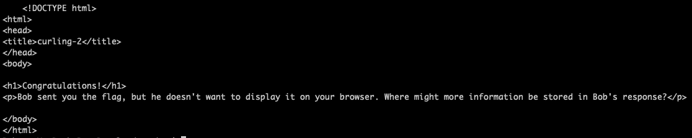

Responses come with both a header and body, and curl by default only displays the body. We can either look for just the head using the `-I, --head` option or get everything together using the `-v, --verbose` option.

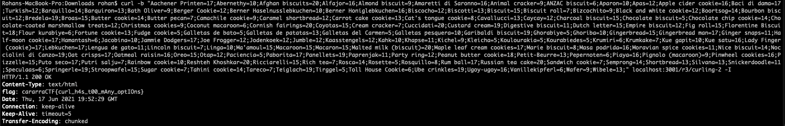

Finally, we have the flag is `cararraCTF{curl_h4s_t00_mAny_optIOns}`.

## web-crawlin

General Skills (200 points)

### Problem

Can you find the flag?

Relevant links: [web-crawlin.html](https://cararra-ctf-files.herokuapp.com/r3/web-crawlin.html)

### Writeup

Doing this by hand would take forever, but this is a common application of web crawling (which is also used to classify web pages for Google's PageRank algorithm).

We can write some simple python code to traverse the pages using BFS, then grep the output for cararraCTF.

```bash
import requests
from bs4 import BeautifulSoup

queue = ['http://localhost:3001/r3/web-crawlin.html']
visited = set()
visited.add(queue[0])

while queue:
    url = queue.pop(0)
    response = requests.get(url)
    html = response.content
    print(html)

    soup = BeautifulSoup(html)
    for link in soup.findAll('a'):
        hf = link.get("href")
        if hf:
            hf = "http://localhost:3001" + hf
            if not hf in visited:
                queue.append(hf)
                visited.add(hf)
```

Running the command , `python crawler.py | grep cararraCTF{.*} -o` we get our flag is `cararraCTF{w3b_cr4wl1ng_is_@_G00d_sk!lL}`.

## greedy-businessman-1

Algorithms (150 points)

### Problem

Bob the businessman wants to earn as much money as he can, and if he closes a deal `i` by the end of a certain day `d_i`, he gets `p_i` dollars for it. Unfortunately, he can only close one deal a day (starting on Day 0) and he gets nothing if he misses the deadline. Find out the maximum profit he can make mod `10^9 + 7`. The test case gives `N`, the number of deals, followed by `N` lines each consisting of `d_i` and `p_i` for the `i`th deal.

Relevant links: [greedy-businessman-1](https://cararra-ctf-files.herokuapp.com/r3/greedy-businessman-1)

### Writeup

This is an adaption of the [job sequencing problem](https://www.geeksforgeeks.org/job-sequencing-using-disjoint-set-union/). Since `N=1000000`, an `O(N^2)` algorithm is too slow and thus we have to use the DSU solution.

The idea is basically to put the highest profit deals as close to their deadlines as possible until we can no longer close any more deals.

```python
f = open('greedy-businessman-1.txt')

n = int(f.readline())
points = []
d = 0

for i in range(n):
    points.append(tuple(map(int, f.readline().split())))
    d = max(d, points[i][0])

height = [1]*(d+1)
parent = [i for i in range(d+1)]
maxd = [i for i in range(d+1)]

def find(x):
    if parent[x]==x:
        return x
    return find(parent[x])

def union(x, y):
    fx = find(x)
    fy = find(y)
    if height[fy] > height[fx]:
        parent[fx] = fy
        height[fy] = max(height[fx]+1, height[fy])
        maxd[fy] = min(maxd[fy], maxd[fx])
    else:
        parent[fy] = fx
        height[fx] = max(height[fy]+1, height[fx])
        maxd[fx] = min(maxd[fy], maxd[fx])

points.sort(key=lambda x: x[1], reverse=True)
profit = 0
for p in points:
    bestpos = maxd[find(p[0])]
    if bestpos >= 0:
        if bestpos == 0:
            maxd[find(p[0])] = -1
        else:
            union(bestpos-1, bestpos)
        profit += p[1]
        profit %= 10**9 + 7

print(profit)
```

Running the code, we get an answer of `44727646` and a flag of `cararraCTF{44727646}`.

## greedy-businessman-2

Algorithms (300 points)

### Problem

Bob the businessman now owns a lot of companies after closing so many deals. Each company `i` he owns has `e_i` employees, and he aims to spend 1 minute talking to each employee every month. He now wants to merge all his companies into a single entity just for ease of accounting, and government regulations allow him to only merge two companies at a time. Unfortunately, each merger makes him have to spend an extra minute to reach each employee of the two companies in question due to extra levels of management. After all the mergers are complete and Bob has a single company to work with, what is the minimum number of minutes he will have to spend each month on talking to his employees mod `10^9 + 7`? The test case gives `N`, the number of companies, followed `N` lines each giving `e_i` for the corresponding company.

Relevant links: 

### Writeup

This problem, believe it or not, is a Huffman encoding problem, where the length of the code can be seen as how long it takes to talk to all employees and each employee has to be represented by a prefix-free code. Given that, the code is pretty straightforward (just merging the smallest companies first using a priority queue).

```cpp
#include <iostream>
#include <fstream>
#include <queue>

using namespace std;

ifstream fin("greedy-businessman-2.txt");

priority_queue<int, vector<int>, greater<int> > pq;

int main() {
  int n;
  fin >> n;
  int cost = 0;
  for (int i = 0; i < n; i++) {
    int e;
    fin >> e;
    pq.push(e);
    cost += e;
  }
  while (pq.size() > 1) {
    int a = pq.top();
    pq.pop();
    int b = pq.top();
    pq.pop();
    cost += a + b;
    cost %= 1000000007;
    pq.push(a+b);
  }
  cout << cost << endl;
}
```

Running the code, we get an answer of `560499839` and a flag of `cararraCTF{560499839}`.

### Additional Solutions

```java
import java.util.*;
import java.io.*;

public class greedybusinessman2 {
    public static void main(String[] args) throws IOException {
        BufferedReader br = new BufferedReader(new FileReader("greedy-businessman-2.txt"));
        int mod = (int)1e9+7;
        int n = Integer.parseInt(br.readLine());
        int ans = 0;
        PriorityQueue<Integer> pq = new PriorityQueue<>();
        for (int i = 0; i<n; i++) {
            int e = Integer.parseInt(br.readLine());
            ans += e; 
            pq.add(e);
        }
        while (pq.size() > 1) {
            int x = pq.poll();
            int y = pq.poll();
            ans += x+y;
            ans %= mod;
            pq.add((x+y)%mod);
        }
        System.out.println(ans);
    }
}
```

## padding-problems-1

Cryptography (150 points)

### Problem

Bob wants to send his grades to Alice. He is taking 5 classes and he always includes them in the same order. The way he generates his encrypted message is given in `padding-problems-1.js`. Connect to the challenge using the terminal command `websocat ws://cararra-ctf-files.herokuapp.com/r3/padding-problems-1 -E` and decrypt Bob's grades!

Relevant links: [padding-problems-1.js](https://cararra-ctf-files.herokuapp.com/r3/padding-problems-1.js), [websocat](https://github.com/vi/websocat)

### Writeup

Since we know what the plaintext looks like, we can brute force possible plaintexts to see which one results in the correct ciphertext (this wouldn't work with padding since that adds random bytes).

We can co-opt the given file as follows to brute force the answer:

```jsx
const WebSocket = require('ws');

function modpow(a, b, n) {
  if (b == BigInt(0)) {
    return BigInt(1);
  }
  half = modpow(a, b / BigInt(2), n);
  if (b % BigInt(2) == 0) {
    return (half * half) % n;
  } else {
    return (half * half * a) % n;
  }
}

function b64ToBn(b64) {
  var bin = atob(b64);
  var hex = [];

  bin.split("").forEach(function (ch) {
    var h = ch.charCodeAt(0).toString(16);
    if (h.length % 2) {
      h = "0" + h;
    }
    hex.push(h);
  });

  return BigInt("0x" + hex.join(""));
}

function bnToB64(bn) {
  var hex = BigInt(bn).toString(16);
  if (hex.length % 2) {
    hex = "0" + hex;
  }

  var bin = [];
  var i = 0;
  var d;
  var b;
  while (i < hex.length) {
    d = parseInt(hex.slice(i, i + 2), 16);
    b = String.fromCharCode(d);
    bin.push(b);
    i += 2;
  }

  return btoa(bin.join(""));
}

function rsa_encrypt(message, n, e) {
  return bnToB64(modpow(b64ToBn(btoa(message)), e, n));
}

function create_encrypted_message(n, e, c) {
  n = b64ToBn(n);
  e = b64ToBn(e);
  grades = ["A+", "A", "A-", "B+", "B", "B-", "C+", "C", "C-", "D+", "D", "D-", "F"];

  for (let i = 0; i < 13 ** 5; i++) {
    x = i;
    classes = [];
    classes.push(
      { name: "AP Chem", grade: grades[x % 13] },
    );
    x -= x%13;
    x /= 13;
    classes.push(
      { name: "AP Spanish", grade: grades[x % 13] },
    );
    x -= x%13;
    x /= 13;
    classes.push(
      { name: "English 11 Honors", grade: grades[x % 13] },
    );
    x -= x%13;
    x /= 13;
    classes.push(
      { name: "APUSH", grade: grades[x % 13] },
    );
    x -= x%13;
    x /= 13;
    classes.push(
      { name: "AP Physics", grade: grades[x % 13] },
    );
    console.log(classes);
    if (rsa_encrypt(JSON.stringify(classes), n, e) === c) {
      console.log(JSON.stringify(classes));
      return JSON.stringify(classes);
    }
  }
}

var socket = new WebSocket("ws://localhost:3001/r3/padding-problems-1")
let count = 0;
let c = "";
let n = "";
let e = "";
socket.onmessage = function (event) {
  console.log(event.data);
  if (count == 0) {
    c = event.data.split(": ")[1];
  }
  if (count == 2) {
    n = event.data.split(" = ")[1];
  }
  if (count == 3) {
    e = event.data.split(" = ")[1];
    socket.send(create_encrypted_message(n, e, c));
  }
  count++;
}
```

Running the code, we get a flag of `cararraCTF{chOs3N_pL41nt3xt_OP_w1thout_r@nDom_paddIng}`.

## learn-your-cbcs

Cryptography (250 points)

### Problem

Alice sent Bob a message encrypted with 128-bit AES-CBC that says "Bob is very cool and so is Alice". Bob wants you to send him a message and will send you the decryption of any message you send him, but for some reason he doesn't want to give you his key. To get the flag, flatter Bob by sending him the encryption of "Bob is so much cooler than Alice". Keep in mind that the first 16 bytes of the ciphertext should be the IV and that the ciphertext's length must be a multiple of the block length. Connect to the challenge using the terminal command `websocat ws://cararra-ctf-files.herokuapp.com/r3/learn-your-cbcs -E`.

Relevant links: [websocat](https://github.com/vi/websocat)

### Writeup

It turns out that we can pretty easily change single bytes using AES-CBC if we can see our decryption. Here's a diagram of how it works:

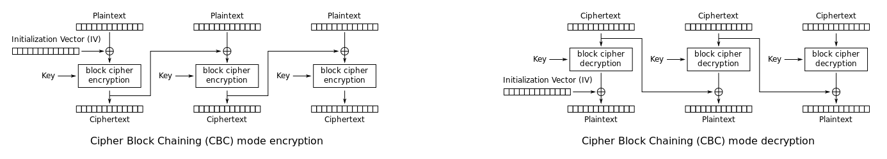

Taken from Wikipedia

Essentially, by changing a byte in one block of the ciphertext, we change the corresponding byte in the next block (unfortunately, the block that we changed becomes gibberish because of the block cipher decryption, but we can fix that by changing the IV later).

So, all we have to do is work backward, changing the last character of the first ciphertext block until the plaintext ends in the correct character, then moving to the second to last, and so on and so forth.

Here is the code:

```python
import asyncio
import websockets
import math

intended_message = "Bob is so much cooler than Alice"

async def solve():
    uri = "ws://cararra-ctf-files.herokuapp.com/r3/learn-your-cbcs"
    async with websockets.connect(uri) as websocket:
        print(f"< {await websocket.recv()}")
        encrypted = f"< {await websocket.recv()}"
        print(encrypted)
        encrypted = encrypted.split(": ")[1]
        current = "";
        
        for j in range(32):
            for i in range(256):
                print(f"< {await websocket.recv()}")
                new_encrypted = encrypted[:64-2*j-2] + ("00"+hex(i)[2:])[-2:] + current + encrypted[64:]
                await websocket.send(f"{new_encrypted}")
                print(f"> {new_encrypted}")
                message = await websocket.recv()
                print("< " + message)
                if message[-j-1] == intended_message[-j-1]:
                    current = ("00"+hex(i)[2:])[-2:] + current
                    break

        print(f"< {await websocket.recv()}")

asyncio.get_event_loop().run_until_complete(solve())
```

Running the code, we get a flag of `cararraCTF{n1ce_yOu_kn0W_How_AES_wOrKS!}`.

## padding-problems-2

Cryptography (400 points)

### Problem

Alice sent Bob a message encrypted with 128-bit AES-CBC. Bob has a mailbox that you can send messages to, but he gets very angry if you incorrectly pad your messages (and padding them correctly is somewhat hard without the key...). Can you decode Alice's message? Keep in mind that the first 16 bytes of the ciphertext should be the IV and that the ciphertext's length must be a multiple of the block length. Connect to the challenge using the terminal command `websocat ws://cararra-ctf-files.herokuapp.com/r3/padding-problems-2 -E`.

### Writeup

This system is vulnerable to the so-called [padding oracle attack](https://en.wikipedia.org/wiki/Padding_oracle_attack) since Bob tells us when our message has incorrect padding.

Here's the code (it sometimes doesn't work depending on the IV, so rerun it if it only gives you a partial answer).

```python
import asyncio
import websockets
import math

async def solve():
    uri = "ws://localhost:3001/r3/padding-problems-2"
    async with websockets.connect(uri) as websocket:
        print(f"< {await websocket.recv()}")
        encrypted = f"< {await websocket.recv()}"
        print(encrypted)
        encrypted = encrypted.split(": ")[1]
        current = [];
        flag = ""
        
        for k in range(3):
            for j in range(16):
                for i in range(256):
                    print(f"< {await websocket.recv()}")
                    new_encrypted = encrypted[:-32-2*j-2] + ("00"+hex(i)[2:])[-2:] + "".join([("00"+hex(c ^ (j+1))[2:])[-2:] for c in current]) + encrypted[-32:]
                    await websocket.send(f"{new_encrypted}")
                    print(f"> {new_encrypted}")
                    message = await websocket.recv()
                    print("< " + message)
                    if "Thank you" in message:
                        current.insert(0, i ^ (j+1))
                        break
            temp_flag = ""
            for (a, b) in zip([int(encrypted[-64+i:-64+i+2], 16) for i in range(0, 32, 2)], current):
                temp_flag += chr(a ^ b)
            print(temp_flag)
            flag = temp_flag + flag
            encrypted = encrypted[:-32]
            current = []
        print(flag.strip())

asyncio.get_event_loop().run_until_complete(solve())
```

Running the code, we get a flag of `cararraCTF{p4DD1ng_OraCleS_r_3XPlo1t@ble}`.


