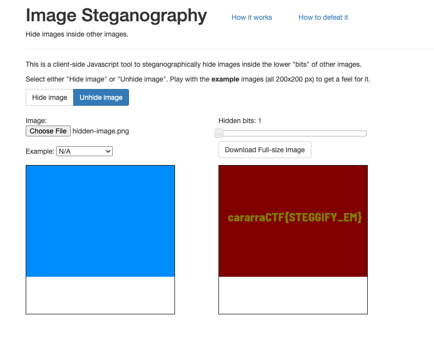
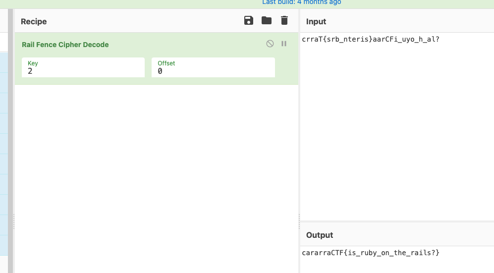
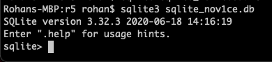
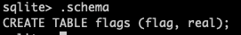
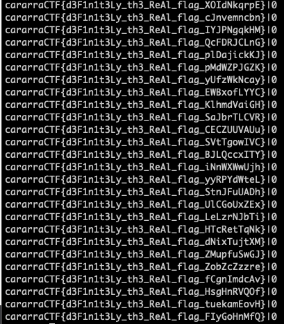
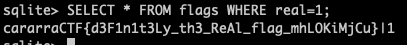
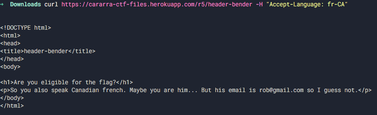
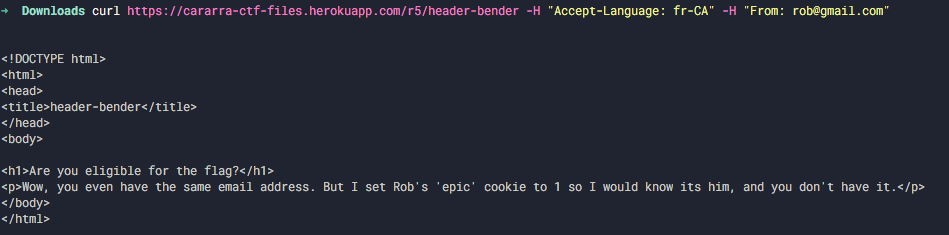
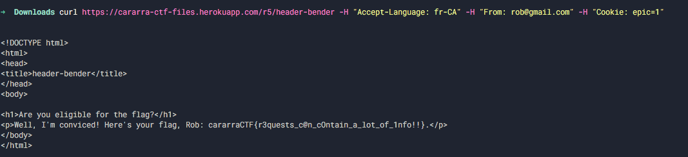

# Round 5 Writeups

- [sanity-check](#sanity-check)
- [find-the-difference](#find-the-difference)
- [hidden-image](#hidden-image)
- [binary-tree-1](#binary-tree-1)
- [encoded-rails](#encoded-rails)
- [number-games-1](#number-games-1)
- [sqlite_nov1ce](#sqlite_nov1ce)
- [binary-tree-2](#binary-tree-2)
- [2qlite_intermediate](#2qlite_intermediate)
- [binary-tree-3](#binary-tree-3)
- [sqlit3_master](#sqlit3_master)
- [hidden-image-2](#hidden-image-2)
- [manager-problem](#manager-problem)
- [function-medians](#function-medians)
- [double-des](#double-des)
- [header-bender](#header-bender)
- [box-stacking](#box-stacking)
- [defygg-hot](#defygg-hot)
- [manager-problem-2](#manager-problem-2)

## sanity-check

General Skills (10 points)

### Problem

Take your free flag :D: `cararraCTF{w3lCOm3_TO_R5!!!!!!}`

### Writeup

Seems somewhat self explanatory... 🙂

- cararra#0001

## find-the-difference

General Skills (20 points)

### Problem

You are given two files containing long strings. The strings are identical for the most part, but there are a few letters that differ in each string. Find all the letters that are different in file2.txt and concatenate them to get your answer. If your answer is cat, enter it as cararraCTF{cat}.

Relevant links: [file1.txt](https://cararra-ctf-files.herokuapp.com/r5/file1.txt), [file2.txt](https://cararra-ctf-files.herokuapp.com/r5/file2.txt)

### Solution

This question is pretty straightforward and easy. You can reduce workload by using the mac command `cmp -l file1.txt file2.txt` or windows command `fc /b file1.txt file2.txt`. You get the differences in file2 in octal/hex and you can use an online converter to change it to a string. However, you can also brute force the answer through Python as shown below.

- Undertaker#9548

```python
f = open("file1.txt","r")

f2 = open("file2.txt","r")

s = f.read()
s2 = f2.read()

for i in range(len(s)):
    if s[i] != s2[i]:
        print(s2[i],end="")
```

Running the code, we get an answer of `fCisCO0L!` and a flag of `cararraCTF{fCisCO0L!}`.

- Undertaker#9548

## hidden-image

Forensics (30 points)

### Problem

Who knew you can hide an image in another image?

Relevant links: [hidden-image.png](https://cararra-ctf-files.herokuapp.com/r5/hidden-image.png)

### Writeup

We can use this site to unhide the image: [https://osric.com/chris/steganography/decode.html](https://incoherency.co.uk/image-steganography/#unhide).

Inputting the image, we get the following output:



So, our flag is `cararraCTF{STEGGIFY_EM}`.

- cararra#0001

## binary-tree-1

Algorithms (50 points)

### Problem

Given a list of pairs containing a node and its parent in a binary tree, find the sum of all node values at height 10 in the binary tree. The first line of input contains N, the number of pairs, followed by N lines each containing the child node first and its parent node next. If the sum is equal to 50, enter your answer as cararraCTF{50}.

Relevant links: [binary-tree-1.txt](https://cararra-ctf-files.herokuapp.com/r5/binary-tree-1.txt)

### Solution

We can use recursion to solve this problem. Essentially, a node at height 10 has 10 generations of ancestors. We manually trace back each node in the array up to the root and whichever nodes have 10 generations of ancestors, we add their node value to the sum.

```python
f = open("binary-tree-1.txt","r")

n = int(f.readline().strip())

parent = dict()
for i in range(n):
    x = f.readline().strip().split(" ")
    parent[int(x[0])] = int(x[1])

ans = 0
for i in parent.keys():
    count = 0
    orig = i
    while True:
        if i not in parent.keys():
            break
        i = parent[i]
        count += 1
    if count == 10:
        ans += orig

print(ans)
```

Running the code, we get an answer of `5122292` and a flag of `cararraCTF{5122292}`.

- Undertaker#9548

## encoded-rails

Cryptography (50 points)

### Problem

That looks like a flag, but not quite. I wonder what cipher it is...

Relevant links: [encoded-rails.txt](https://cararra-ctf-files.herokuapp.com/r5/encoded-rails.txt)

### Writeup

It somewhat looks like every other letter of cararraCTF was included at the beginning, and the remainder are found near the end. It turns out that this is an instance of the rail-fence cipher with 2 rails, which is equivalent to alternating letters between two strings then concatenating the strings.

For example, the string "abcd" would translate into the strings "ac" and "bd" that are concatenated to form the string "acbd."

Inverting this procedure for the flag using [CyberChef](https://gchq.github.io/CyberChef/#recipe=Rail_Fence_Cipher_Decode(2,0)&input=Y3JyYVR7c3JiX250ZXJpc31hYXJDRmlfdXlvX2hfYWw/Cg), we get our flag:



So, our flag is `cararraCTF{is_ruby_on_the_rails?}`.

## number-games-1

Algorithms (75 points)

### Problem

Loki and Thor are playing a number game. Initially, each player randomly gets N number of cards with a number on them. In each round, each player plays a card simultaneously, and whoever has the higher card wins the round. In case of a tie, neither player wins the round. Thor met with Dr. Strange before the game and now knows exactly what cards Loki has and the exact order Loki plays those cards. Find the maximum number of rounds Thor can win if he plays optimally. N is given on the first line of the test case. The N integers that represent Thor’s cards in no particular order are given on the next line, and the N integers that represent Loki’s cards in the exact order they are played are given on the last line. Enter your answer in flag format: if your answer is 50, enter the flag cararraCTF{50}.

Relevant Links: [number-games-1.txt](https://cararra-ctf-files.herokuapp.com/r5/number-games-1.txt)

### Writeup

This is a greedy problem. We first sort both sets of cards and start with the highest possible card in both sets. Every iteration of the loop, we compare the cards and if Loki's is higher, we decrement his index because we don't have any other option as none of Thor's cards can beat that card. If Thor's is higher, we will go ahead and use that card against Loki's card and increment the answer as Thor wins the round. We repeat this until one of them runs out of cards (i.e. index goes below 0). 

```python
f = open("number-games-1.txt","r")

n = int(f.readline().strip())

thor = list(map(int,f.readline().strip().split(" ")))
loki = list(map(int,f.readline().strip().split(" ")))

thor.sort()
loki.sort()

ans = 0
l = n-1
r = n-1
while(True):
    if(l<0 or r < 0):
        break
    if(loki[r]>=thor[l]):
        r-=1
    else:
        l -= 1
        r -= 1
        ans += 1

print(ans)

```

Running the code, we get an answer of `9821` and a flag of `cararraCTF{9821}`.

- Undertaker#9548

## sqlite_nov1ce

General Skills (75 points)

### Problem

Here's a SQLite database for you to take a look at. I didn't bother encrypting it because I doubted anyone actually knew how to use SQL, but you can try your hand at it...

Relevant files: [sqlite_nov1ce](https://cararra-ctf-files.herokuapp.com/r5/sqlite_nov1ce.db)

### Writeup

Download the database and open it using SQLite3 (which is downloaded on Macs by default and can also be downloaded from their [website](https://www.sqlite.org/download.html)).



To see the tables and their schemas, we can run the command `.schema`:



We can then run `SELECT * FROM flags;` just to see what our data looks like:



It seems that there are a lot of flags, but only one which is the real deal. We can get that one flag by running the query `SELECT * FROM flags WHERE real=1;`:



And we now have our flag, `cararraCTF{d3F1n1t3Ly_th3_ReAl_flag_mhLOKiMjCu}`!

- cararra#0001

## binary-tree-2

Algorithms (100 points)

### Problem

Given a perfect binary tree of size N in the form of an array of numbers, find the distance between each given pair of nodes and compute the sum of those distances. The first line of input gives N and Q, the number of queries, followed by N lines each containing one unique node value. For each node at index i, the nodes at indices 2*i+1 and 2*i+2 are its children in the tree. The node values are followed by Q lines of queries, each line containing two node values. If the total sum of all queries is 50, enter your answer as cararraCTF{50}.

Relevant Links: [binary-tree-2.txt](https://cararra-ctf-files.herokuapp.com/r5/binary-tree-2.txt)

### Writeup

Brute Force (by Undertaker#9548). Since the array already has all the nodes in an ordered fashion, we basically keep moving up from a node to its parent until we end up on the same node for both the original nodes. This node is the least common ancestor. The distance between the two original nodes is just the sum of path distances from each node to the LCA. 

```python
f = open("binary-tree-2.txt", "r")
x = f.readline().strip().split(" ")
n = int(x[0])
q = int(x[1])

arr = []
for i in range(n):
    arr.append(int(f.readline()))

s = 0
for i in range(10000):
    x = f.readline().strip().split(" ")
    a = int(x[0])
    b = int(x[1])
    ai = arr.index(a)
    bi = arr.index(b)
    count = 0
    while(ai!=bi):
        count += 1
        if(ai>bi):
            ai = (ai-1)//2
        else:
            bi = (bi-1)//2
    s += count

print(s)
```

### Additional Solutions

Python Bit Arithmetic (by rohankk#6312)

```python
import math

f = open('binary-tree-2.txt')
[n, q] = map(int, f.readline().split())
ids = { int(f.readline()):(i+1) for i in range(n) }

tot = 0
for i in range(q):
    [a, b] = map(lambda x:ids[int(x)], f.readline().split())
    al, bl = a.bit_length(), b.bit_length()

    b = b >> max(0, bl - al)
    a = a >> max(0, al - bl)

    dist = al + bl - 2 * (a.bit_length() - (a^b).bit_length())

    tot += dist
    tot %= 10 ** 9 + 7

print(tot)
```

With either method, we get an answer of `179727`, so the flag is `cararraCTF{179727}`.  

- Undertaker#9548

## 2qlite_intermediate

General Skills (125 points)

### Problems

Find the lexicographically smallest flag that is either "trash" or "cute".

Relevant links: [2qlite_intermediate.db](https://cararra-ctf-files.herokuapp.com/r5/2qlite_intermediate.db)

### Writeup

We first run sqlite3 2qlite_intermediate.db to open the database, then use the .schema command in the sqlite3 CLI to get our tables and columns.


When we have information in two separate tables, we need to use a LEFT JOIN to access the data together. We can retrieve the smallest flag using an ORDER BY clause, and use an IN operator to get flags of the correct class with a LIMIT clause to get only the top row of our query.

Running the one-liner `SELECT * FROM class LEFT JOIN flag ON class.id=flag.id WHERE class.class IN ('trash','cute') ORDER BY flag.flag LIMIT 1;`, we get our flag is `cararraCTF{which_1s_d4_SM@lleSt?_AFWtmrAWEO}`.


- cararra#0001

## binary-tree-3

Algorithms (100 points)

### Problem

A binary tree is given in the form of an array, where the root is the first element, and the children of a node are at indices 2*i+1 and 2*i+2. Find the largest subtree sum in the binary tree. The first line of input tells how many elements there are in the array, and the next line contains space-separated node values. If the max sum is 50, enter your answer as cararraCTF{50}.

Relevant Links: [binary-tree-3.txt](https://cararra-ctf-files.herokuapp.com/r5/binary-tree-3.txt)

### Writeup

We can use recursion to solve this problem. At any given subtree, the sum is calculated by adding the left subtree, the right subtree, and the current node. We start at the root and recursively apply this formula to all of the children and we store the maximum value, which is the answer. 

```python
f = open("binary-tree-3.txt","r")

n = int(f.readline().strip())

arr = list(map(int,f.readline().strip().split(" ")))

ans = -100*100000
def findsum(i):
    global ans, arr
    curr = arr[i]
    if i*2+1 <= n-1:
        curr += findsum(i*2+1)
    if i*2+2 <= n-1:
        curr += findsum(i*2+2)
    ans = max(ans,curr)
    return curr
findsum(0)
print(ans)
```

We get the answer `17262`, so the flag is `cararraCTF{17262}`.

- Undertaker#9548

## sqlit3_master

General Skills (200 points)

### Problems

Two of the users of this website spent at least 200 dollars on the same item. Find the flag of the one who spent more money overall.

Relevant links: [sqlit3_master.db](https://cararra-ctf-files.herokuapp.com/r5/2qlite_master.db)

### Writeup

Here's the schema of the database:


In this case, we need to left join several tables in order to link a user with the good they purchased as well as its cost. In addition to that, we need to check how much they spent on each item, which we can do using a GROUP BY clause on the good's ID.

Once we get the users that spent more than 200 on a single item using a subquery, we can then use another GROUP BY clause on user ID to find how much each user spent on goods.

Here is the final SQL statement (quite a massive one, you could theoretically split it up by selecting into a new intermediate table and querying that).

```sql
select flags.flag from users left join flags on users.id = flags.user_id left join purchases on purchases.user_id = users.id left join goods on purchases.good_purchased = goods.id where exists (select * from purchases left join goods on purchases.good_purchased = goods.id where purchases.user_id = users.id group by goods.id having sum(goods.cost) >= 200) group by users.id order by sum(goods.cost) desc limit 1;
```

Running the command, we get our flag is `cararraCTF{my_flag_is_DjwBAYDDcI}`!


## hidden-image-2

Cryptography (100 points)

### Problem

Can you find the flag in these two images?

Relevant Links: [image1.png](https://cararra-ctf-files.herokuapp.com/r5/image1.png), [image2.png](https://cararra-ctf-files.herokuapp.com/r5/image2.png)

### Writeup

The key to this problem is using XOR between the pixels in each image and combining them into a single image. Once you do that, you can see the flag in the final image. 

```python
# open both photos
i1 = Image.open("image1.png")
i2 = Image.open("image2.png")

# get width and height
width1, height1 = i1.size

# open new image
i3 = Image.new('RGB', (width1, height1))

# load the pixels
pixels = i3.load()

# loop through all pixels
for i in range(width1):
    for j in range(height1):
        # xor the values
        x = i1.getpixel((i,j))[0] ^ i2.getpixel((i,j))[0]
        y = i1.getpixel((i,j))[1] ^ i2.getpixel((i,j))[1]
        z = i1.getpixel((i,j))[2] ^ i2.getpixel((i,j))[2]

        i3.putpixel((i,j), (x,y,z))

i3.save("test2.png", "PNG")
```

In the image, you find the flag `cararraCTF{XORTHEPIXELS}`.

- Undertaker#9548

## manager-problem

Algorithms (150 points)

### Problem

You work at a dessert store where all the chefs are robots. There are N chefs and all of them can make any type of dessert in 0 time! You have M orders in a queue, each order being a number between 1 and 500 indicating the type of dessert. Your job is to assign these orders to each chef while minimizing the production cost. It costs you one dollar every time a chef has to switch the type of dessert they are working on. For example, say a chef got assigned type 3 dessert 100 times, it costs you only 1 dollar because the chef had to initially switch to type 3 and never change again. The first line of input contains N and M, and the next line contains space-separated integers representing the M orders in the queue. If your answer is 50, enter the flag as cararraCTF{50}.

Relevant Links: [manager-problem.txt](https://cararra-ctf-files.herokuapp.com/r5/manager-problem.txt)

### Writeup

This problem can be solved using a greedy approach. Essentially, there are two cases. If a dessert is already being made by one of the chefs, then just assign the current dessert to the same chef with a cost of 0. If not, there are two subcases. If there is a chef who isn't making any desserts at the moment, assign him this dessert with a cost of 1. If all chefs are occupied, we have to consider all the desserts that are currently being made by chefs. Out of those, we have to choose the one that is either never going to be made in the future again or will be made the latest in the future. We replace this chosen dessert with a cost of 1. 

```python
def find(arr, pos, m, isRunning):
    # Iterate from last to current
    # position and find where the
    # task will happen next.
    d = [0] * (m + 1)
    for i in range(m - 1, pos, -1):

        if isRunning[arr[i]]:
            d[arr[i]] = i

    # Find out maximum of all these positions
    # and it is the farthest position.
    maxipos = 0
    for ele in d:
        maxipos = max(ele, maxipos)

    return maxipos

def mincost(n, m, arr):
    # freqarr[i][j] denotes the frequency
    # of type j task after position i
    # like in array 1, 2, 1, 3, 2, 1
    # frequency of type 1 task after
    # position 0 is 2. So, for this
    # array freqarr[0][1] = 2. Here,
    # i can range in between 0 to m-1 and
    # j can range in between 0 to m(though
    # there is not any type 0 task).
    freqarr = [[] for i in range(m)]

    # Fill up the freqarr vector from
    # last to first. After m-1 th position
    # frequency of all type of tasks will be
    # 0. Then at m-2 th position only frequency
    # of arr[m-1] type task will be increased
    # by 1. Again, in m-3 th position only
    # frequency of type arr[m-2] task will
    # be increased by 1 and so on.
    newvec = [0] * (m + 1)
    freqarr[m - 1] = newvec[:]
    for i in range(m - 2, -1, -1):
        nv = freqarr[i + 1][:]
        nv[arr[i + 1]] += 1
        freqarr[i] = nv[:]

    # isRunning[i] denotes whether type i
    # task is currently running in one
    # of the cores.
    # At the beginning no tasks are
    # running so all values are false.
    isRunning = [False] * (m + 1)

    # cost denotes total cost to assign tasks
    cost = 0

    # truecount denotes number of occupied cores
    truecount = 0

    # iterate through each task
    # and find the total cost.
    for i in range(0, m):

        # ele denotes type of task.
        ele = arr[i]

        # Case 1: if smae type of task is
        # currently running cost for this is 0.
        if isRunning[ele] == True:
            continue

        # Case 2: same type of task
        # is not currently running.
        else:

            # Subcase 1: if there is at least
            # one free core then assign this task
            # to that core at a cost of 1 unit.
            if truecount < n:
                cost += 1
                truecount += 1
                isRunning[ele] = True

            # Subcase 2: No core is free
            else:

                # here we will first find the minimum
                # frequency among all the ongoing tasks
                # in future.
                # If the minimum frequency is 0 then
                # there is at least one ongoing task
                # which will not occur again. Then we just
                # stop tha task.
                # If minimum frequency is >0 then, all the
                # tasks will occur at least once in future.
                # we have to find out which of these will
                # rehappen last among the all ongoing tasks.

                # set minimum frequency to a big number
                mini = 100000

                # set index of minimum frequency task to 0.
                miniind = 0

                # find the minimum frequency task
                # type(miniind) and frequency(mini).
                for j in range(1, m + 1):
                    if isRunning[j] and mini > freqarr[i][j]:
                        mini = freqarr[i][j]
                        miniind = j

                # If minimum frequency is zero then just stop
                # the task and start the present task in that
                # core. Cost for this is 1 unit.
                if mini == 0:
                    isRunning[miniind] = False
                    isRunning[ele] = True
                    cost += 1

                # If minimum frequency is nonzero then find
                # the farthest position where one of the
                # ongoing task will rehappen.
                # Stop that task and start present task
                # in that core.
                else:

                    # find out the farthest position
                    # using find function
                    farpos = find(arr, i, m, isRunning)
                    isRunning[arr[farpos]] = False
                    isRunning[ele] = True
                    cost += 1

    return cost

f = open("manager-problem.txt","r")

(n,m) = tuple(map(int,f.readline().strip().split(" ")))
arr = list(map(int,f.readline().strip().split(" ")))
print(mincost(n,m,arr))
```

The flag is `cararraCTF{4719}`.

- Undertaker#9548

## function-medians

Algorithms (200 points)

### Problem

Suppose we have the functions f(x) = 2 * x^2 + 10x + 4 and g(x) = 5x^3 + 5x + 1. Find twice the median of the set {f(0), f(1), f(2), ... , f(10^9), g(0), g(1), g(2), ... , g(10^9)}. If your answer is 50, enter your answer as cararraCTF{50}.

### Writeup

We can binary search on the median using the method outlined in this article: [https://www.geeksforgeeks.org/median-of-two-sorted-arrays/](https://www.geeksforgeeks.org/median-of-two-sorted-arrays/). Since our arrays are implicitly defined, we can (and have to) do this in `O(log N)` time.

Here is the code:

```python
def f(x):
    return 2 * x ** 2 + 10 * x + 4
def g(x):
    return 5 * x ** 3 + 5 * x  + 1

n = 10 ** 9

# Feel free to uncomment this code to verify the answer using the naive method
# nums = [f(x) for x in range(n+1)] + [g(x) for x in range(n+1)]
# nums.sort()
# ans = nums[n] + nums[n+1]
# print(ans)

def median():
    lo1 = 0
    hi1 = n
    lo2 = 0
    hi2 = n

    while lo1 + 1 < hi1 or lo2 + 1 < hi2:
        mid1 = (lo1 + hi1) // 2
        m1 = f(mid1)
        if (lo1 + hi1)%2 == 1:
            m1 = m1 + f(mid1+1)
        else:
            m1 *= 2
        mid2 = (lo2 + hi2) // 2
        m2 = g(mid2)
        if (lo2 + hi2)%2 == 1:
            m2 = m2 + g(mid2+1)
        else:
            m2 *= 2
        if m1 == m2:
            return m1
        if m1 > m2:
            hi1 = mid1 + (lo1 + hi1)%2
            lo2 = mid2 
        else:
            lo1 = mid1 
            hi2 = mid2 + (lo2 + hi2)%2

    return (max(f(lo1), g(lo2)) + min(f(hi1), g(hi2)))

print(median())
```

Running the code, we get an answer of `3994110633387277440` and a flag of `cararraCTF{3994110633387277440}`.

## double-des

Cryptography (200 points)

### Problem

The text file attached contains a flag encrypted with double DES. It also contains a plaintext and its associated ciphertext. A python file is also attached which shows how the encryption is performed. Can you decode the flag?

Relevant Links: [double-des.txt](https://cararra-ctf-files.herokuapp.com/r5/double-des.txt), [double-des.py](https://cararra-ctf-files.herokuapp.com/r5/double-des.py)

### Writeup

The key realization in this problem is that we can perform a **meet-in-the-middle attack**. Basically, we brute force all keys (there are 10^6 possibilities for each key because 6 random digits are chosen for the keys). We do the brute force two times: first, we encrypt the sample text with all possible keys, then we decrypt the ciphertext with all possible keys. Only one of the encrypted texts and decrypted texts will match. The two keys associated with that text are the ones used in this particular encryption. Then we just have to decrypt the flag with the keys to get the answer.  

Here is the code:

```python
import binascii
from Crypto.Cipher import DES
from tqdm import tqdm

padding = "  "
encrypted_flag = binascii.unhexlify("af285bc9516f8dec88ccb625d9545acbe84220affecc9a35541f122355b48912")

def pad(msg):
    block_len = 8
    over = len(msg) % block_len
    pad = block_len - over
    return (msg + " " * pad).encode()

custom_known_text = pad("sample_text")
custom_ciphertext = binascii.unhexlify("ca2cba524873ab6df508f0a1dbbc742a")

encrypt_table = {}
for key in tqdm(range(999999), desc="Bruteforcing 1st Key"):
    key = (f"{key:06}" + padding).encode()
    cipher = DES.new(key, DES.MODE_ECB)
    encrypted_custom = cipher.encrypt(custom_known_text)
    encrypt_table[encrypted_custom] = key

decrypt_table = {}
for key in tqdm(range(999999), desc="Bruteforcing 2nd Key"):
    key = (f"{key:06}" + padding).encode()
    cipher = DES.new(key, DES.MODE_ECB)
    decrypted_custom = cipher.decrypt(custom_ciphertext)
    decrypt_table[decrypted_custom] = key

print("Finding Key Intersection...")
encrypt_table_set = set(encrypt_table.keys())
decrypt_table_set = set(decrypt_table.keys())
for encrypt_decrypt_value in encrypt_table_set.intersection(decrypt_table_set):
    encrypt_key = encrypt_table[encrypt_decrypt_value]
    decrypt_key = decrypt_table[encrypt_decrypt_value]
    break
print("1st Key Found: %s" % encrypt_key)
print("2nd Key Found: %s" % decrypt_key)

cipher1 = DES.new(encrypt_key, DES.MODE_ECB)
cipher2 = DES.new(decrypt_key, DES.MODE_ECB)
flag_intermediate = cipher2.decrypt(encrypted_flag)
flag = cipher1.decrypt(flag_intermediate).decode()
print("Flag: %s" % flag)
```

Once you decrypt, you get the flag `cararraCTF{dOuB13dE5iNseCUr3!}`.

## header-bender

Web Exploitation (150 points)

### Problem

Bob made a website for his friend Rob to get a flag. Can you successfully impersonate Rob?

Relevant links: [header-bender](https://cararra-ctf-files.herokuapp.com/r5/header-bender)

### Writeup

Much of the information sent to a server is encoded in the HTTP request sent by the client. If you take a look at [https://developer.mozilla.org/en-US/docs/Web/HTTP/Headers](https://developer.mozilla.org/en-US/docs/Web/HTTP/Headers), you can see that there are a lot of headers to attach to your request.

On our first page, we see that we need to tell the server that we speak Canadian french. This can be done using the Accept-Languages header, which we can set to fr-CA using this command:

```bash
curl https://cararra-ctf-files.herokuapp.com/r5/header-bender -H "Accept-Language: fr-CA"
```



It now asks us to tell the server our email address, which we can do using the From header.



And now finally, we need to set the epic cookie, which we can do using the Cookie header.



And hooray, we got the flag `cararraCTF{r3quests_c@n_cOntain_a_lot_of_1nfo!!}` !

## box-stacking

Algorithms (250 points)

### Problem

Bob has N boxes with different dimensions and he is trying to stack as many as possible on top of each other such that every box on top has strictly smaller width and length compared to the one below it. Bob has duplicates of each box so a box can be reused as well. Bob can also rotate the box in any direction. Given N and the dimensions of the boxes, find the maximum height Bob can stack these boxes. If your answer is 50, enter the flag as cararraCTF{50).

Relevant Links: [box-stacking.txt](https://cararra-ctf-files.herokuapp.com/r5/box-stacking.txt)

### Writeup

The key realization in this problem is that this problem is similar to another famous DP problem - the longest increasing subsequence (LIS) problem. Another observation is that regardless of the fact that we can have many duplicate boxes, we can use at most two duplicates because we can rotate the box in two directions only to create new boxes. In the code, we basically create an array with all possible dimensions of boxes and sort them based on the base area. We then compute the maximum possible stack height if the given box is at the top of the stack using the following formula: maxheight[i] = max(maxheight[i],maxheight[j]+height[i]) for all boxes j that can be below box i. 

Here is the code:

```python
class Box:
    def __init__(self, h, w, d):
        self.h = h
        self.w = w
        self.d = d

    def __lt__(self, other):
        return self.d * self.w < other.d * other.w

def maxStackHeight(arr, n):
    # Create an array of all rotations of
    # given boxes. For example, for a box {1, 2, 3},
    # we consider three instances{{1, 2, 3},
    # {2, 1, 3}, {3, 1, 2}}
    rot = [Box(0, 0, 0) for _ in range(3 * n)]
    index = 0

    for i in range(n):
        # Copy the original box
        rot[index].h = arr[i].h
        rot[index].d = max(arr[i].d, arr[i].w)
        rot[index].w = min(arr[i].d, arr[i].w)
        index += 1

        # First rotation of the box
        rot[index].h = arr[i].w
        rot[index].d = max(arr[i].h, arr[i].d)
        rot[index].w = min(arr[i].h, arr[i].d)
        index += 1

        # Second rotation of the box
        rot[index].h = arr[i].d
        rot[index].d = max(arr[i].h, arr[i].w)
        rot[index].w = min(arr[i].h, arr[i].w)
        index += 1

    # Now the number of boxes is 3n
    n *= 3

    # Sort the array 'rot[]' in non-increasing
    # order of base area
    rot.sort(reverse=True)

    # Uncomment following two lines to print
    # all rotations
    # for i in range(n):
    #    print(rot[i].h, 'x', rot[i].w, 'x', rot[i].d)

    # Initialize msh values for all indexes
    # msh[i] --> Maximum possible Stack Height
    # with box i on top
    msh = [0] * n

    for i in range(n):
        msh[i] = rot[i].h

    # Compute optimized msh values
    # in bottom up manner
    for i in range(1, n):
        for j in range(0, i):
            if (rot[i].w < rot[j].w and
                    rot[i].d < rot[j].d):
                if msh[i] < msh[j] + rot[i].h:
                    msh[i] = msh[j] + rot[i].h

    maxm = -1
    for i in range(n):
        maxm = max(maxm, msh[i])

    return maxm

f = open("box-stacking.txt","r")

n = int(f.readline().strip())

arr = []
for i in range(n):
    x = list(map(int,f.readline().strip().split(" ")))
    arr.append(Box(x[0],x[1],x[2]))

print(maxStackHeight(arr,n))
```

The flag is `cararraCTF{1316659}`.

- Undertaker#9548

## defygg-hot

Cryptography (350 points)

### Problem

DefyGG made an encryption program for you guys, and he claims its very secure. See if you can still get his top secret flag. Connect to the challenge using the command websocat ws://cararra-ctf-files.herokuapp.com/r5/defygg-hot -E.

Relevant links: [defygg-hot.py](https://cararra-ctf-files.herokuapp.com/r5/defygg-hot.py)

### Writeup

The most notable problem with the encryption script is that it always uses the same nonce (the whole point of a nonce is to add randomness to the encryption, so we should be able to exploit this).

It turns out that in AES-CTR, each nonce corresponds to a different key that is applied as a one-time-pad to the plaintext. So, since we use the same nonce, we are essentially reusing a one time pad key. Since we have several messages, we can use our knowledge that the message must have cararraCTF{ in it to leak parts of the key and eventually get the entire flag.

So, we can essentially try to find two ciphertexts that are offset by 1 and then use something called crib-dragging to recover the flag.

Specifically, lets say we have m1 = cararraCTF{blah_blah} and m2 = xcararraCTF{blah_blah}. Then the second character of c1^c2 will be 'a'^'c', meaning we can retrieve the next character ('a') by xoring it with c. The third character of c1^c2 would be 'r'^'a', so we xor the previous character we found to get our next character 'r'.

Eventually, we recover the whole flag! Here's the script assuming you put a bunch of ciphertexts in ciphertext.txt:

```python
def solver(l):
    x,y=l
    ns=[]
    for i in range(min(len(x),len(y))):
        ns.append(int(x[i],16)^int(y[i],16))
    for i in range(len(ns)-1):
        #crib dragging the different pairs
        cur=99
        s=""
        for j in range(i,min(len(x),len(y))-3):
            cur=ns[j+1]^cur
            s+=chr(cur)

        #print possible flag nicley
        if ("cararraCTF{" in s):
            flag=s.split("}")[0]
            print(flag+"}")

#in reality you only need around 25 ish, but 80 should be more than plenty
ct=open("ciphertexts.txt","r").readlines()
for i in range(len(ct)):
        ct[i]=ct[i].strip()

for ct1 in ct:
        for ct2 in ct:
        #checking every possible pair
                if ct1==ct2:
                        continue
                x,y=[[ct1[i:i+2] for i in range(0,len(ct1),2)],[ct2[i:i+2] for i in range(0,len(ct2),2)]]
                solver([x,y])
```

Running the code, we get a flag of `cararraCTF{n0nC3s_G0TT4_b_rAnDom!}` .

## manager-problem-2

Algorithms (250 points)

### Problem

You are a manager at a store where there are N workers and N jobs. Every job needs to be done and any worker can only perform one job. Each worker can do any job, but they cost different amounts for different jobs. Can you minimize the total cost of assigning the jobs to workers? The first line of input contains N, followed by N lines, and each of these lines contains the N costs the workers have for each job. If your answer is 50, enter the flag as cararraCTF{50}.

Relevant Links: [](https://cararra-ctf-files.herokuapp.com/r5/box-stacking.txt)[manager-problem-2.txt](https://cararra-ctf-files.herokuapp.com/r5/manager-problem-2.txt)

### Writeup

This problem can be solved using the Hungarian algorithm. Python scipy library has an implementation of this algorithm in its optimization section. Thanks to that, we can solve this problem with a few lines. However, GeeksforGeeks has a great explanation of this algorithm at this [link](https://www.geeksforgeeks.org/hungarian-algorithm-assignment-problem-set-1-introduction/).

Here is the code:

```python
import numpy as np

cost = []

f = open("manager-problem-2.txt","r")
n = int(f.readline().strip())

for i in range(n):
    x = list(map(int, f.readline().strip().split(" ")))
    cost.append(x)
cost = np.array(cost)

from scipy.optimize import linear_sum_assignment

row_ind, col_ind = linear_sum_assignment(cost)

print(cost[row_ind, col_ind].sum())
```

The flag is `cararraCTF{2092}`.

- Undertaker#9548
